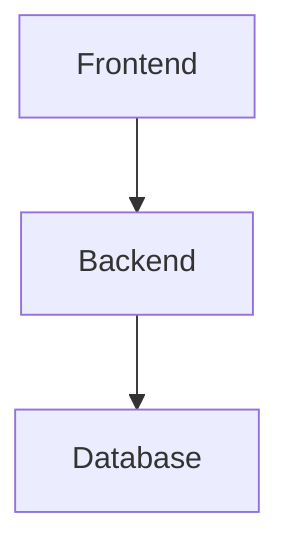
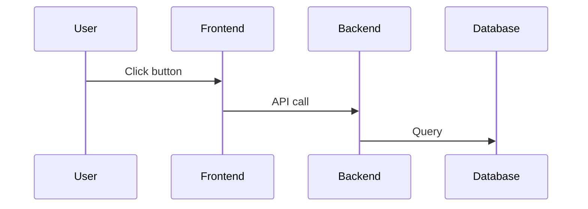
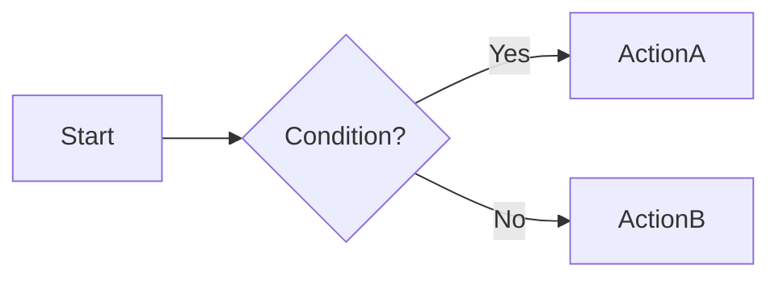

# Architecture Documentation

This directory contains comprehensive architecture documentation for Flashpoint
Web, detailing the system design, service communication patterns, and data
flows.

## Documentation Structure

### 1. [System Architecture](./system-architecture.md)

**Deep dive into the complete system architecture**

Topics covered:

- Three-service architecture overview (Frontend, Backend, Game Service)
- Technology stack and rationale
- Service responsibilities and boundaries
- Database architecture (flashpoint.sqlite and user.db)
- Security architecture (JWT, RBAC)
- File system layout
- Scalability considerations
- Development vs production modes
- Error handling strategies
- Monitoring and logging

**When to read**: Start here for a high-level understanding of the entire
system.

### 2. [Service Communication](./service-communication.md)

**Inter-service communication patterns and protocols**

Topics covered:

- Frontend ↔ Backend communication (REST API)
- Backend ↔ Game Service communication (internal APIs)
- Frontend ↔ Game Service communication (direct file loading)
- API endpoints by domain
- Authentication token flow
- Request/response formats
- Error handling and retry logic
- Rate limiting
- CORS configuration
- Performance optimization
- WebSocket (future considerations)

**When to read**: When you need to understand how services communicate or add
new API endpoints.

### 3. [Data Flow Diagrams](./data-flow-diagrams.md)

**Complete request/response flows with Mermaid diagrams**

Topics covered:

- Game browse and search flow
- Game detail view flow
- Filter options loading
- Image loading with lazy loading
- Pagination flow
- Real-time search with debouncing
- Multi-select filter flow
- Sort order changes
- Cache management (stale-while-revalidate)

**When to read**: When debugging data flow issues or understanding user journeys
through the system.

### 4. [Authentication Flow](./authentication-flow.md)

**Complete authentication and authorization flow**

Topics covered:

- User registration flow
- User login flow
- Protected request flow
- Token refresh flow (automatic)
- Logout flow
- Role-based access control (RBAC)
- Permission model
- JWT token structure
- Guest mode (optional authentication)
- Security best practices
- Common authentication issues

**When to read**: When implementing authentication features or troubleshooting
auth issues.

### 5. [Game Launch Flow](./game-launch-flow.md)

**Detailed game playing flow from click to play**

Topics covered:

- Game launch request flow
- ZIP mounting flow
- Game content loading (Flash and HTML5)
- HTTP proxy server request handling
- MIME type detection
- Ruffle player integration
- Full game launch example
- Error handling
- Performance optimization

**When to read**: When debugging game loading issues or understanding how games
are served.

### 6. [Play Tracking Flow](./play-tracking-flow.md)

**Session tracking and statistics aggregation**

Topics covered:

- Session start flow
- Session end flow
- Statistics aggregation (per-game and per-user)
- Flashpoint database integration
- Statistics retrieval and visualization
- Abandoned session cleanup
- Database schema and indexing
- Privacy and data management

**When to read**: When implementing analytics features or understanding play
session tracking.

## Architecture Diagrams

All architecture documents include Mermaid diagrams for visual representation.
These diagrams are rendered automatically in GitHub and most Markdown viewers.

### Key Diagram Types

**System Diagrams**: Show the overall architecture and service relationships



**Sequence Diagrams**: Show step-by-step interactions between components



**Flow Diagrams**: Show decision trees and process flows



## Key Architectural Patterns

### 1. Service Layer Pattern

```
Routes → Middleware → Services → Database
```

Business logic lives in service classes, routes are thin controllers.

### 2. Repository Pattern (Implicit)

Database access is abstracted through `DatabaseService` and
`UserDatabaseService`.

### 3. Middleware Pipeline

Express middleware chains handle cross-cutting concerns:

- Authentication (JWT verification)
- Authorization (RBAC)
- Logging (activity tracking)
- Error handling
- Rate limiting

### 4. State Management

**Frontend**:

- Server state: TanStack Query
- UI state: Zustand
- URL state: React Router
- Form state: React Hook Form

**Backend**:

- Stateless (JWT for session)
- Database as source of truth

### 5. Separation of Concerns

- **Backend**: Metadata, authentication, business logic
- **Game Service**: File serving, proxying, ZIP mounting
- **Frontend**: UI, client-side state, routing

## Technology Decisions

### Why TypeScript?

- Type safety across frontend and backend
- Better IDE support and refactoring
- Shared types between services
- Reduced runtime errors

### Why BetterSqlite3?

- Synchronous API (simpler code)
- Better performance than async wrappers
- Perfect for read-heavy workloads
- WAL mode for concurrent reads

### Why TanStack Query?

- Automatic caching and invalidation
- Background refetching
- Optimistic updates
- Loading and error states
- Deduplication

### Why Monorepo?

- Shared TypeScript types
- Coordinated development
- Single deployment
- Consistent tooling

### Why Three Services?

- Clear separation of concerns
- Independent scaling
- Backend doesn't block on file I/O
- Game service can be replicated
- Easier to reason about

## Common Workflows

### Adding a New API Endpoint

1. Define types in `shared/types` (if monorepo) or duplicate types
2. Create route in `backend/src/routes/`
3. Add middleware (auth, permissions, validation)
4. Implement service method in `backend/src/services/`
5. Add API client method in `frontend/src/lib/api.ts`
6. Create custom hook in `frontend/src/hooks/`
7. Use hook in component
8. Update documentation

### Adding a New Permission

1. Add permission to database migration
2. Update default role permissions
3. Add middleware check in route
4. Update frontend `ProtectedRoute` usage
5. Test with different roles

### Adding a New Database Table

1. Create migration file in `backend/src/migrations/`
2. Define schema with indexes
3. Add service methods for CRUD
4. Add TypeScript types
5. Run migration on startup
6. Test with sample data

## Performance Optimization

### Database

- Proper indexing on frequently queried columns
- Query result caching (TanStack Query)
- Prepared statements for repeated queries
- WAL mode for concurrent reads
- Periodic VACUUM for maintenance

### Frontend

- Code splitting with React.lazy
- Image lazy loading
- Virtual scrolling for large lists
- Debounced search
- Optimistic updates

### Backend

- Response compression
- HTTP caching headers
- Connection pooling (future)
- Rate limiting

### Game Service

- ZIP file caching (in memory)
- Streaming large files
- MIME type caching
- CDN fallback

## Security Considerations

### Authentication

- JWT with short expiration (15 min)
- Refresh tokens with long expiration (7 days)
- Automatic token refresh
- Secure token storage

### Authorization

- Role-based access control
- Granular permissions
- Middleware enforcement
- Frontend guards

### Input Validation

- Zod schemas for requests
- SQL parameterized queries
- XSS prevention
- CSRF protection (future)

### Database

- Read-only Flashpoint DB
- User DB with transactions
- Foreign key constraints
- Cascade deletes

## Testing Strategy

### Unit Tests

- Service layer methods
- Utility functions
- Helper functions

### Integration Tests

- API endpoint tests
- Database migration tests
- Auth flow tests

### E2E Tests (Future)

- User registration/login
- Game search and play
- Playlist management

## Debugging Tips

### Backend Issues

1. Check logs (`backend/logs/`)
2. Verify environment variables
3. Check database schema migrations
4. Test API endpoints with Postman
5. Enable DEBUG log level

### Frontend Issues

1. Check browser console
2. Inspect TanStack Query DevTools
3. Check Zustand DevTools
4. Verify API responses in Network tab
5. Check React DevTools

### Game Service Issues

1. Check if ZIP is mounted
2. Verify file paths
3. Check MIME types
4. Test proxy directly (curl)
5. Check htdocs fallback chain

### Database Issues

1. Verify migration version
2. Check table schema
3. Test queries directly in DB Browser
4. Check indexes
5. Verify foreign keys

## Future Enhancements

### Planned Features

1. **WebSocket Support**: Real-time features (live activity, multiplayer)
2. **GraphQL API**: Flexible queries, reduced over-fetching
3. **Redis Caching**: Session management, API response cache
4. **OAuth2**: Third-party authentication
5. **Content Security Policy**: Enhanced security
6. **Service Worker**: Offline support
7. **Database Sharding**: Horizontal scaling
8. **Docker Compose**: Simplified deployment

### Architectural Evolution

1. **Microservices**: Further service separation
2. **Event Bus**: Async communication between services
3. **CQRS**: Separate read/write models
4. **Read Replicas**: Scale database reads
5. **CDN Integration**: Global content delivery

## Related Documentation

- [Overview Documentation](../01-overview/): High-level overview and getting
  started
- [API Reference](../03-api/): Detailed API endpoint documentation (if exists)
- [Development Guide](../04-development/): Development setup and workflows (if
  exists)
- [Deployment Guide](../05-deployment/): Production deployment (if exists)

## Contributing

When updating architecture:

1. Keep diagrams in sync with code
2. Update all affected documents
3. Include examples
4. Test all code snippets
5. Get review from team

## Questions?

For questions about the architecture:

1. Check these docs first
2. Review code examples
3. Check GitHub issues
4. Ask in team chat
5. Create documentation issue

---

**Last Updated**: 2025-01-18

**Maintainers**: Flashpoint Web Development Team
