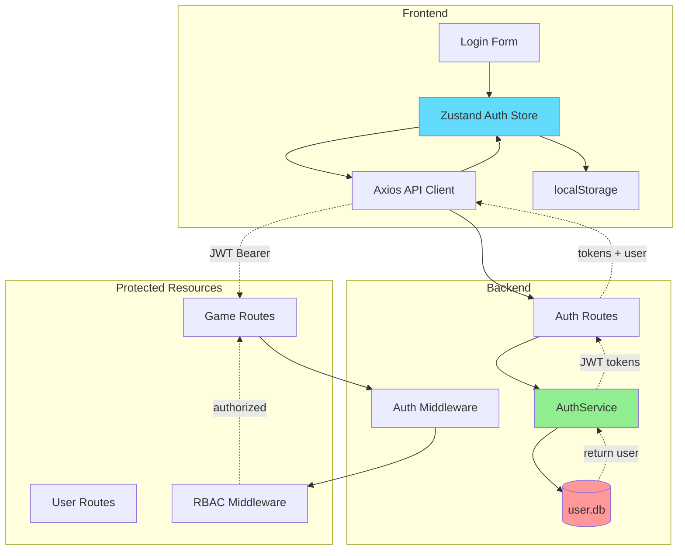
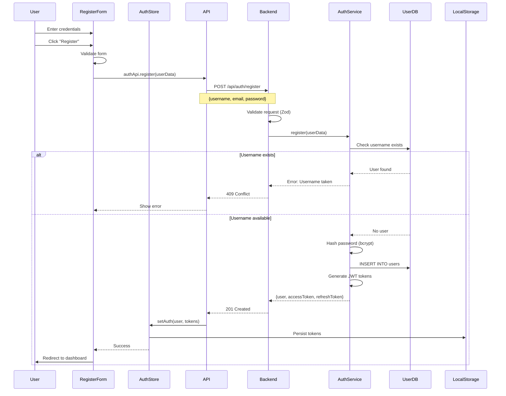
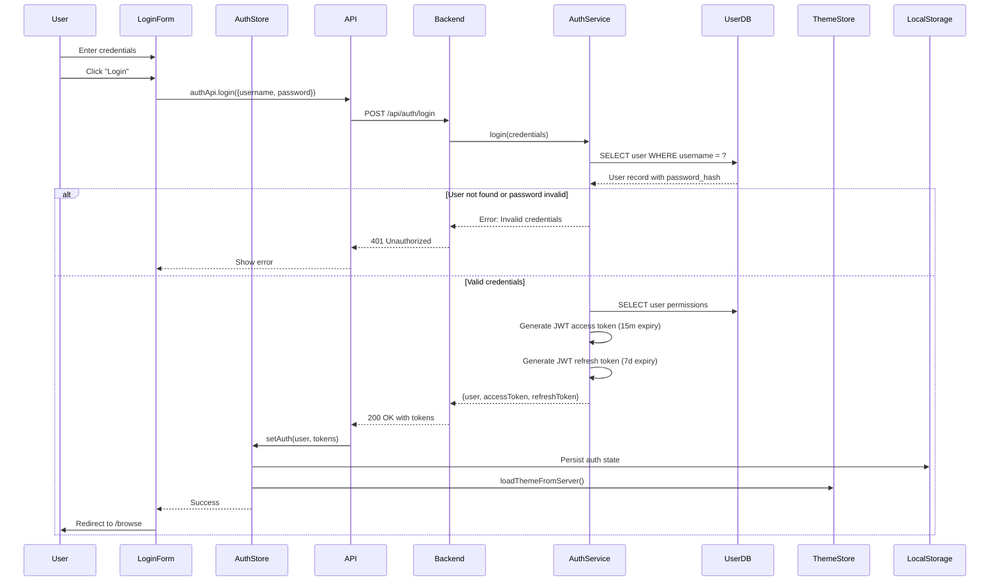
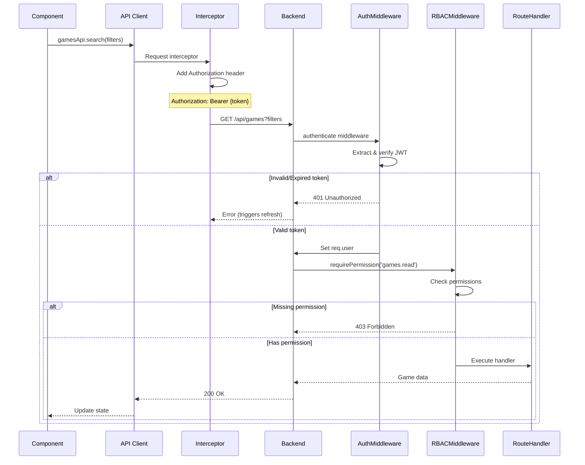
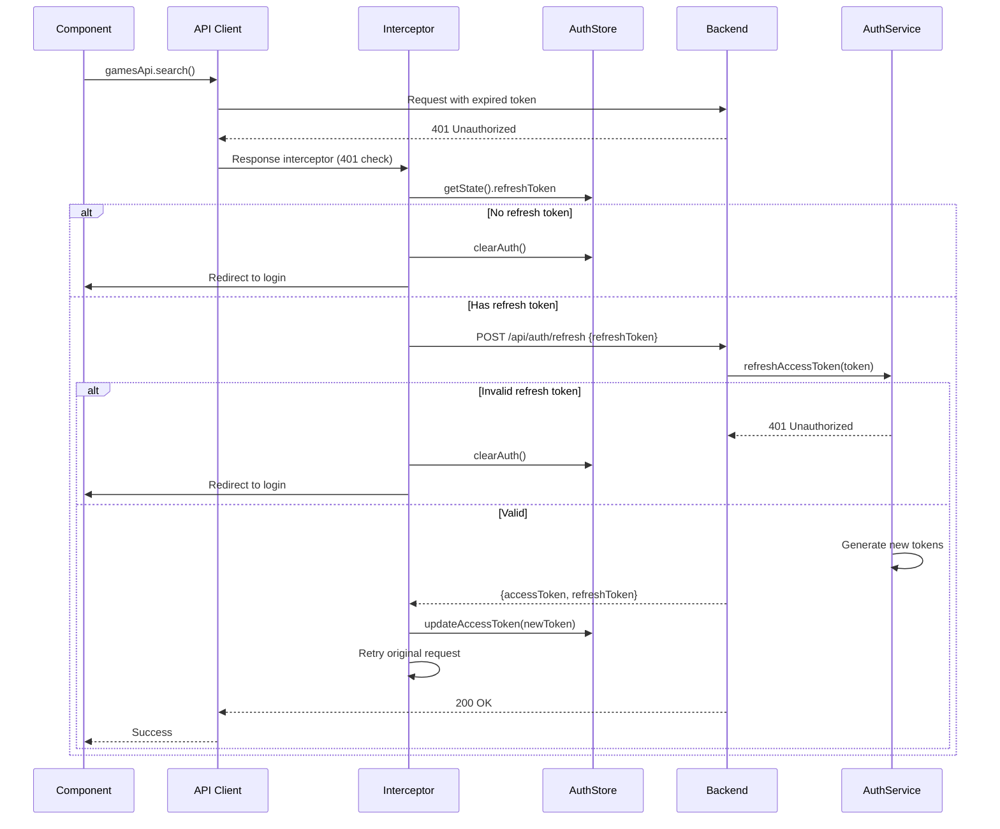
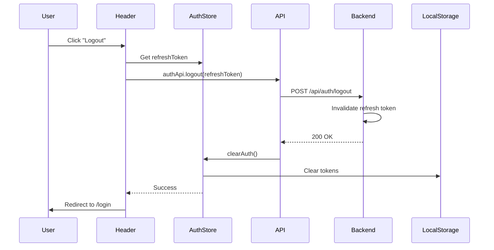
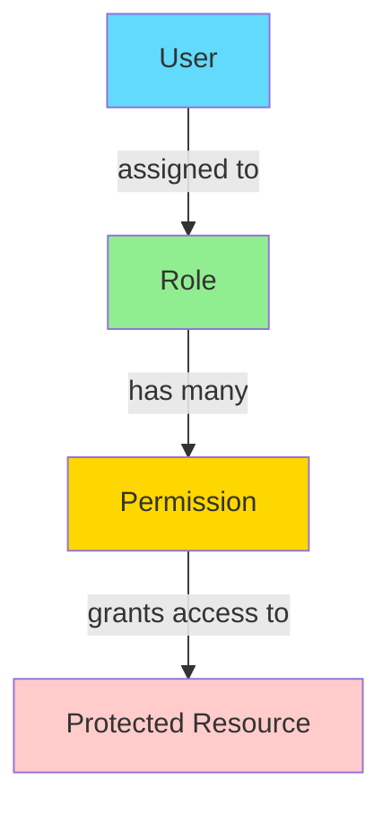

# Authentication Flow

## Overview

Flashpoint Web uses JWT-based authentication with role-based access control (RBAC).

## Authentication Architecture



## 1. User Registration Flow



**Password Validation Schema**:
```typescript
const registerSchema = z.object({
  username: z.string().min(3).max(50),
  email: z.string().email(),
  password: z.string().min(6),
  confirmPassword: z.string()
}).refine(data => data.password === data.confirmPassword, {
  message: "Passwords don't match",
  path: ["confirmPassword"]
});
```

## 2. User Login Flow



**JWT Token Structure**:
```typescript
// Access Token
{
  userId: 1,
  username: "user",
  email: "user@example.com",
  role: "user",
  permissions: ["games.read", "games.play"],
  iat: 1705579200,
  exp: 1705580100   // 15 minutes
}

// Refresh Token
{
  userId: 1,
  type: "refresh",
  iat: 1705579200,
  exp: 1706184000   // 7 days
}
```

## 3. Protected Request Flow



**Authentication Middleware**:
```typescript
export const authenticate = async (req, res, next) => {
  try {
    const authHeader = req.headers.authorization;
    if (!authHeader?.startsWith('Bearer ')) {
      throw new AppError(401, 'No token provided');
    }

    const token = authHeader.substring(7);
    const decoded = jwt.verify(token, process.env.JWT_SECRET);
    const user = await authService.getUserWithPermissions(decoded.userId);

    req.user = {
      id: user.id,
      username: user.username,
      email: user.email,
      role: user.roleName,
      permissions: user.permissions
    };

    next();
  } catch (error) {
    next(new AppError(401, 'Invalid token'));
  }
};
```

**RBAC Middleware**:
```typescript
export const requirePermission = (permission: string) => {
  return (req, res, next) => {
    if (!req.user?.permissions.includes(permission)) {
      return next(new AppError(403, `Permission denied: ${permission}`));
    }
    next();
  };
};
```

## 4. Token Refresh Flow



**Axios Response Interceptor**:
```typescript
api.interceptors.response.use(
  (response) => response,
  async (error) => {
    const originalRequest = error.config;

    if (error.response?.status === 401 && !originalRequest._retry) {
      originalRequest._retry = true;

      try {
        const refreshToken = useAuthStore.getState().refreshToken;
        if (!refreshToken) {
          useAuthStore.getState().clearAuth();
          window.location.href = '/login';
          return Promise.reject(error);
        }

        const tokens = await authApi.refreshToken(refreshToken);
        useAuthStore.getState().updateAccessToken(tokens.accessToken);
        originalRequest.headers.Authorization = `Bearer ${tokens.accessToken}`;
        return api(originalRequest);
      } catch (refreshError) {
        useAuthStore.getState().clearAuth();
        window.location.href = '/login';
        return Promise.reject(refreshError);
      }
    }

    return Promise.reject(error);
  }
);
```

## 5. Logout Flow



## 6. Role-Based Access Control



**Database Schema**:
```sql
CREATE TABLE roles (
  id INTEGER PRIMARY KEY AUTOINCREMENT,
  name TEXT UNIQUE NOT NULL,
  description TEXT,
  created_at TEXT DEFAULT (datetime('now'))
);

CREATE TABLE permissions (
  id INTEGER PRIMARY KEY AUTOINCREMENT,
  name TEXT UNIQUE NOT NULL,
  description TEXT,
  resource TEXT NOT NULL,
  action TEXT NOT NULL
);

CREATE TABLE role_permissions (
  role_id INTEGER NOT NULL,
  permission_id INTEGER NOT NULL,
  PRIMARY KEY (role_id, permission_id),
  FOREIGN KEY (role_id) REFERENCES roles(id) ON DELETE CASCADE,
  FOREIGN KEY (permission_id) REFERENCES permissions(id) ON DELETE CASCADE
);
```

**Default Roles**:
- `admin`: Full system access
- `moderator`: Content management and user support
- `user`: Standard user features (games, playlists)
- `guest`: Read-only access (if enabled)

**Common Permissions**:
```
games.read, games.play
playlists.read, playlists.create, playlists.update, playlists.delete
users.read, users.create, users.update, users.delete
roles.read, roles.create, roles.update, roles.delete
settings.update
```

**Frontend Permission Checks**:
```typescript
export const ProtectedRoute = ({ children, requiredPermission }) => {
  const { isAuthenticated, hasPermission } = useAuthStore();

  if (!isAuthenticated) {
    return <Navigate to="/login" />;
  }

  if (requiredPermission && !hasPermission(requiredPermission)) {
    return <Navigate to="/unauthorized" />;
  }

  return <>{children}</>;
};

// Usage
{hasPermission('users.create') && (
  <Button onClick={handleCreateUser}>Create User</Button>
)}
```

## 7. Guest Mode

When `auth.guest_access_enabled` is true in system settings, unauthenticated users can browse games with limited permissions.

```typescript
// Frontend
const guestUser: User = {
  id: 0,
  username: 'Guest',
  role: 'guest',
  permissions: ['games.read', 'games.play']
};

// Backend
export const optionalAuth = async (req, res, next) => {
  const authHeader = req.headers.authorization;

  if (authHeader?.startsWith('Bearer ')) {
    const token = authHeader.substring(7);
    const user = await authService.verifyAccessToken(token);
    req.user = user;
  } else {
    const settings = await authSettingsService.getSettings();
    if (!settings.guestAccessEnabled) {
      throw new AppError(401, 'Authentication required');
    }
    req.user = { id: 0, username: 'guest', role: 'guest', permissions: ['games.read'] };
  }

  next();
};
```

## Security Measures

**Password Security**: Bcrypt with 10 rounds

**JWT Security**:
- Short-lived access tokens (15 minutes)
- Long-lived refresh tokens (7 days)
- Signed with random 256-bit JWT_SECRET
- Verify algorithm: HS256

**Rate Limiting**: 5 login attempts per 15 minutes

**Input Sanitization**: Zod schema validation on all routes

**HTTPS**: Secure cookies in production only

## Troubleshooting

| Issue | Cause | Solution |
|-------|-------|----------|
| 401 on valid requests | Token expired | Automatic refresh in Axios interceptor |
| Infinite refresh loop | Refresh token also expired | Force logout and redirect to login |
| 403 despite logged in | Missing permission | Check user role and permissions in database |
| Guest access not working | Setting disabled | Verify `auth.guest_access_enabled` in system_settings |
| Admin gets 503 in maintenance | Unauthenticated request | Use authenticated `api` client, not raw `fetch()` |
