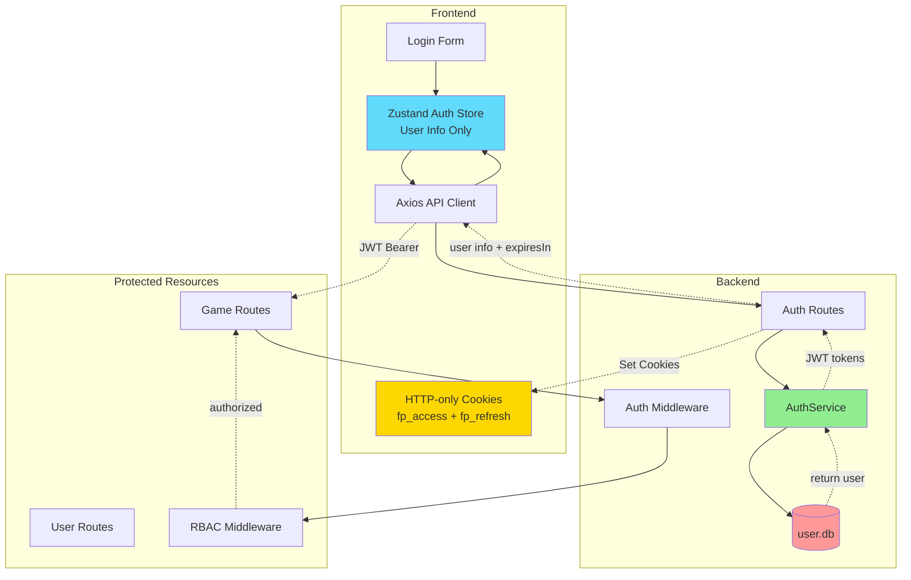
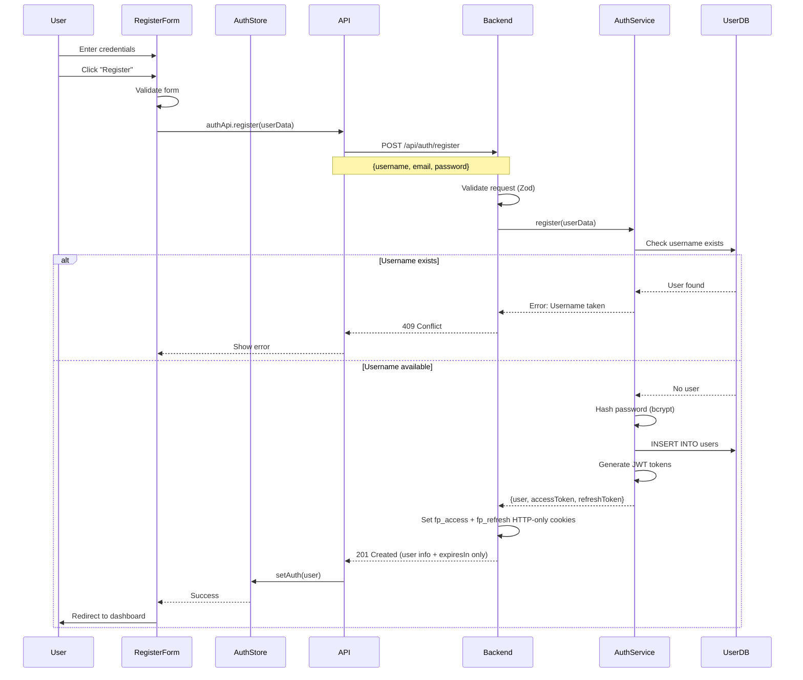
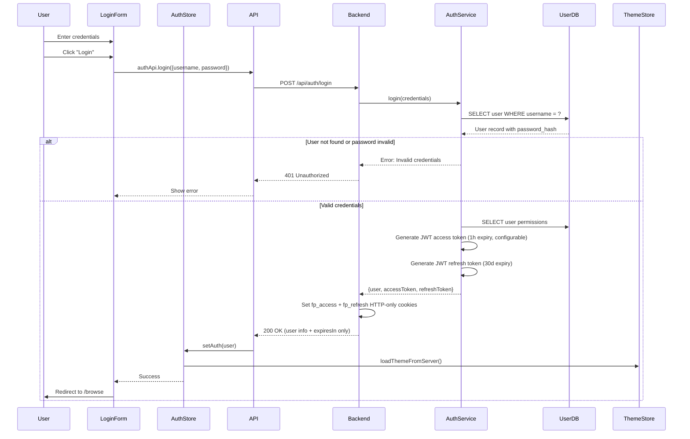
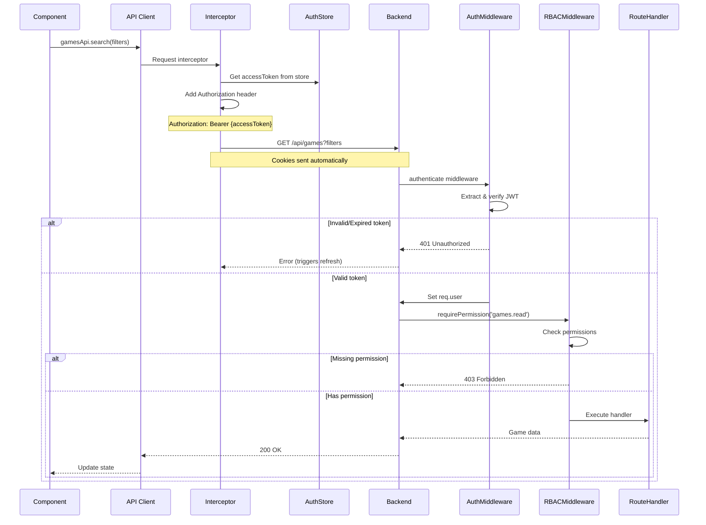
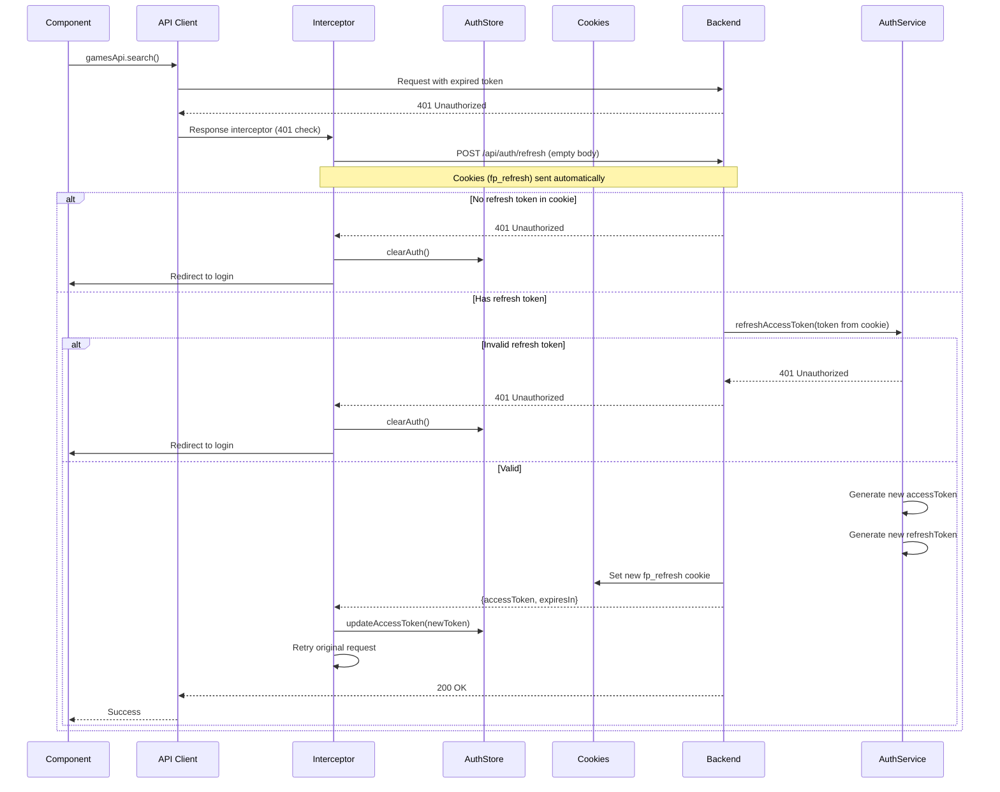
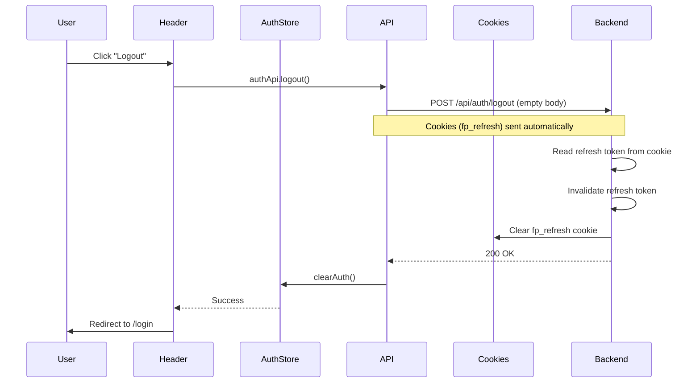
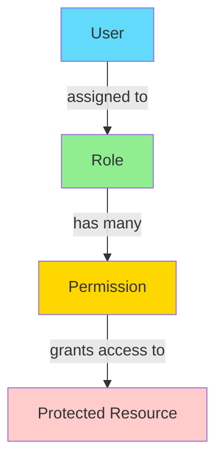

# Authentication Flow

## Overview

Flashpoint Web uses JWT-based authentication with role-based access control
(RBAC).

## Authentication Architecture



## 1. User Registration Flow



**Password Validation Schema**:

```typescript
const registerSchema = z
  .object({
    username: z.string().min(3).max(50),
    email: z.string().email(),
    password: z.string().min(6),
    confirmPassword: z.string(),
  })
  .refine((data) => data.password === data.confirmPassword, {
    message: "Passwords don't match",
    path: ['confirmPassword'],
  });
```

## 2. User Login Flow



**JWT Token Structure**:

```typescript
// Access Token (stored in HTTP-only cookie fp_access, path: /api)
{
  userId: 1,
  username: "user",
  email: "user@example.com",
  role: "user",
  permissions: ["games.read", "games.play"],
  iat: 1705579200,
  exp: 1705582800   // 1 hour (configurable via JWT_EXPIRES_IN)
}

// Refresh Token (stored in HTTP-only cookie fp_refresh, path: /api/auth)
{
  userId: 1,
  type: "refresh",
  iat: 1705579200,
  exp: 1708257600   // 30 days
}
```

## 3. Protected Request Flow



**Authentication Middleware**:

```typescript
export const authenticate = async (req, res, next) => {
  try {
    const authHeader = req.headers.authorization;
    if (!authHeader?.startsWith('Bearer ')) {
      throw new AppError(401, 'No token provided');
    }

    const token = authHeader.substring(7);
    const decoded = jwt.verify(token, process.env.JWT_SECRET);
    const user = await authService.getUserWithPermissions(decoded.userId);

    req.user = {
      id: user.id,
      username: user.username,
      email: user.email,
      role: user.roleName,
      permissions: user.permissions,
    };

    next();
  } catch (error) {
    next(new AppError(401, 'Invalid token'));
  }
};
```

**RBAC Middleware**:

```typescript
export const requirePermission = (permission: string) => {
  return (req, res, next) => {
    if (!req.user?.permissions.includes(permission)) {
      return next(new AppError(403, `Permission denied: ${permission}`));
    }
    next();
  };
};
```

## 4. Token Refresh Flow



**Axios Response Interceptor**:

```typescript
api.interceptors.response.use(
  (response) => response,
  async (error) => {
    const originalRequest = error.config;

    if (error.response?.status === 401 && !originalRequest._retry) {
      originalRequest._retry = true;

      try {
        // Refresh token is sent in HTTP-only cookie automatically
        const { data } = await authApi.refreshToken();
        useAuthStore.getState().updateAccessToken(data.accessToken);
        originalRequest.headers.Authorization = `Bearer ${data.accessToken}`;
        return api(originalRequest);
      } catch (refreshError) {
        useAuthStore.getState().clearAuth();
        window.location.href = '/login';
        return Promise.reject(refreshError);
      }
    }

    return Promise.reject(error);
  }
);
```

**Page Reload Recovery**:

When the page reloads, the access token in memory is lost, but the refresh token
remains in the HTTP-only cookie. The frontend auth initialization sequence detects
this and automatically calls `/auth/refresh` to recover the session:

```typescript
// During app initialization
useEffect(() => {
  const { isAuthenticated, accessToken } = useAuthStore.getState();
  if (isAuthenticated && !accessToken) {
    // Session exists (has refresh cookie) but no access token in memory
    authApi.refreshToken().then(({ data }) => {
      useAuthStore.getState().updateAccessToken(data.accessToken);
    });
  }
}, []);
```

## 5. Logout Flow



## 6. Role-Based Access Control



**Database Schema**:

```sql
CREATE TABLE roles (
  id INTEGER PRIMARY KEY AUTOINCREMENT,
  name TEXT UNIQUE NOT NULL,
  description TEXT,
  created_at TEXT DEFAULT (datetime('now'))
);

CREATE TABLE permissions (
  id INTEGER PRIMARY KEY AUTOINCREMENT,
  name TEXT UNIQUE NOT NULL,
  description TEXT,
  resource TEXT NOT NULL,
  action TEXT NOT NULL
);

CREATE TABLE role_permissions (
  role_id INTEGER NOT NULL,
  permission_id INTEGER NOT NULL,
  PRIMARY KEY (role_id, permission_id),
  FOREIGN KEY (role_id) REFERENCES roles(id) ON DELETE CASCADE,
  FOREIGN KEY (permission_id) REFERENCES permissions(id) ON DELETE CASCADE
);
```

**Default Roles**:

- `admin`: Full system access
- `moderator`: Content management and user support
- `user`: Standard user features (games, playlists)
- `guest`: Read-only access (if enabled)

**Common Permissions**:

```
games.read, games.play
playlists.read, playlists.create, playlists.update, playlists.delete
users.read, users.create, users.update, users.delete
roles.read, roles.create, roles.update, roles.delete
settings.update
```

**Frontend Permission Checks**:

```typescript
export const ProtectedRoute = ({ children, requiredPermission }) => {
  const { isAuthenticated, hasPermission } = useAuthStore();

  if (!isAuthenticated) {
    return <Navigate to="/login" />;
  }

  if (requiredPermission && !hasPermission(requiredPermission)) {
    return <Navigate to="/unauthorized" />;
  }

  return <>{children}</>;
};

// Usage
{hasPermission('users.create') && (
  <Button onClick={handleCreateUser}>Create User</Button>
)}
```

## 7. Guest Mode

When `auth.guest_access_enabled` is true in system settings, unauthenticated
users can browse games with limited permissions. **Note:** Guests cannot play
games — only authenticated users have the `games.play` permission.

```typescript
// Frontend
const guestUser: User = {
  id: 0,
  username: 'Guest',
  role: 'guest',
  permissions: ['games.read', 'playlists.read'],  // No games.play
};

// Backend
export const optionalAuth = async (req, res, next) => {
  const authHeader = req.headers.authorization;

  if (authHeader?.startsWith('Bearer ')) {
    const token = authHeader.substring(7);
    const user = await authService.verifyAccessToken(token);
    req.user = user;
  } else {
    const settings = await authSettingsService.getSettings();
    if (!settings.guestAccessEnabled) {
      throw new AppError(401, 'Authentication required');
    }
    req.user = {
      id: 0,
      username: 'guest',
      role: 'guest',
      permissions: ['games.read', 'playlists.read'],  // Read-only access
    };
  }

  next();
};
```

## Security Measures

**Password Security**: Bcrypt with 10 rounds (configurable via `BCRYPT_SALT_ROUNDS`)

**JWT Security**:

- Access tokens (1 hour default, configurable via `JWT_EXPIRES_IN`) - stored in HTTP-only cookie `fp_access` with path `/api`
- Long-lived refresh tokens (30 days) - stored in HTTP-only cookie `fp_refresh` with path `/api/auth`
- Both tokens in HTTP-only cookies prevents XSS token theft
- Refresh tokens are rotated on each use to prevent token reuse attacks
- Signed with random 256-bit JWT_SECRET
- Verify algorithm: HS256
- HTTP-only cookie prevents XSS attacks from accessing the refresh token

**Rate Limiting**: 5 login attempts per 15 minutes

**Input Sanitization**: Zod schema validation on all routes

**HTTPS**: Secure cookies in production only

**HTTP-only Cookies**: `fp_refresh` cookie is configured with:
- `httpOnly: true` - Not accessible to JavaScript (prevents XSS)
- `secure: true` - Only sent over HTTPS in production
- `sameSite: 'lax'` - CSRF protection
- `path: '/api/auth'` - Only sent to auth endpoints
- `maxAge: 2592000000` - 30 days (in milliseconds)

## Troubleshooting

| Issue                         | Cause                      | Solution                                              |
| ----------------------------- | -------------------------- | ----------------------------------------------------- |
| 401 on valid requests         | Token expired              | Automatic refresh in Axios interceptor                |
| Infinite refresh loop         | Refresh token also expired | Force logout and redirect to login                    |
| 403 despite logged in         | Missing permission         | Check user role and permissions in database           |
| Guest access not working      | Setting disabled           | Verify `auth.guest_access_enabled` in system_settings |
| Admin gets 503 in maintenance | Unauthenticated request    | Use authenticated `api` client, not raw `fetch()`     |
