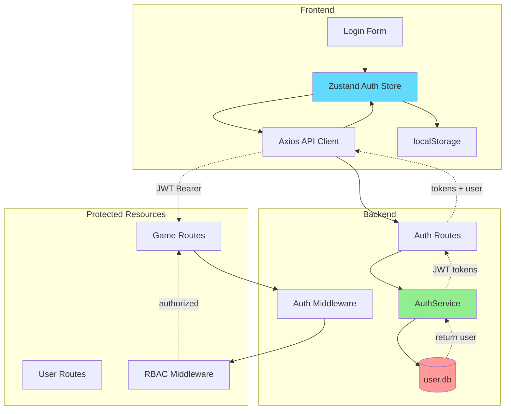
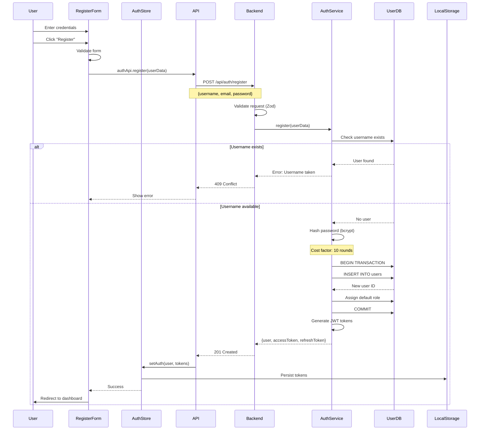
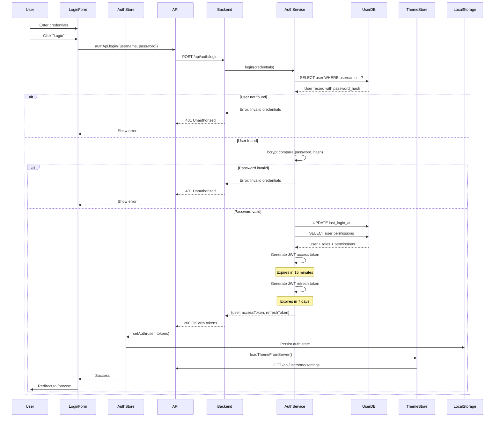
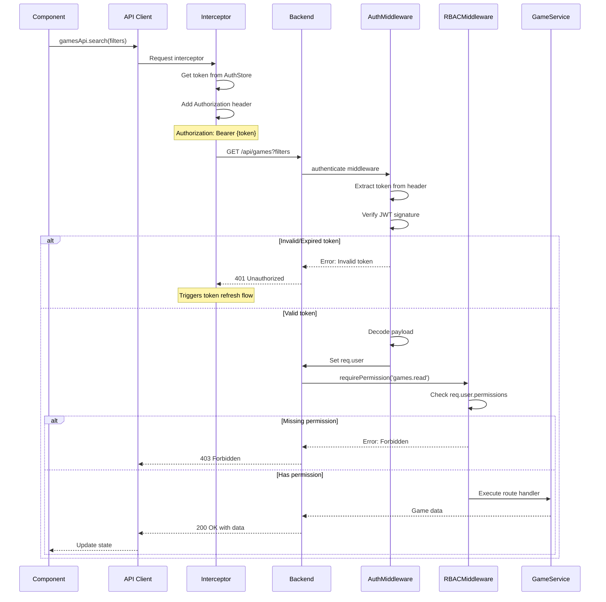
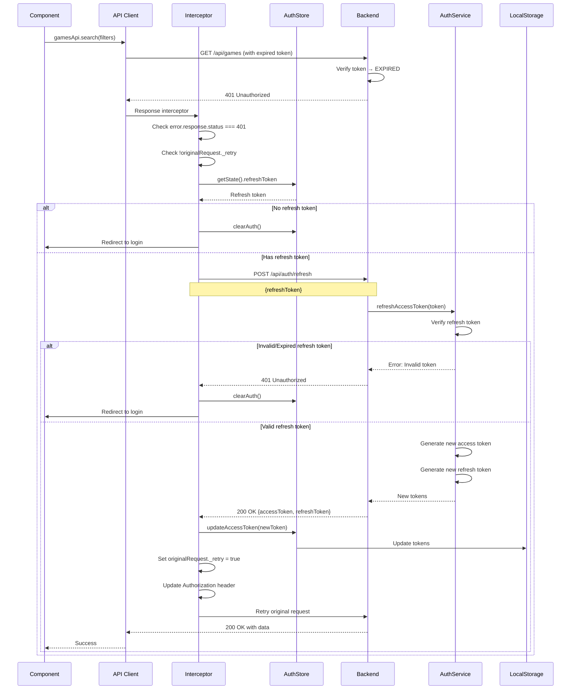
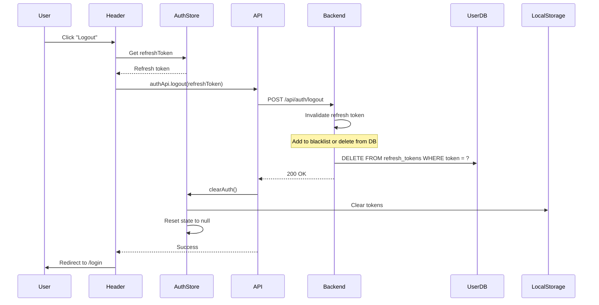
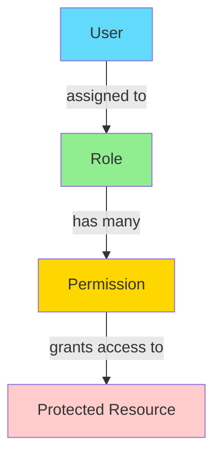
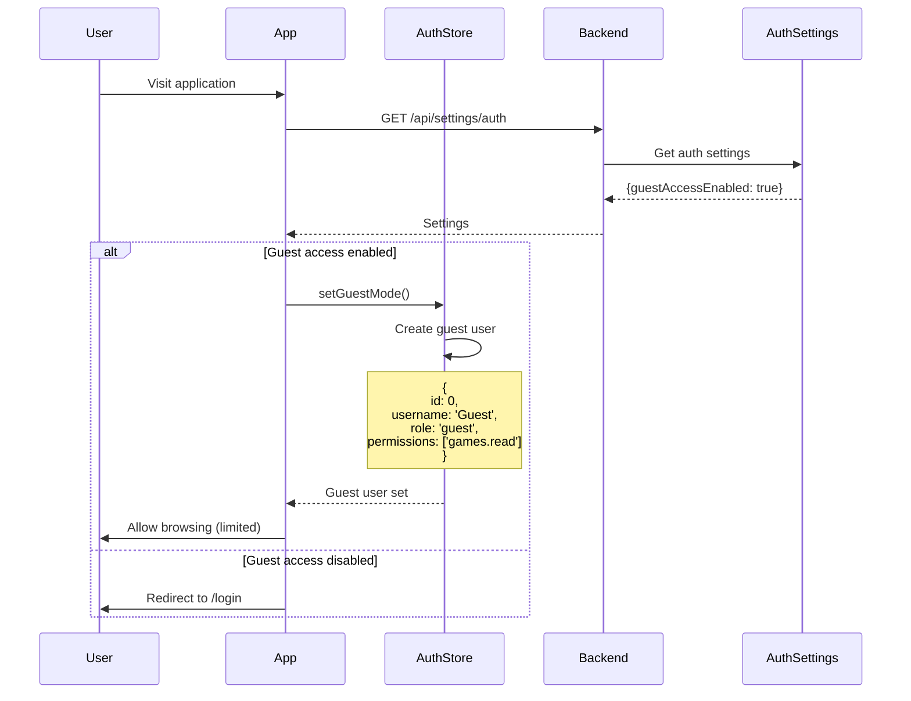

# Authentication Flow

## Overview

Flashpoint Web uses JWT-based authentication with role-based access control (RBAC). This document details the complete authentication flow from login to token refresh, including authorization patterns and security considerations.

## Authentication Architecture



## 1. User Registration Flow

### Sequence Diagram



### Registration Data Flow

**1. Frontend Validation**:
```typescript
const registerSchema = z.object({
  username: z.string().min(3).max(50),
  email: z.string().email(),
  password: z.string().min(6),
  confirmPassword: z.string()
}).refine(data => data.password === data.confirmPassword, {
  message: "Passwords don't match",
  path: ["confirmPassword"]
});
```

**2. Backend Processing**:
```typescript
// AuthService.register()
export class AuthService {
  async register(data: RegisterData): Promise<LoginResponse> {
    // Check if username exists
    const existingUser = UserDatabaseService.get(
      'SELECT id FROM users WHERE username = ?',
      [data.username]
    );
    if (existingUser) {
      throw new AppError(409, 'Username already exists');
    }

    // Check if email exists
    const existingEmail = UserDatabaseService.get(
      'SELECT id FROM users WHERE email = ?',
      [data.email]
    );
    if (existingEmail) {
      throw new AppError(409, 'Email already exists');
    }

    // Hash password
    const passwordHash = await bcrypt.hash(data.password, 10);

    // Get default role
    const defaultRole = UserDatabaseService.get(
      'SELECT id FROM roles WHERE name = ?',
      ['user']
    );

    // Create user
    const result = UserDatabaseService.run(
      'INSERT INTO users (username, email, password_hash, role_id) VALUES (?, ?, ?, ?)',
      [data.username, data.email, passwordHash, defaultRole.id]
    );

    const userId = result.lastInsertRowid as number;

    // Get full user with permissions
    const user = await this.getUserWithPermissions(userId);

    // Generate tokens
    const accessToken = this.generateAccessToken(user);
    const refreshToken = this.generateRefreshToken(user);

    return {
      user: {
        id: user.id,
        username: user.username,
        email: user.email,
        role: user.roleName,
        permissions: user.permissions
      },
      accessToken,
      refreshToken
    };
  }
}
```

## 2. User Login Flow

### Sequence Diagram



### JWT Token Structure

**Access Token Payload**:
```typescript
{
  userId: 1,
  username: "user",
  email: "user@example.com",
  role: "user",
  permissions: ["games.read", "games.play", "playlists.create"],
  iat: 1705579200,  // Issued at
  exp: 1705580100   // Expires at (15 minutes later)
}
```

**Refresh Token Payload**:
```typescript
{
  userId: 1,
  type: "refresh",
  iat: 1705579200,
  exp: 1706184000  // Expires at (7 days later)
}
```

### Token Generation

```typescript
import jwt from 'jsonwebtoken';

export function generateAccessToken(user: UserWithPermissions): string {
  const payload = {
    userId: user.id,
    username: user.username,
    email: user.email,
    role: user.roleName,
    permissions: user.permissions
  };

  return jwt.sign(payload, process.env.JWT_SECRET || 'default-secret', {
    expiresIn: process.env.JWT_EXPIRES_IN || '15m'
  });
}

export function generateRefreshToken(user: UserWithPermissions): string {
  const payload = {
    userId: user.id,
    type: 'refresh'
  };

  return jwt.sign(payload, process.env.JWT_SECRET || 'default-secret', {
    expiresIn: process.env.REFRESH_TOKEN_EXPIRES_IN || '7d'
  });
}
```

## 3. Protected Request Flow

### Sequence Diagram



### Authentication Middleware

```typescript
export const authenticate = async (
  req: Request,
  res: Response,
  next: NextFunction
) => {
  try {
    // Get token from Authorization header
    const authHeader = req.headers.authorization;
    if (!authHeader || !authHeader.startsWith('Bearer ')) {
      throw new AppError(401, 'No token provided');
    }

    const token = authHeader.substring(7); // Remove 'Bearer ' prefix

    // Verify token
    const decoded = jwt.verify(token, process.env.JWT_SECRET || 'default-secret');

    // Get full user data with permissions
    const user = await authService.getUserWithPermissions(decoded.userId);

    if (!user) {
      throw new AppError(401, 'User not found');
    }

    // Attach user to request
    req.user = {
      id: user.id,
      username: user.username,
      email: user.email,
      role: user.roleName,
      permissions: user.permissions
    };

    next();
  } catch (error) {
    if (error instanceof jwt.JsonWebTokenError) {
      next(new AppError(401, 'Invalid token'));
    } else if (error instanceof jwt.TokenExpiredError) {
      next(new AppError(401, 'Token expired'));
    } else {
      next(error);
    }
  }
};
```

### RBAC Middleware

```typescript
export const requirePermission = (permission: string) => {
  return (req: Request, res: Response, next: NextFunction) => {
    if (!req.user) {
      return next(new AppError(401, 'Authentication required'));
    }

    if (!req.user.permissions.includes(permission)) {
      return next(new AppError(403, `Permission denied: ${permission} required`));
    }

    next();
  };
};

// Usage in routes
router.get('/games',
  authenticate,                      // Verify JWT
  requirePermission('games.read'),   // Check permission
  async (req, res) => { ... }
);
```

## 4. Token Refresh Flow

### Sequence Diagram



### Axios Response Interceptor

```typescript
api.interceptors.response.use(
  (response) => response,
  async (error) => {
    const originalRequest = error.config;

    // If error is 401 and we haven't retried yet
    if (error.response?.status === 401 && !originalRequest._retry) {
      originalRequest._retry = true;

      try {
        const refreshToken = useAuthStore.getState().refreshToken;

        if (!refreshToken) {
          // No refresh token available, clear auth and redirect to login
          useAuthStore.getState().clearAuth();
          window.location.href = '/login';
          return Promise.reject(error);
        }

        // Try to refresh the token
        const tokens = await authApi.refreshToken(refreshToken);

        // Update the access token in the store
        useAuthStore.getState().updateAccessToken(tokens.accessToken);

        // Update the authorization header and retry the original request
        originalRequest.headers.Authorization = `Bearer ${tokens.accessToken}`;
        return api(originalRequest);
      } catch (refreshError) {
        // Refresh failed, clear auth and redirect to login
        useAuthStore.getState().clearAuth();
        window.location.href = '/login';
        return Promise.reject(refreshError);
      }
    }

    return Promise.reject(error);
  }
);
```

## 5. Logout Flow

### Sequence Diagram



### Logout Implementation

```typescript
// Frontend
const handleLogout = async () => {
  try {
    const { refreshToken } = useAuthStore.getState();
    if (refreshToken) {
      await authApi.logout(refreshToken);
    }
  } catch (error) {
    console.error('Logout error:', error);
  } finally {
    // Always clear local auth state
    useAuthStore.getState().clearAuth();
    navigate('/login');
  }
};

// Backend
export class AuthService {
  async logout(refreshToken: string): Promise<void> {
    try {
      // Verify token
      const decoded = jwt.verify(refreshToken, process.env.JWT_SECRET);

      // Invalidate token (if using token blacklist)
      // Or delete from refresh_tokens table (if storing them)
      await this.invalidateRefreshToken(refreshToken);

      logger.info(`User ${decoded.userId} logged out`);
    } catch (error) {
      logger.warn('Logout error:', error);
      // Don't throw - allow logout even if token is invalid
    }
  }
}
```

## 6. Role-Based Access Control (RBAC)

### Permission Model



### Database Schema

```sql
-- Roles table
CREATE TABLE roles (
  id INTEGER PRIMARY KEY AUTOINCREMENT,
  name TEXT UNIQUE NOT NULL,
  description TEXT,
  created_at TEXT DEFAULT (datetime('now'))
);

-- Permissions table
CREATE TABLE permissions (
  id INTEGER PRIMARY KEY AUTOINCREMENT,
  name TEXT UNIQUE NOT NULL,
  description TEXT,
  resource TEXT NOT NULL,
  action TEXT NOT NULL
);

-- Role-Permission mapping
CREATE TABLE role_permissions (
  role_id INTEGER NOT NULL,
  permission_id INTEGER NOT NULL,
  PRIMARY KEY (role_id, permission_id),
  FOREIGN KEY (role_id) REFERENCES roles(id) ON DELETE CASCADE,
  FOREIGN KEY (permission_id) REFERENCES permissions(id) ON DELETE CASCADE
);

-- User-Role assignment
CREATE TABLE users (
  id INTEGER PRIMARY KEY AUTOINCREMENT,
  username TEXT UNIQUE NOT NULL,
  email TEXT UNIQUE NOT NULL,
  password_hash TEXT NOT NULL,
  role_id INTEGER NOT NULL,
  FOREIGN KEY (role_id) REFERENCES roles(id)
);
```

### Default Permissions

```typescript
const defaultPermissions = [
  // Games
  { name: 'games.read', resource: 'games', action: 'read' },
  { name: 'games.play', resource: 'games', action: 'play' },

  // Playlists
  { name: 'playlists.read', resource: 'playlists', action: 'read' },
  { name: 'playlists.create', resource: 'playlists', action: 'create' },
  { name: 'playlists.update', resource: 'playlists', action: 'update' },
  { name: 'playlists.delete', resource: 'playlists', action: 'delete' },

  // Users (admin only)
  { name: 'users.read', resource: 'users', action: 'read' },
  { name: 'users.create', resource: 'users', action: 'create' },
  { name: 'users.update', resource: 'users', action: 'update' },
  { name: 'users.delete', resource: 'users', action: 'delete' },

  // Roles (admin only)
  { name: 'roles.read', resource: 'roles', action: 'read' },
  { name: 'roles.create', resource: 'roles', action: 'create' },
  { name: 'roles.update', resource: 'roles', action: 'update' },
  { name: 'roles.delete', resource: 'roles', action: 'delete' },

  // Settings (admin only)
  { name: 'settings.update', resource: 'settings', action: 'update' }
];
```

### Default Roles

```typescript
const defaultRoles = [
  {
    name: 'admin',
    description: 'Full system access',
    permissions: [
      'games.read', 'games.play',
      'playlists.read', 'playlists.create', 'playlists.update', 'playlists.delete',
      'users.read', 'users.create', 'users.update', 'users.delete',
      'roles.read', 'roles.create', 'roles.update', 'roles.delete',
      'settings.update'
    ]
  },
  {
    name: 'moderator',
    description: 'Content management and user support',
    permissions: [
      'games.read', 'games.play',
      'playlists.read', 'playlists.create', 'playlists.update', 'playlists.delete',
      'users.read'
    ]
  },
  {
    name: 'user',
    description: 'Standard user',
    permissions: [
      'games.read', 'games.play',
      'playlists.read', 'playlists.create', 'playlists.update', 'playlists.delete'
    ]
  },
  {
    name: 'guest',
    description: 'Read-only access',
    permissions: [
      'games.read',
      'playlists.read'
    ]
  }
];
```

### Frontend Permission Checks

```typescript
// ProtectedRoute component
export const ProtectedRoute = ({
  children,
  requiredPermission
}: {
  children: React.ReactNode;
  requiredPermission?: string;
}) => {
  const { isAuthenticated, hasPermission } = useAuthStore();

  if (!isAuthenticated) {
    return <Navigate to="/login" />;
  }

  if (requiredPermission && !hasPermission(requiredPermission)) {
    return <Navigate to="/unauthorized" />;
  }

  return <>{children}</>;
};

// Usage in routes
<Route
  path="/users"
  element={
    <ProtectedRoute requiredPermission="users.read">
      <UsersView />
    </ProtectedRoute>
  }
/>

// Conditional rendering
const { hasPermission } = useAuthStore();

{hasPermission('users.create') && (
  <Button onClick={handleCreateUser}>Create User</Button>
)}
```

## 7. Guest Mode (Optional Authentication)

### Sequence Diagram



### Guest User Implementation

```typescript
// Frontend
export const useAuthStore = create<AuthState>()((set, get) => ({
  setGuestMode: () => {
    const guestUser: User = {
      id: 0,
      username: 'Guest',
      email: 'guest@flashpoint.local',
      role: 'guest',
      permissions: ['games.read', 'games.play']
    };
    set({
      user: guestUser,
      accessToken: null,
      refreshToken: null,
      isAuthenticated: false,
      isGuest: true
    });
  }
}));

// Backend middleware
export const optionalAuth = async (req, res, next) => {
  const authHeader = req.headers.authorization;

  if (authHeader && authHeader.startsWith('Bearer ')) {
    // Has token - verify it
    const token = authHeader.substring(7);
    const user = await authService.verifyAccessToken(token);
    req.user = user;
  } else {
    // No token - check if guest access enabled
    const settings = await authSettingsService.getSettings();

    if (!settings.guestAccessEnabled) {
      throw new AppError(401, 'Authentication required');
    }

    // Set guest user
    req.user = {
      id: 0,
      username: 'guest',
      email: '',
      role: 'guest',
      permissions: ['games.read', 'playlists.read']
    };
  }

  next();
};
```

## Security Best Practices

### 1. Password Security

```typescript
import bcrypt from 'bcrypt';

// Hashing (registration)
const saltRounds = 10;
const passwordHash = await bcrypt.hash(password, saltRounds);

// Verification (login)
const isValid = await bcrypt.compare(password, storedHash);
```

### 2. JWT Security

**Secure Secret**:
```bash
# .env
JWT_SECRET=random-256-bit-secret-here-use-crypto.randomBytes(32).toString('hex')
```

**Short Expiration**:
```typescript
// Access token: 15 minutes
expiresIn: '15m'

// Refresh token: 7 days
expiresIn: '7d'
```

**Verify Algorithm**:
```typescript
jwt.verify(token, secret, { algorithms: ['HS256'] });
```

### 3. HTTPS Only (Production)

```typescript
// Set secure cookies in production
res.cookie('refreshToken', token, {
  httpOnly: true,
  secure: process.env.NODE_ENV === 'production',
  sameSite: 'strict',
  maxAge: 7 * 24 * 60 * 60 * 1000 // 7 days
});
```

### 4. Rate Limiting

```typescript
import rateLimit from 'express-rate-limit';

const loginLimiter = rateLimit({
  windowMs: 15 * 60 * 1000, // 15 minutes
  max: 5, // 5 attempts
  message: 'Too many login attempts, please try again later',
  skipSuccessfulRequests: true
});

router.post('/auth/login', loginLimiter, loginHandler);
```

### 5. Input Sanitization

```typescript
import { z } from 'zod';

const loginSchema = z.object({
  username: z.string().min(3).max(50).trim(),
  password: z.string().min(6).max(100)
});

// Prevents SQL injection and XSS
const validated = loginSchema.parse(req.body);
```

## Troubleshooting

### Common Issues

**1. Token Expired During Request**:
- Symptom: 401 errors on valid requests
- Solution: Implemented automatic token refresh in Axios interceptor

**2. Refresh Loop**:
- Symptom: Infinite refresh attempts
- Solution: Added `_retry` flag to prevent loops

**3. Permission Denied**:
- Symptom: 403 errors despite being logged in
- Solution: Check user role and assigned permissions in database

**4. Guest Access Not Working**:
- Symptom: Login required even with guest mode enabled
- Solution: Verify `auth.guest_access_enabled` setting is true in system_settings table

## Conclusion

The authentication flow in Flashpoint Web provides:

- Secure JWT-based authentication
- Automatic token refresh for seamless UX
- Role-based access control with granular permissions
- Optional guest mode for public browsing
- Protection against common security vulnerabilities

This architecture balances security with usability, ensuring users stay authenticated while protecting sensitive resources and operations.
