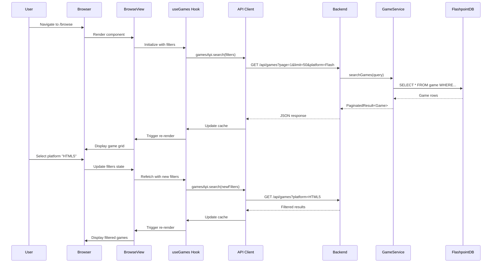
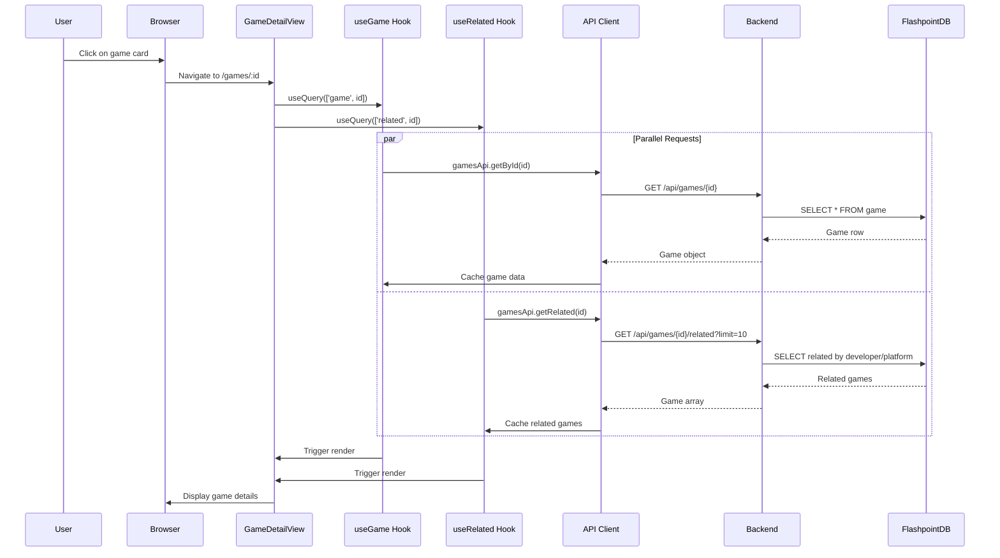
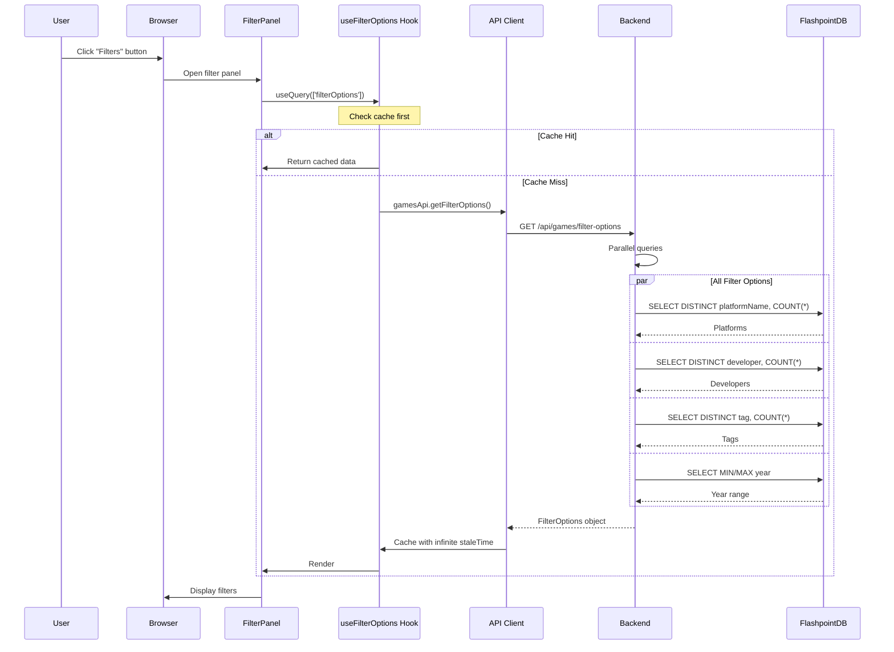
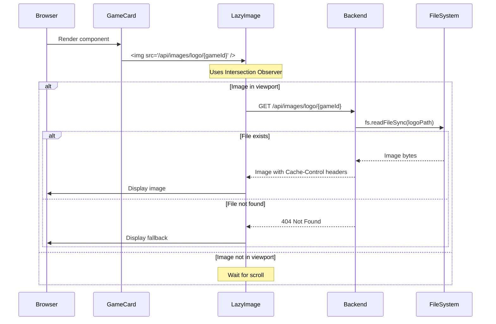
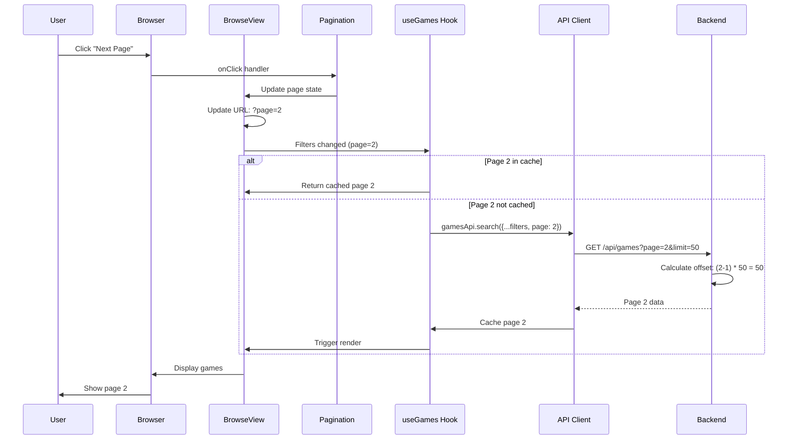
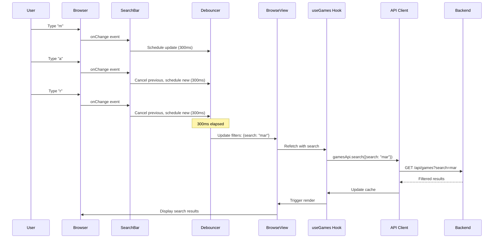
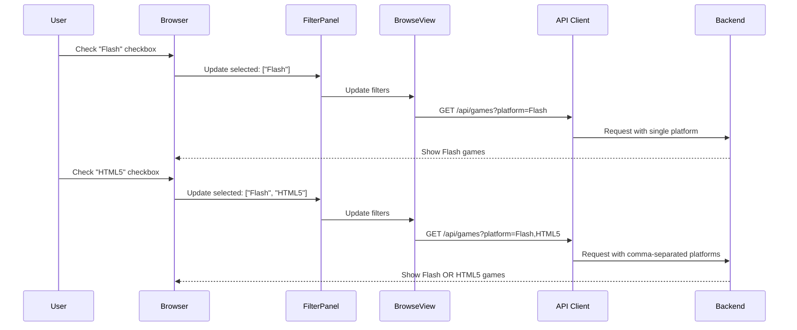
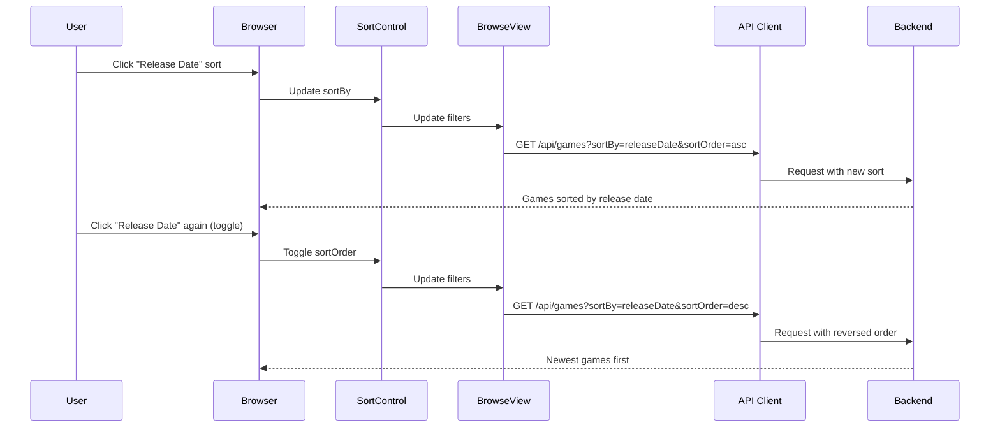
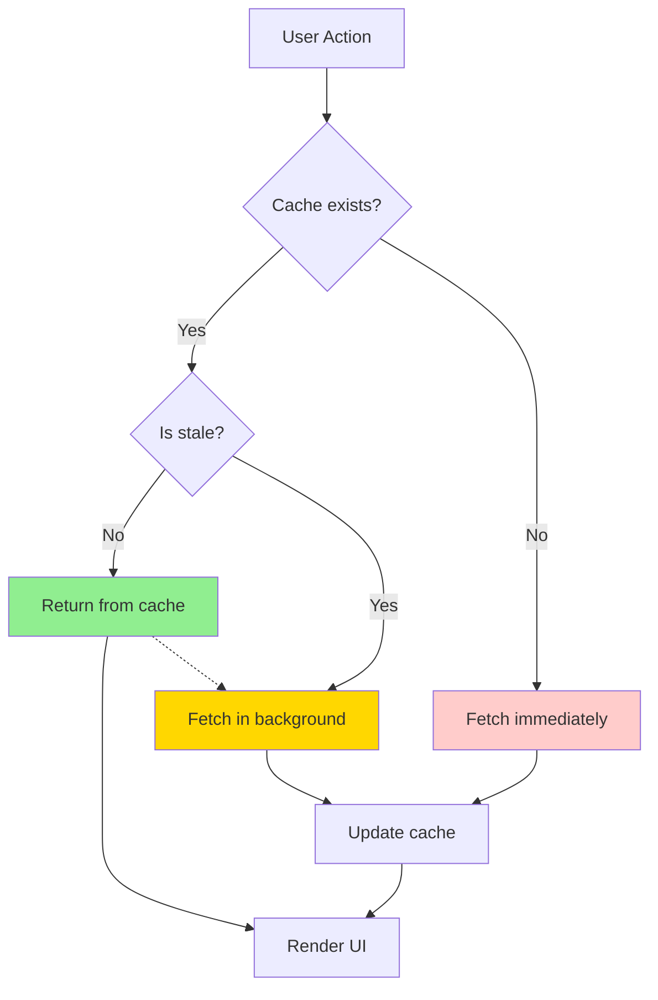

# Data Flow Diagrams

## 1. Game Browse and Search Flow



**Data Transformation**:
- Frontend state: `{ search: "mario", platform: "Flash", page: 1, limit: 50 }`
- URL params: `?search=mario&platform=Flash&page=1&limit=50`
- Backend validation: Zod schema validation
- SQL: `SELECT * FROM game WHERE platformName = 'Flash' AND title LIKE '%mario%' ... LIMIT 50 OFFSET 0`

## 2. Game Detail View Flow



## 3. Filter Options Loading Flow



**Filter Options Response**:
```json
{
  "platforms": [
    { "name": "Flash", "count": 85000 },
    { "name": "HTML5", "count": 15000 }
  ],
  "developers": [
    { "name": "Developer A", "count": 500 }
  ],
  "tags": [
    { "name": "Action", "count": 15000 }
  ],
  "yearRange": { "min": 1995, "max": 2024 }
}
```

## 4. Image Loading Flow



## 5. Pagination Flow



## 6. Real-time Search Flow



**Debounce Implementation**:
```typescript
const debouncedSearch = useMemo(
  () => debounce((value: string) => {
    onSearch(value);
  }, 300),
  [onSearch]
);

const handleChange = (e: React.ChangeEvent<HTMLInputElement>) => {
  const value = e.target.value;
  setSearchValue(value);        // Immediate UI update
  debouncedSearch(value);       // Debounced API call
};
```

## 7. Multi-Select Filter Flow



**Multi-Select SQL**:
```typescript
// Frontend: Array to string
const platformParam = selectedPlatforms.join(',');  // "Flash,HTML5"

// Backend: Parse back
const platforms = query.platform?.split(',').filter(Boolean);  // ["Flash", "HTML5"]

// SQL: Dynamic placeholders
if (platforms?.length > 0) {
  const placeholders = platforms.map(() => '?').join(', ');
  sql += ` AND g.platformName IN (${placeholders})`;
  params.push(...platforms);
}
```

## 8. Sort Order Change Flow



## 9. Cache Management



**Stale-While-Revalidate**:
```typescript
useQuery({
  queryKey: ['games', filters],
  queryFn: () => gamesApi.search(filters),
  staleTime: 5 * 60 * 1000,         // 5 min - fresh
  cacheTime: 10 * 60 * 1000,        // 10 min - in memory
  refetchOnWindowFocus: true,       // Refresh on tab focus
  keepPreviousData: true            // Show old while fetching new
});
```

## Key Patterns

1. **Layered Architecture**: UI → API → Service → Database
2. **Smart Caching**: TanStack Query provides automatic cache management
3. **Optimistic Updates**: UI updates immediately with rollback on error
4. **Parallel Requests**: Multiple queries execute concurrently
5. **Debouncing**: User input debounced to reduce requests
6. **State Synchronization**: URL state, local state, and server state in sync
