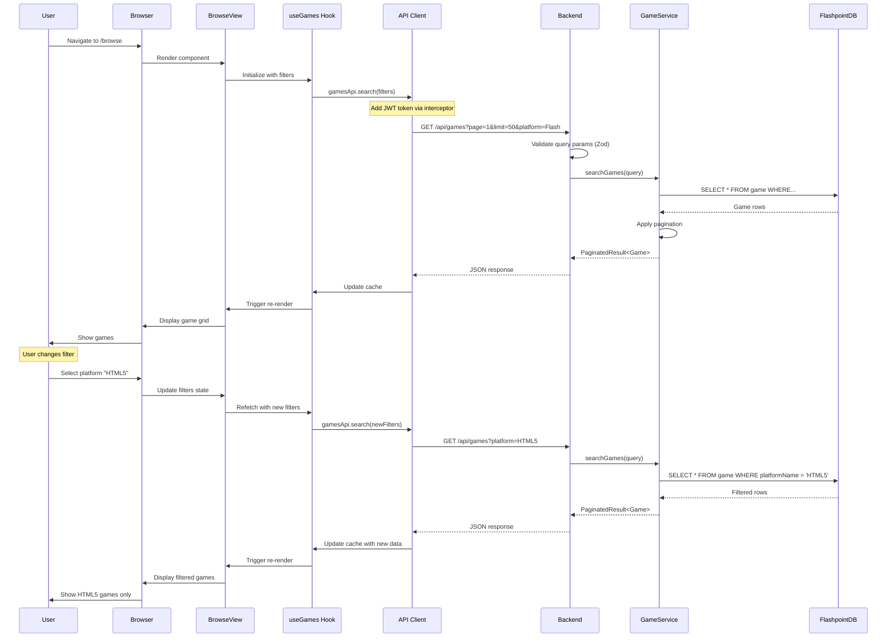
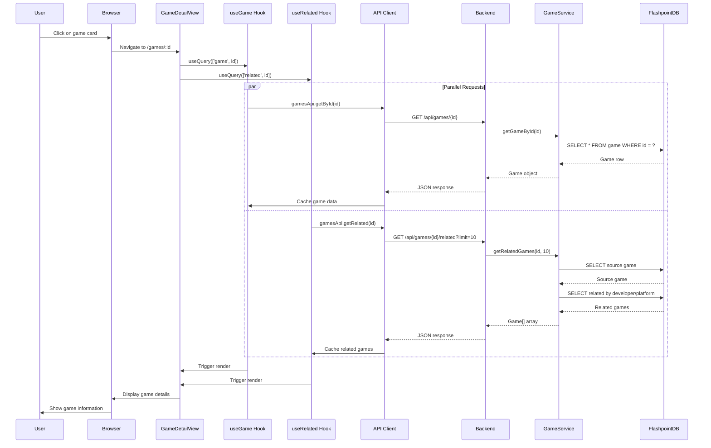
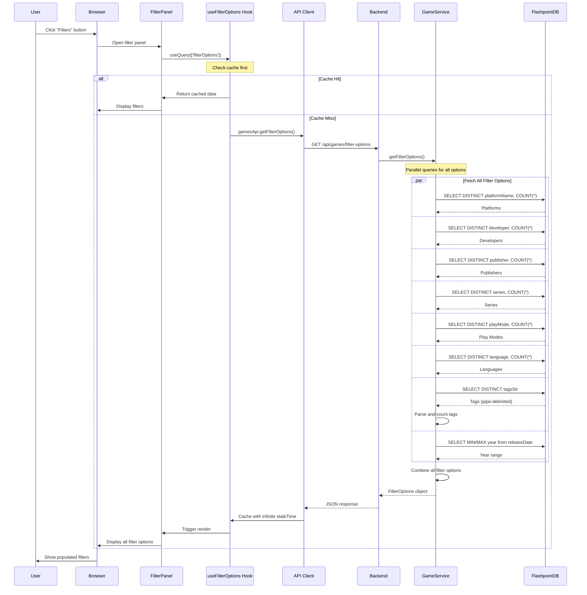
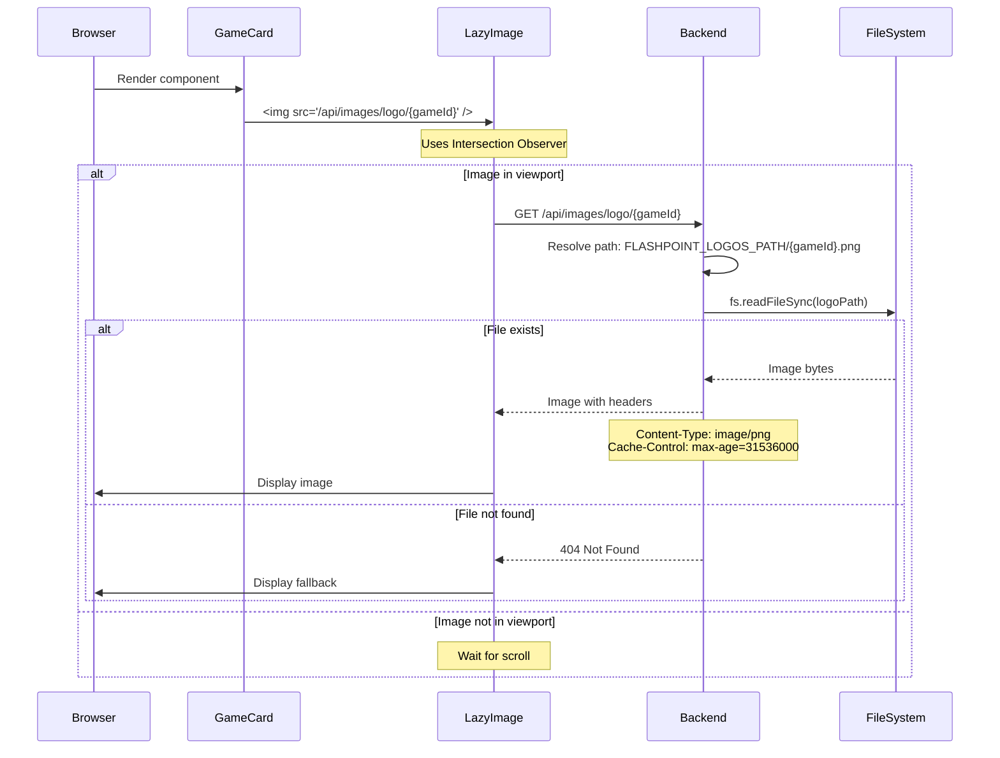
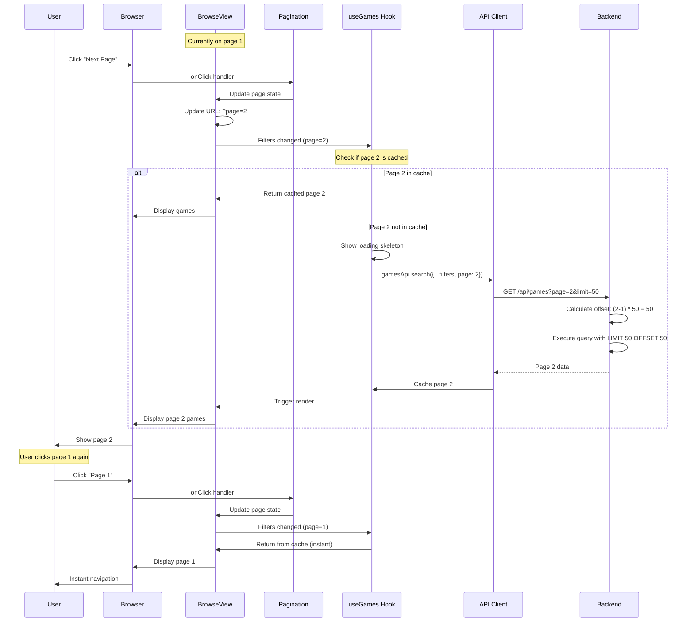
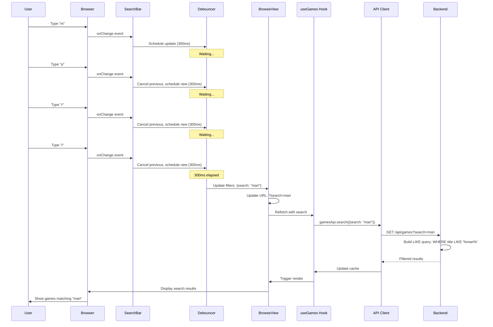
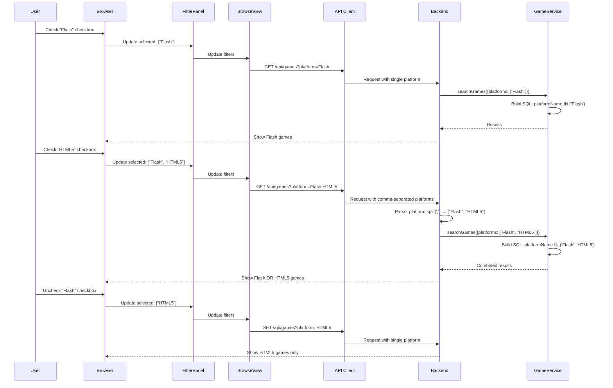
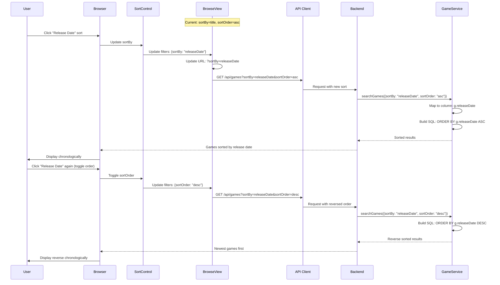
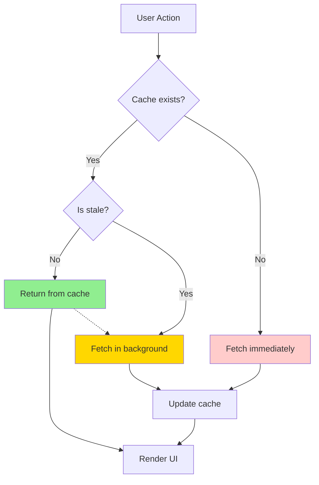

# Data Flow Diagrams

## Overview

This document provides detailed data flow diagrams for key user journeys and system operations in Flashpoint Web. Each diagram illustrates the complete flow of data from user interaction through all system layers to the database and back.

## 1. Game Browse and Search Flow

### User Story
As a user, I want to browse and search for games with filters so I can find games I'm interested in.

### Sequence Diagram



### Data Transformation

**1. User Input → Query Parameters**:
```typescript
// Frontend state
{
  search: "mario",
  platform: "Flash",
  yearFrom: 2000,
  yearTo: 2010,
  page: 1,
  limit: 50
}

// Transformed to URL params
?search=mario&platform=Flash&yearFrom=2000&yearTo=2010&page=1&limit=50
```

**2. Backend Validation**:
```typescript
const searchQuerySchema = z.object({
  search: z.string().optional(),
  platform: z.string().optional(),
  yearFrom: z.coerce.number().int().min(1970).max(2100).optional(),
  yearTo: z.coerce.number().int().min(1970).max(2100).optional(),
  page: z.coerce.number().int().min(1).default(1),
  limit: z.coerce.number().int().min(1).max(100).default(50)
});
```

**3. SQL Query Construction**:
```sql
SELECT
  g.id, g.title, g.developer, g.publisher,
  g.platformName, g.releaseDate, g.logoPath
FROM game g
WHERE 1=1
  AND g.platformName = 'Flash'
  AND g.title LIKE '%mario%'
  AND CAST(SUBSTR(g.releaseDate, 1, 4) AS INTEGER) BETWEEN 2000 AND 2010
  AND (g.broken = 0 OR g.broken IS NULL)
ORDER BY g.orderTitle ASC
LIMIT 50 OFFSET 0
```

**4. Response Transformation**:
```typescript
// Database row
{
  id: 'abc-123',
  title: 'Super Mario Flash',
  developer: 'Developer Name',
  platformName: 'Flash',
  logoPath: 'abc-123.png',
  ...
}

// API Response
{
  data: [{ game objects }],
  total: 1234,
  page: 1,
  limit: 50,
  totalPages: 25
}
```

## 2. Game Detail View Flow

### User Story
As a user, I want to view detailed information about a game including screenshots, metadata, and related games.

### Sequence Diagram



### Related Games Query Logic

```sql
-- 1. Get source game
SELECT * FROM game WHERE id = 'source-id';

-- 2. Find related games with priority scoring
SELECT
  g.id, g.title, g.developer, g.platformName,
  g.logoPath, g.screenshotPath
FROM game g
WHERE g.id != 'source-id'
  AND (
    g.developer = 'Source Developer' OR
    g.platformName = 'Source Platform'
  )
ORDER BY
  CASE
    WHEN g.developer = 'Source Developer' THEN 1
    WHEN g.platformName = 'Source Platform' THEN 2
    ELSE 3
  END,
  RANDOM()
LIMIT 10
```

## 3. Filter Options Loading Flow

### User Story
As a user, when I open the filter panel, I want to see all available filter options with counts.

### Sequence Diagram



### Filter Options Response Structure

```typescript
{
  platforms: [
    { name: "Flash", count: 85000 },
    { name: "HTML5", count: 15000 },
    { name: "Shockwave", count: 5000 }
  ],
  developers: [
    { name: "Developer A", count: 500 },
    { name: "Developer B", count: 300 }
  ],
  publishers: [
    { name: "Publisher A", count: 1000 },
    { name: "Publisher B", count: 800 }
  ],
  series: [
    { name: "Series A", count: 50 },
    { name: "Series B", count: 30 }
  ],
  playModes: [
    { name: "Single Player", count: 80000 },
    { name: "Multiplayer", count: 20000 }
  ],
  languages: [
    { name: "en", count: 90000 },
    { name: "es", count: 5000 }
  ],
  tags: [
    { name: "Action", count: 15000 },
    { name: "Puzzle", count: 10000 }
  ],
  yearRange: {
    min: 1995,
    max: 2024
  }
}
```

## 4. Image Loading Flow

### User Story
As a user, I want to see game logos and screenshots that load efficiently.

### Sequence Diagram



### Image URL Construction

**Logo**:
```typescript
// Frontend
const logoUrl = `/api/images/logo/${game.id}`;

// Backend route
router.get('/images/logo/:gameId', (req, res) => {
  const imagePath = path.join(
    process.env.FLASHPOINT_LOGOS_PATH,
    `${req.params.gameId}.png`
  );
  res.sendFile(imagePath);
});
```

**Screenshot**:
```typescript
// Frontend
const screenshotUrl = `/api/images/screenshot/${game.id}`;

// Backend route
router.get('/images/screenshot/:gameId', (req, res) => {
  const imagePath = path.join(
    process.env.FLASHPOINT_IMAGES_PATH,
    `${req.params.gameId}.png`
  );
  res.sendFile(imagePath);
});
```

## 5. Pagination Flow

### User Story
As a user, I want to navigate through pages of search results efficiently.

### Sequence Diagram



### Pagination State Management

```typescript
// URL state (source of truth)
const [searchParams, setSearchParams] = useSearchParams();
const currentPage = parseInt(searchParams.get('page') || '1');

// Update page
const handlePageChange = (newPage: number) => {
  setSearchParams({ ...Object.fromEntries(searchParams), page: newPage.toString() });
};

// Query key includes page for automatic caching
const queryKey = ['games', { ...filters, page: currentPage }];
```

## 6. Real-time Search Flow

### User Story
As a user, I want search results to update as I type, with debouncing to avoid excessive requests.

### Sequence Diagram



### Debounce Implementation

```typescript
import { useMemo } from 'react';
import { debounce } from 'lodash';

const SearchBar = ({ onSearch }) => {
  const [searchValue, setSearchValue] = useState('');

  const debouncedSearch = useMemo(
    () => debounce((value: string) => {
      onSearch(value);
    }, 300),
    [onSearch]
  );

  const handleChange = (e: React.ChangeEvent<HTMLInputElement>) => {
    const value = e.target.value;
    setSearchValue(value); // Immediate UI update
    debouncedSearch(value); // Debounced API call
  };

  return (
    <input
      type="text"
      value={searchValue}
      onChange={handleChange}
      placeholder="Search games..."
    />
  );
};
```

## 7. Multi-Select Filter Flow

### User Story
As a user, I want to select multiple platforms/developers to see games matching any of them (OR logic).

### Sequence Diagram



### Multi-Select SQL Generation

```typescript
// Frontend: Array to comma-separated string
const platformParam = selectedPlatforms.join(',');
// "Flash,HTML5"

// Backend: Parse back to array
const platforms = query.platform?.split(',').filter(Boolean);
// ["Flash", "HTML5"]

// SQL: Dynamic placeholders
if (platforms && platforms.length > 0) {
  const placeholders = platforms.map(() => '?').join(', ');
  sql += ` AND g.platformName IN (${placeholders})`;
  params.push(...platforms);
}

// Generated SQL:
// WHERE platformName IN (?, ?)
// Params: ["Flash", "HTML5"]
```

## 8. Sort Order Change Flow

### User Story
As a user, I want to sort games by title, release date, or date added in ascending or descending order.

### Sequence Diagram



### Sort Column Mapping

```typescript
private getSortColumn(sortBy: string): string {
  const columnMap: Record<string, string> = {
    title: 'g.orderTitle',      // Normalized for sorting
    releaseDate: 'g.releaseDate',
    dateAdded: 'g.dateAdded',
    developer: 'g.developer'
  };
  return columnMap[sortBy] || 'g.orderTitle';
}

// Usage in query
const sortColumn = this.getSortColumn(query.sortBy);
sql += ` ORDER BY ${sortColumn} ${query.sortOrder.toUpperCase()}`;
```

## 9. Cache Management Flow

### User Story
As a user, I want my data to stay fresh but also load quickly from cache when appropriate.



### Stale-While-Revalidate Strategy

```typescript
// TanStack Query configuration
useQuery({
  queryKey: ['games', filters],
  queryFn: () => gamesApi.search(filters),
  staleTime: 5 * 60 * 1000,        // 5 minutes - consider fresh
  cacheTime: 10 * 60 * 1000,       // 10 minutes - keep in memory
  refetchOnWindowFocus: true,      // Refresh when tab gains focus
  refetchOnReconnect: true,        // Refresh when back online
  keepPreviousData: true           // Show old data while fetching new
});
```

**Timeline**:
```
t=0: Fetch data → Cache (fresh)
t=3min: Return from cache (still fresh)
t=6min: Return from cache (stale) + Fetch in background
t=6min+200ms: Background fetch complete → Update cache
t=11min: Cache expired → Fetch immediately
```

## Conclusion

These data flow diagrams illustrate the complete journey of data through the Flashpoint Web system. Key patterns include:

1. **Layered Architecture**: Clear separation between UI, API, service, and data layers
2. **Smart Caching**: TanStack Query provides intelligent cache management
3. **Optimistic Updates**: UI updates immediately with rollback on error
4. **Parallel Loading**: Multiple queries execute concurrently for performance
5. **Debouncing**: User input is debounced to reduce unnecessary requests
6. **State Synchronization**: URL state, local state, and server state stay in sync

Understanding these flows is essential for debugging issues, optimizing performance, and extending the system with new features.
