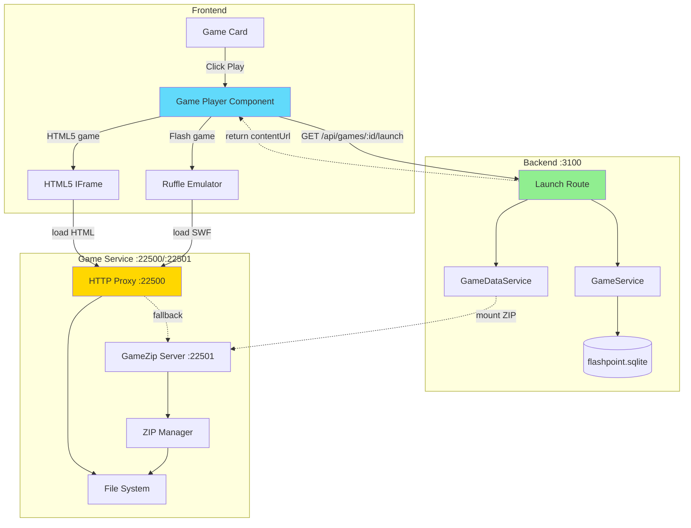
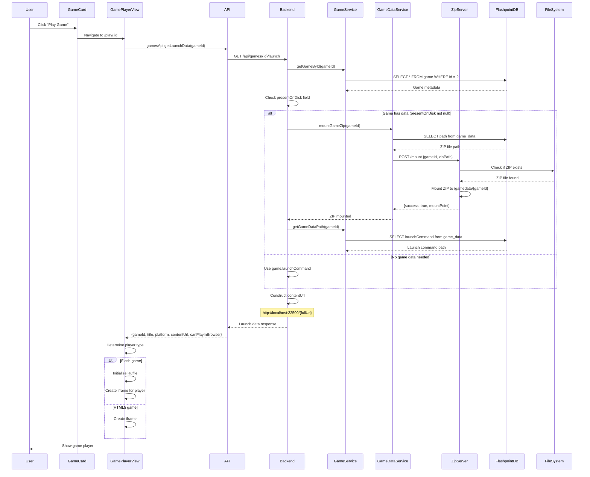
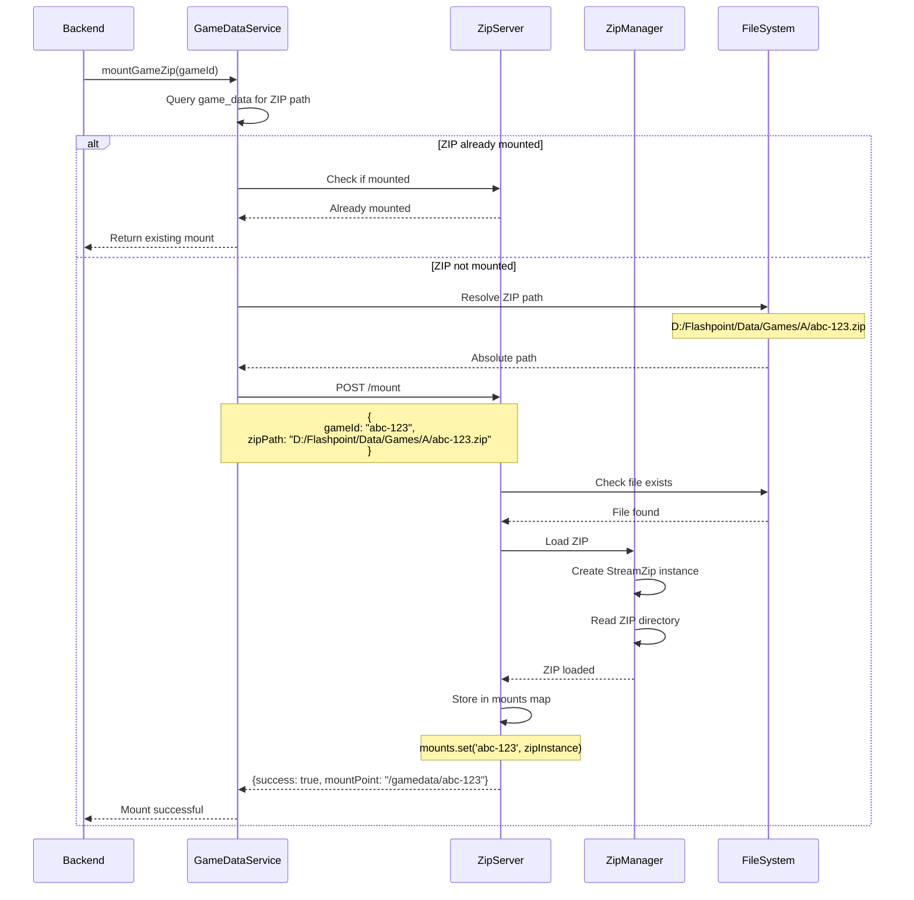
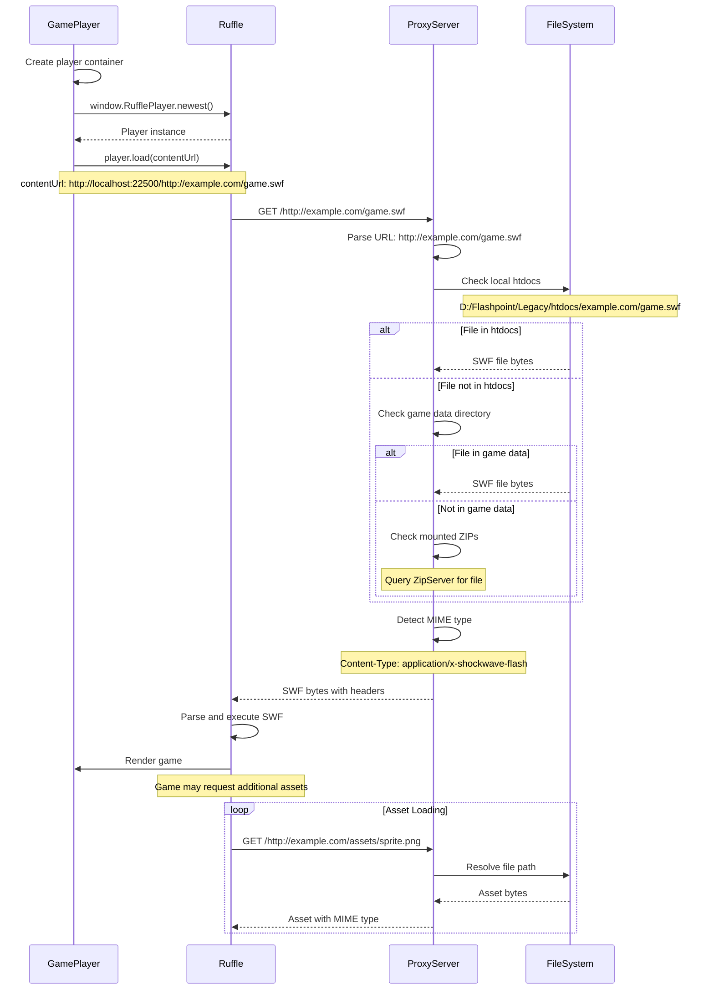
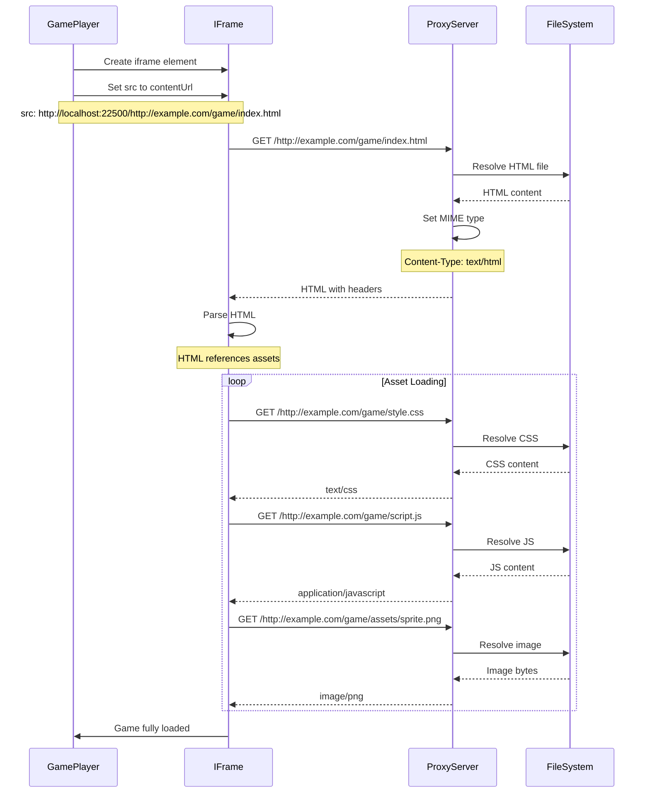
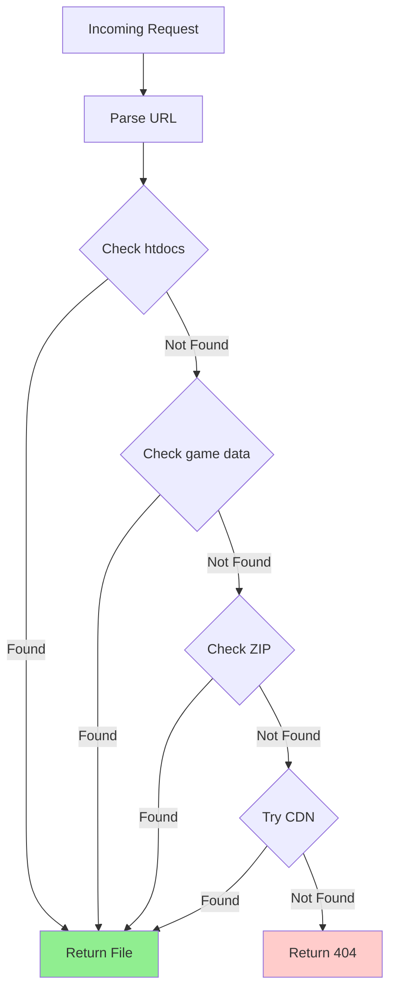

# Game Launch Flow

## Overview

The game launch flow handles the complete journey from a user clicking "Play" on a game to the game loading and running in their browser. This involves coordinating between the frontend, backend, and game service to mount ZIPs, resolve file paths, and load content into the appropriate player (Ruffle for Flash, iframe for HTML5).

## Game Launch Architecture



## 1. Game Launch Request Flow

### Sequence Diagram



### Launch Data Response Structure

```typescript
interface GameLaunchData {
  gameId: string;
  title: string;
  platform: string;
  launchCommand: string;        // Original launch command
  contentUrl: string;            // Full URL to game content
  applicationPath?: string;
  playMode?: string;
  canPlayInBrowser: boolean;    // true for Flash/HTML5
}
```

**Example Response**:
```json
{
  "gameId": "abc-123-def-456",
  "title": "Super Mario Flash",
  "platform": "Flash",
  "launchCommand": "http://example.com/games/mario.swf",
  "contentUrl": "http://localhost:22500/http://example.com/games/mario.swf",
  "playMode": "Single Player",
  "canPlayInBrowser": true
}
```

## 2. ZIP Mounting Flow

### Sequence Diagram



### ZIP Manager Implementation

```typescript
class ZipManager {
  private mounts: Map<string, StreamZip.StreamZipAsync> = new Map();
  private lastAccess: Map<string, number> = new Map();

  async mount(gameId: string, zipPath: string): Promise<string> {
    // Check if already mounted
    if (this.mounts.has(gameId)) {
      this.lastAccess.set(gameId, Date.now());
      return `/gamedata/${gameId}`;
    }

    // Verify file exists
    if (!fs.existsSync(zipPath)) {
      throw new Error(`ZIP file not found: ${zipPath}`);
    }

    // Load ZIP
    const zip = new StreamZip.async({ file: zipPath });
    await zip.entries(); // Verify ZIP is valid

    // Store mount
    this.mounts.set(gameId, zip);
    this.lastAccess.set(gameId, Date.now());

    logger.info(`Mounted ZIP: ${gameId} -> ${zipPath}`);

    return `/gamedata/${gameId}`;
  }

  async getFile(gameId: string, filePath: string): Promise<Buffer | null> {
    const zip = this.mounts.get(gameId);
    if (!zip) {
      return null;
    }

    this.lastAccess.set(gameId, Date.now());

    try {
      const data = await zip.entryData(filePath);
      return data;
    } catch (error) {
      logger.warn(`File not found in ZIP: ${filePath}`);
      return null;
    }
  }

  async unmount(gameId: string): Promise<void> {
    const zip = this.mounts.get(gameId);
    if (zip) {
      await zip.close();
      this.mounts.delete(gameId);
      this.lastAccess.delete(gameId);
      logger.info(`Unmounted ZIP: ${gameId}`);
    }
  }

  // Cleanup unused mounts (older than 1 hour)
  async cleanupStale(): Promise<void> {
    const now = Date.now();
    const maxAge = 60 * 60 * 1000; // 1 hour

    for (const [gameId, lastAccess] of this.lastAccess.entries()) {
      if (now - lastAccess > maxAge) {
        await this.unmount(gameId);
      }
    }
  }
}
```

## 3. Game Content Loading Flow

### Flash Game (Ruffle)



### HTML5 Game (IFrame)



## 4. HTTP Proxy Server Request Handling

### Request Processing Flow



### Implementation

```typescript
// HTTP Proxy Server
app.get('*', async (req, res) => {
  try {
    // Extract URL from request path
    // Request: GET /http://example.com/game.swf
    const requestedUrl = req.url.substring(1); // Remove leading /

    // Parse URL
    const parsedUrl = new URL(requestedUrl);
    const domain = parsedUrl.hostname;
    const path = parsedUrl.pathname;

    // 1. Check local htdocs
    const htdocsPath = join(
      process.env.FLASHPOINT_HTDOCS_PATH,
      domain,
      path
    );

    if (fs.existsSync(htdocsPath)) {
      return res.sendFile(htdocsPath, {
        headers: {
          'Content-Type': getMimeType(htdocsPath),
          'Access-Control-Allow-Origin': '*'
        }
      });
    }

    // 2. Check game data directory
    const gameDataPath = join(
      process.env.FLASHPOINT_PATH,
      'Data',
      domain,
      path
    );

    if (fs.existsSync(gameDataPath)) {
      return res.sendFile(gameDataPath, {
        headers: {
          'Content-Type': getMimeType(gameDataPath),
          'Access-Control-Allow-Origin': '*'
        }
      });
    }

    // 3. Check mounted ZIPs
    const zipFile = await zipManager.getFileFromAnyMount(path);
    if (zipFile) {
      return res.send(zipFile).set({
        'Content-Type': getMimeType(path),
        'Access-Control-Allow-Origin': '*'
      });
    }

    // 4. Fallback to CDN
    const cdnUrls = process.env.EXTERNAL_FALLBACK_URLS.split(',');

    for (const cdnBase of cdnUrls) {
      try {
        const cdnUrl = `${cdnBase}/${domain}${path}`;
        const response = await axios.get(cdnUrl, {
          responseType: 'arraybuffer'
        });

        // Cache the file locally
        await cacheFile(htdocsPath, response.data);

        return res.send(response.data).set({
          'Content-Type': response.headers['content-type'],
          'Access-Control-Allow-Origin': '*'
        });
      } catch (cdnError) {
        // Try next CDN
        continue;
      }
    }

    // 5. Not found anywhere
    res.status(404).send('File not found');

  } catch (error) {
    logger.error('Proxy error:', error);
    res.status(500).send('Proxy error');
  }
});
```

## 5. MIME Type Detection

### Implementation

```typescript
function getMimeType(filePath: string): string {
  const ext = path.extname(filePath).toLowerCase();

  const mimeTypes: Record<string, string> = {
    // Flash
    '.swf': 'application/x-shockwave-flash',
    '.spl': 'application/futuresplash',

    // HTML/CSS/JS
    '.html': 'text/html',
    '.htm': 'text/html',
    '.css': 'text/css',
    '.js': 'application/javascript',
    '.json': 'application/json',

    // Images
    '.png': 'image/png',
    '.jpg': 'image/jpeg',
    '.jpeg': 'image/jpeg',
    '.gif': 'image/gif',
    '.svg': 'image/svg+xml',
    '.webp': 'image/webp',
    '.ico': 'image/x-icon',

    // Audio
    '.mp3': 'audio/mpeg',
    '.wav': 'audio/wav',
    '.ogg': 'audio/ogg',

    // Video
    '.mp4': 'video/mp4',
    '.webm': 'video/webm',

    // Fonts
    '.woff': 'font/woff',
    '.woff2': 'font/woff2',
    '.ttf': 'font/ttf',
    '.otf': 'font/otf',

    // Archives
    '.zip': 'application/zip',

    // Documents
    '.pdf': 'application/pdf',
    '.xml': 'application/xml',
    '.txt': 'text/plain'
  };

  return mimeTypes[ext] || 'application/octet-stream';
}
```

## 6. Ruffle Player Integration

### Implementation

```typescript
import { useEffect, useRef } from 'react';

interface RufflePlayerProps {
  gameUrl: string;
  gameTitle: string;
}

export const RufflePlayer: React.FC<RufflePlayerProps> = ({ gameUrl, gameTitle }) => {
  const containerRef = useRef<HTMLDivElement>(null);
  const playerRef = useRef<any>(null);

  useEffect(() => {
    if (!containerRef.current) return;

    const loadRuffle = async () => {
      // Ensure Ruffle is loaded
      if (!window.RufflePlayer) {
        console.error('Ruffle not loaded');
        return;
      }

      // Create player instance
      const ruffle = window.RufflePlayer.newest();
      const player = ruffle.createPlayer();

      // Configure player
      player.config = {
        allowScriptAccess: true,
        autoplay: 'auto',
        backgroundColor: '#000000',
        letterbox: 'on',
        unmuteOverlay: 'visible',
        logLevel: 'warn',
        showSwfDownload: false,
        contextMenu: 'on',
        preloader: true,
        splashScreen: true,
        maxExecutionDuration: { secs: 15, nanos: 0 },
        base: gameUrl,
        quality: 'high',
        scale: 'showall', // exactfit, noborder, showall, noscale
        wmode: 'window'
      };

      // Add to container
      containerRef.current.appendChild(player);
      playerRef.current = player;

      // Load game
      try {
        await player.load(gameUrl);
        console.log(`Loaded game: ${gameTitle}`);
      } catch (error) {
        console.error('Failed to load game:', error);
      }
    };

    loadRuffle();

    // Cleanup
    return () => {
      if (playerRef.current) {
        playerRef.current.remove();
        playerRef.current = null;
      }
    };
  }, [gameUrl, gameTitle]);

  return (
    <div
      ref={containerRef}
      className="ruffle-container"
      style={{
        width: '100%',
        height: '100%',
        display: 'flex',
        justifyContent: 'center',
        alignItems: 'center'
      }}
    />
  );
};
```

## 7. Full Game Launch Example

### Example: Playing "Super Mario Flash"

**Step-by-step**:

1. **User clicks "Play Game"** on game card
   - gameId: `abc-123-def-456`

2. **Frontend requests launch data**:
   ```http
   GET /api/games/abc-123-def-456/launch
   Authorization: Bearer {token}
   ```

3. **Backend queries database**:
   ```sql
   SELECT * FROM game WHERE id = 'abc-123-def-456';
   ```
   Returns:
   ```json
   {
     "id": "abc-123-def-456",
     "title": "Super Mario Flash",
     "platform": "Flash",
     "launchCommand": "http://example.com/games/mario.swf",
     "presentOnDisk": 1
   }
   ```

4. **Backend checks if ZIP needed**:
   - `presentOnDisk = 1` → Has game data
   - Calls `mountGameZip('abc-123-def-456')`

5. **Game service mounts ZIP**:
   ```http
   POST http://localhost:22501/mount
   {
     "gameId": "abc-123-def-456",
     "zipPath": "D:/Flashpoint/Data/Games/A/abc-123-def-456.zip"
   }
   ```

6. **Backend constructs content URL**:
   ```typescript
   const contentUrl = `http://localhost:22500/http://example.com/games/mario.swf`;
   ```

7. **Backend returns launch data**:
   ```json
   {
     "gameId": "abc-123-def-456",
     "title": "Super Mario Flash",
     "platform": "Flash",
     "launchCommand": "http://example.com/games/mario.swf",
     "contentUrl": "http://localhost:22500/http://example.com/games/mario.swf",
     "canPlayInBrowser": true
   }
   ```

8. **Frontend creates Ruffle player**:
   ```typescript
   <RufflePlayer
     gameUrl="http://localhost:22500/http://example.com/games/mario.swf"
     gameTitle="Super Mario Flash"
   />
   ```

9. **Ruffle loads SWF**:
   ```http
   GET http://localhost:22500/http://example.com/games/mario.swf
   ```

10. **Proxy server resolves file**:
    - Checks htdocs: Not found
    - Checks game data: Not found
    - Checks mounted ZIP: **Found!**
    - Returns `mario.swf` from ZIP

11. **Ruffle executes game**:
    - Parses SWF
    - Renders game
    - Game playable in browser

## Error Handling

### Common Issues and Solutions

**1. ZIP Not Found**:
```typescript
if (!fs.existsSync(zipPath)) {
  throw new AppError(404, 'Game data not found. Please download the game first.');
}
```

**2. Invalid SWF File**:
```typescript
try {
  await player.load(gameUrl);
} catch (error) {
  showErrorToast('Failed to load game. The file may be corrupted.');
  logger.error('Ruffle load error:', error);
}
```

**3. Network Timeout**:
```typescript
const response = await axios.get(cdnUrl, {
  responseType: 'arraybuffer',
  timeout: 30000 // 30 seconds
});
```

**4. CORS Issues**:
```typescript
// Game service sets CORS headers
res.set('Access-Control-Allow-Origin', '*');
res.set('Access-Control-Allow-Methods', 'GET, OPTIONS');
```

## Performance Optimization

### 1. Lazy Loading

```typescript
// Only load Ruffle when needed
const RufflePlayer = lazy(() => import('./RufflePlayer'));

// Preload on game detail page
<link rel="preload" href="/ruffle/ruffle.js" as="script" />
```

### 2. ZIP Caching

```typescript
// Keep frequently accessed ZIPs mounted
const cacheStrategy = {
  maxMounts: 50,
  maxAge: 3600000, // 1 hour
  cleanupInterval: 600000 // 10 minutes
};
```

### 3. File Streaming

```typescript
// Stream large files instead of loading into memory
res.sendFile(filePath, {
  headers: {
    'Content-Type': mimeType,
    'Cache-Control': 'public, max-age=31536000'
  }
});
```

## Conclusion

The game launch flow in Flashpoint Web orchestrates multiple services to:

1. Retrieve game metadata from the database
2. Mount ZIP archives containing game files
3. Proxy game content through the HTTP server
4. Load games into appropriate players (Ruffle for Flash, iframe for HTML5)
5. Handle asset loading with proper MIME types
6. Provide fallback to CDN when files are unavailable

This architecture enables browser-based gameplay while maintaining compatibility with the existing Flashpoint file structure and database schema.
