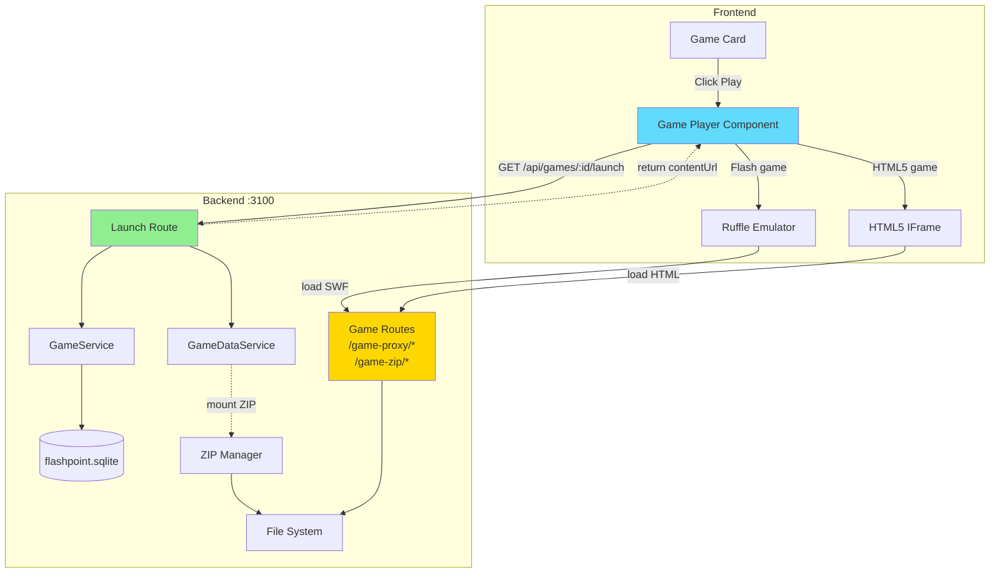
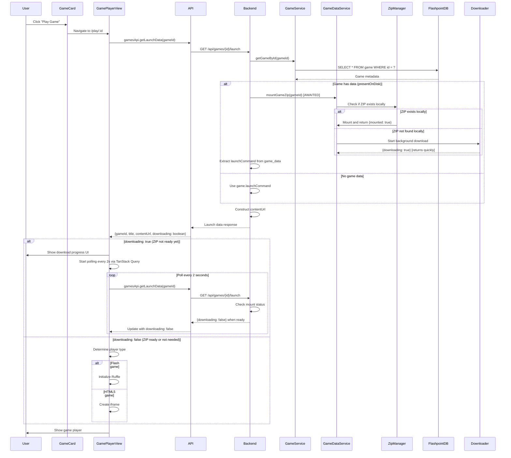
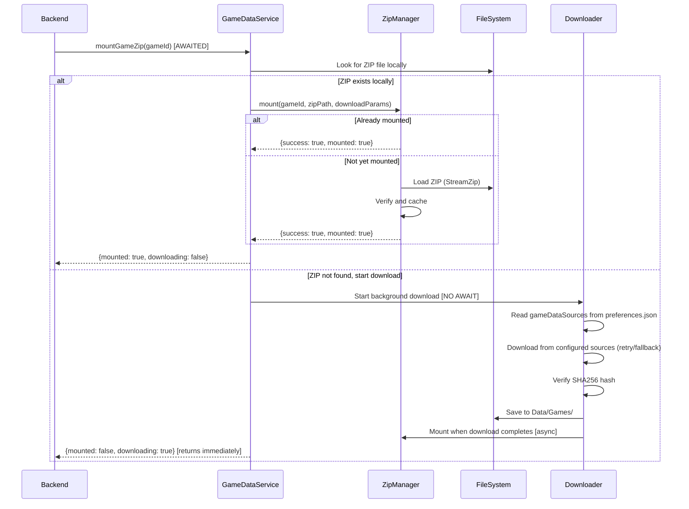
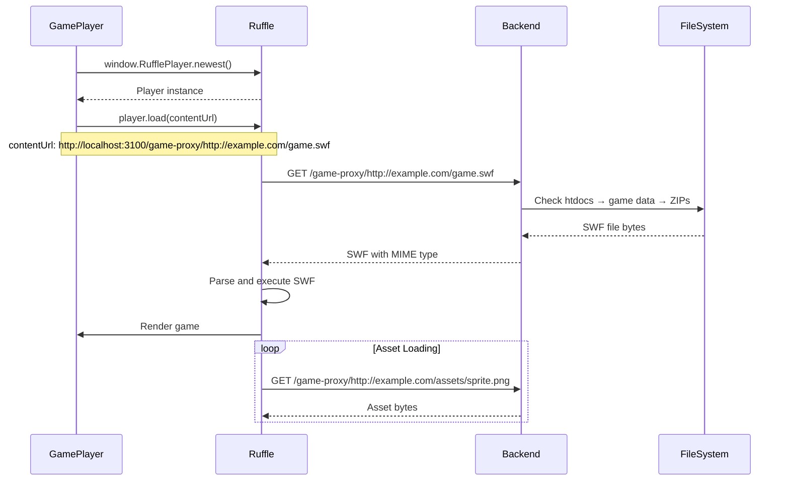
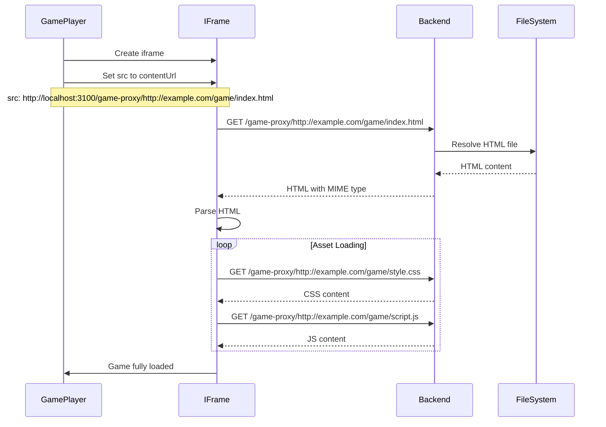
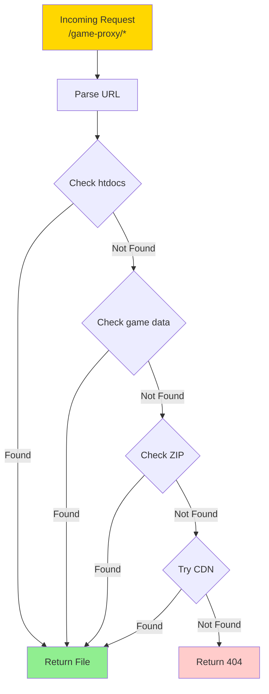

# Game Launch Flow

## Overview

Game launch orchestrates backend and frontend with support for background ZIP
downloads: frontend requests launch data, backend mounts ZIPs (or starts background
downloads), and frontend polls for completion. When ready, frontend loads content
directly from backend game routes into Ruffle or iframe. Downloads show a UI while
in progress, with TanStack Query auto-polling every 2 seconds.

## Architecture



## 1. Game Launch Request Flow



**Launch Data Response**:

```typescript
interface GameLaunchData {
  gameId: string;
  title: string;
  platform: string;
  launchCommand: string;
  contentUrl: string;
  canPlayInBrowser: boolean;
  /** True when the game ZIP is being downloaded in the background */
  downloading?: boolean;
}

// Example - ZIP already mounted (ready to play)
{
  "gameId": "abc-123-def-456",
  "title": "Super Mario Flash",
  "platform": "Flash",
  "launchCommand": "http://example.com/games/mario.swf",
  "contentUrl": "http://localhost:3100/game-proxy/http://example.com/games/mario.swf",
  "canPlayInBrowser": true,
  "downloading": false
}

// Example - ZIP downloading (show download UI, poll every 2s)
{
  "gameId": "xyz-789-abc-123",
  "title": "Legacy Game",
  "platform": "HTML5",
  "launchCommand": "game/index.html",
  "contentUrl": "http://localhost:3100/game-proxy/game/index.html",
  "canPlayInBrowser": true,
  "downloading": true
}
```

## 2. ZIP Mounting Flow



**Key Behavior**:
- `mountGameZip()` is **awaited** by the backend launch endpoint
- Returns `{ mounted: true, downloading: false }` immediately if ZIP exists
- Returns `{ mounted: false, downloading: true }` immediately if starting download
- Frontend polls every 2s when `downloading: true` until mount completes
- Download happens in background without blocking the response

**GameDataService Implementation**:

```typescript
interface MountResult {
  mounted: boolean;
  downloading: boolean;
}

async mountGameZip(gameId: string): Promise<MountResult> {
  // Get game data entry for dateAdded and sha256
  const gameDataEntry = this.getGameDataEntry(gameId);

  // Find ZIP file in Data/Games/
  const zipFile = files.find((f) => f.startsWith(gameId + '-') && f.endsWith('.zip'));
  let zipPath: string;

  if (zipFile) {
    zipPath = path.join(gamesPath, zipFile);
  } else if (gameDataEntry?.dateAdded) {
    // Construct expected filename (needed for download request)
    const timestamp = new Date(gameDataEntry.dateAdded).getTime();
    zipPath = path.join(gamesPath, `${gameId}-${timestamp}.zip`);

    // Start background download (no await)
    gameZipServer.mountZip({
      id: gameId,
      zipPath,
      dateAdded: gameDataEntry.dateAdded,
      sha256: gameDataEntry.sha256
    });

    // Return immediately with downloading flag
    return { mounted: false, downloading: true };
  }

  // ZIP exists locally - mount it synchronously
  const result = await gameZipServer.mountZip({
    id: gameId,
    zipPath,
    // ... parameters
  });

  if (result.success) {
    return { mounted: true, downloading: false };
  }

  return { mounted: false, downloading: false };
}
```

**Frontend Polling Configuration** (`useGameLaunchData` hook):

```typescript
export function useGameLaunchData(id: string) {
  return useQuery({
    queryKey: ['game', id, 'launch'],
    queryFn: () => gamesApi.getLaunchData(id),
    enabled: !!id,
    // Auto-poll every 2s while the game ZIP is being downloaded
    refetchInterval: (query) => (query.state.data?.downloading ? 2000 : false),
  });
}
```

When `downloading: true`, TanStack Query automatically polls every 2 seconds. When
the backend response changes to `downloading: false`, polling stops automatically.

## 3. Download Progress UI

While `downloading: true`, the frontend shows a download progress UI:

```typescript
// GamePlayerView.tsx
{launchData?.downloading ? (
  <div className="flex items-center justify-center h-full bg-black">
    <div className="text-center">
      <Download size={48} className="text-blue-500 mx-auto mb-4 animate-bounce" />
      <h3 className="text-xl font-bold mb-2 text-white">Downloading Game Data...</h3>
      <p className="text-gray-400 text-sm mb-4">
        The game files are being downloaded. This page will update automatically when ready.
      </p>
      <Loader2 size={20} className="text-blue-400 mx-auto animate-spin" />
    </div>
  </div>
) : (
  <GamePlayer {...playerProps} />
)}
```

Features:
- Bouncing Download icon and spinner animation
- User-friendly message
- Auto-updates when download completes
- No manual refresh needed (TanStack Query handles polling)

## 4. Game Content Loading

### Flash Game (Ruffle)



### HTML5 Game (IFrame)



## 5. Game Proxy Route Request Handling



**Implementation**:

```typescript
app.get('*', async (req, res) => {
  try {
    const requestedUrl = req.url.substring(1);
    const parsedUrl = new URL(requestedUrl);
    const domain = parsedUrl.hostname;
    const path = parsedUrl.pathname;

    // 1. Check local htdocs
    const htdocsPath = join(config.htdocsPath, domain, path);
    if (fs.existsSync(htdocsPath)) {
      return res.sendFile(htdocsPath, {
        headers: {
          'Content-Type': getMimeType(htdocsPath),
          'Access-Control-Allow-Origin': '*',
        },
      });
    }

    // 2. Check game data directory
    const gameDataPath = join(
      process.env.FLASHPOINT_PATH,
      'Data',
      domain,
      path
    );
    if (fs.existsSync(gameDataPath)) {
      return res.sendFile(gameDataPath, {
        headers: {
          'Content-Type': getMimeType(gameDataPath),
          'Access-Control-Allow-Origin': '*',
        },
      });
    }

    // 3. Check mounted ZIPs
    const zipFile = await zipManager.getFileFromAnyMount(path);
    if (zipFile) {
      return res.send(zipFile).set({
        'Content-Type': getMimeType(path),
        'Access-Control-Allow-Origin': '*',
      });
    }

    // 4. Fallback to CDN (URLs loaded from proxySettings.json)
    for (const cdnBase of settings.externalFilePaths) {
      try {
        const cdnUrl = `${cdnBase}/${domain}${path}`;
        const response = await axios.get(cdnUrl, {
          responseType: 'arraybuffer',
        });
        await cacheFile(htdocsPath, response.data);
        return res.send(response.data).set({
          'Content-Type': response.headers['content-type'],
          'Access-Control-Allow-Origin': '*',
        });
      } catch (cdnError) {
        continue;
      }
    }

    res.status(404).send('File not found');
  } catch (error) {
    logger.error('Proxy error:', error);
    res.status(500).send('Proxy error');
  }
});
```

## 6. MIME Type Detection

```typescript
function getMimeType(filePath: string): string {
  const ext = path.extname(filePath).toLowerCase();

  const mimeTypes: Record<string, string> = {
    '.swf': 'application/x-shockwave-flash',
    '.html': 'text/html',
    '.css': 'text/css',
    '.js': 'application/javascript',
    '.png': 'image/png',
    '.jpg': 'image/jpeg',
    '.jpeg': 'image/jpeg',
    '.gif': 'image/gif',
    '.mp3': 'audio/mpeg',
    '.mp4': 'video/mp4',
    '.pdf': 'application/pdf',
    '.zip': 'application/zip',
  };

  return mimeTypes[ext] || 'application/octet-stream';
}
```

## 7. Ruffle Player Integration

```typescript
export const RufflePlayer: React.FC<{ gameUrl: string; gameTitle: string }> = ({
  gameUrl,
  gameTitle
}) => {
  const containerRef = useRef<HTMLDivElement>(null);
  const playerRef = useRef<any>(null);

  useEffect(() => {
    if (!containerRef.current || !window.RufflePlayer) return;

    const ruffle = window.RufflePlayer.newest();
    const player = ruffle.createPlayer();

    player.config = {
      autoplay: 'auto',
      backgroundColor: '#000000',
      letterbox: 'on',
      logLevel: 'warn',
      base: gameUrl,
      quality: 'high',
      scale: 'showall'
    };

    containerRef.current.appendChild(player);
    playerRef.current = player;

    try {
      player.load(gameUrl);
    } catch (error) {
      logger.error('Failed to load game:', error);
    }

    return () => {
      if (playerRef.current) {
        playerRef.current.remove();
      }
    };
  }, [gameUrl, gameTitle]);

  return (
    <div
      ref={containerRef}
      className="ruffle-container"
      style={{ width: '100%', height: '100%', display: 'flex' }}
    />
  );
};
```

## 8. Full Example: Playing "Super Mario Flash" (ZIP Already Available)

**Scenario**: ZIP file is already in `Data/Games/` directory

1. User clicks "Play Game" on game card
2. Frontend: `GET /api/games/abc-123-def-456/launch`
3. Backend queries database, finds `presentOnDisk = 1`
4. Backend awaits `mountGameZip(abc-123-def-456)` (ZIP already exists locally)
5. Returns: `{downloading: false, contentUrl: http://localhost:3100/game-proxy/...}`
6. Frontend immediately renders Ruffle player
7. Ruffle loads SWF from backend proxy
8. User plays game

## 9. Full Example: Playing "Legacy Game" (ZIP Needs Download)

**Scenario**: ZIP file doesn't exist, needs to be downloaded

1. User clicks "Play Game" on game card
2. Frontend: `GET /api/games/xyz-789-abc-123/launch`
3. Backend queries database, finds `presentOnDisk = 1` but ZIP not found locally
4. Backend awaits `mountGameZip(xyz-789-abc-123)`
5. GameDataService starts **background download** (no await) and returns immediately
6. Backend returns: `{downloading: true, contentUrl: http://localhost:3100/game-proxy/...}`
7. Frontend shows **download progress UI** (bouncing icon, spinner, message)
8. Frontend starts **auto-polling** every 2s via TanStack Query
9. Meanwhile, background downloader:
   - Reads `gameDataSources` from `preferences.json`
   - Downloads ZIP from configured sources (with retry/fallback)
   - Verifies SHA256 hash
   - Saves to `Data/Games/{gameId}-{timestamp}.zip`
   - Mounts ZIP via ZipManager
10. On next poll (within 2s), backend returns: `{downloading: false, contentUrl: ...}`
11. Frontend automatically **stops polling** and renders Ruffle player
12. User plays game

**Key Improvement**: User sees friendly download UI instead of a timeout or error, and
the download happens automatically without blocking the initial response.

## Error Handling

**ZIP Not Found**: `throw new AppError(404, 'Game data not found')`

**Invalid SWF**: Catch error in Ruffle.load(), show error toast

**Network Timeout**: `axios.get(cdnUrl, { timeout: 30000 })`

**CORS Issues**: Game service sets `Access-Control-Allow-Origin: *`

## Performance Optimization

**Lazy Loading**: Load Ruffle only when needed

**ZIP Caching**: Keep frequently accessed ZIPs mounted (LRU cache, 30-min TTL)

**File Streaming**: Stream large files instead of loading into memory

**Background Downloads**: Start downloads immediately without waiting for completion,
allowing the frontend to show download progress instead of a timeout

**Connection Management**:
- `keepAliveTimeout: 65s` - Keeps connections alive for repeated file requests
- `headersTimeout: 66s` - Slightly higher than keepAliveTimeout
- `timeout: 120s` - 2-minute max for any request (handles slow file downloads)
- `maxConnections: 500` - Prevents connection exhaustion during game file streaming

**Frontend Resource Management**:
- TanStack Query polling stops automatically when download completes
- No unnecessary network traffic when not downloading
- Memory-efficient polling interval (2 seconds)
