# Game Launch Flow

## Overview

Game launch orchestrates multiple services: frontend requests launch data, backend mounts ZIPs, and frontend loads content directly from game-service into Ruffle or iframe.

## Architecture

```mermaid
graph TB
    subgraph "Frontend"
        GameCard[Game Card]
        GamePlayer[Game Player Component]
        Ruffle[Ruffle Emulator]
        IFrame[HTML5 IFrame]
    end

    subgraph "Backend :3100"
        LaunchRoute[Launch Route]
        GameService[GameService]
        GameDataSvc[GameDataService]
        FlashpointDB[(flashpoint.sqlite)]
    end

    subgraph "Game Service :22500/:22501"
        ProxyServer[HTTP Proxy :22500]
        ZipServer[GameZip Server :22501]
        ZipManager[ZIP Manager]
        FileSystem[File System]
    end

    GameCard -->|Click Play| GamePlayer
    GamePlayer -->|GET /api/games/:id/launch| LaunchRoute
    LaunchRoute --> GameService
    GameService --> FlashpointDB
    LaunchRoute --> GameDataSvc

    GameDataSvc -.mount ZIP.-> ZipServer
    ZipServer --> ZipManager
    ZipManager --> FileSystem

    LaunchRoute -.return contentUrl.-> GamePlayer
    GamePlayer -->|Flash game| Ruffle
    GamePlayer -->|HTML5 game| IFrame

    Ruffle -->|load SWF| ProxyServer
    IFrame -->|load HTML| ProxyServer
    ProxyServer --> FileSystem
    ProxyServer -.fallback.-> ZipServer

    style GamePlayer fill:#61dafb
    style LaunchRoute fill:#90ee90
    style ProxyServer fill:#ffd700
```



## 1. Game Launch Request Flow


**Launch Data Response**:
```typescript
interface GameLaunchData {
  gameId: string;
  title: string;
  platform: string;
  launchCommand: string;
  contentUrl: string;
  canPlayInBrowser: boolean;
}

// Example
{
  "gameId": "abc-123-def-456",
  "title": "Super Mario Flash",
  "platform": "Flash",
  "launchCommand": "http://example.com/games/mario.swf",
  "contentUrl": "http://localhost:22500/http://example.com/games/mario.swf",
  "canPlayInBrowser": true
}
```

## 2. ZIP Mounting Flow


**ZIP Manager Implementation**:
```typescript
class ZipManager {
  private mounts: Map<string, StreamZip.StreamZipAsync> = new Map();
  private lastAccess: Map<string, number> = new Map();

  async mount(gameId: string, zipPath: string): Promise<string> {
    if (this.mounts.has(gameId)) {
      this.lastAccess.set(gameId, Date.now());
      return `/gamedata/${gameId}`;
    }

    if (!fs.existsSync(zipPath)) {
      throw new Error(`ZIP file not found: ${zipPath}`);
    }

    const zip = new StreamZip.async({ file: zipPath });
    await zip.entries();

    this.mounts.set(gameId, zip);
    this.lastAccess.set(gameId, Date.now());

    logger.info(`Mounted ZIP: ${gameId}`);
    return `/gamedata/${gameId}`;
  }

  async getFile(gameId: string, filePath: string): Promise<Buffer | null> {
    const zip = this.mounts.get(gameId);
    if (!zip) return null;

    this.lastAccess.set(gameId, Date.now());

    try {
      return await zip.entryData(filePath);
    } catch (error) {
      logger.warn(`File not found in ZIP: ${filePath}`);
      return null;
    }
  }

  async unmount(gameId: string): Promise<void> {
    const zip = this.mounts.get(gameId);
    if (zip) {
      await zip.close();
      this.mounts.delete(gameId);
      logger.info(`Unmounted ZIP: ${gameId}`);
    }
  }

  async cleanupStale(): Promise<void> {
    const now = Date.now();
    const maxAge = 60 * 60 * 1000; // 1 hour

    for (const [gameId, lastAccess] of this.lastAccess.entries()) {
      if (now - lastAccess > maxAge) {
        await this.unmount(gameId);
      }
    }
  }
}
```

## 3. Game Content Loading

### Flash Game (Ruffle)


### HTML5 Game (IFrame)


## 4. HTTP Proxy Server Request Handling


**Implementation**:
```typescript
app.get('*', async (req, res) => {
  try {
    const requestedUrl = req.url.substring(1);
    const parsedUrl = new URL(requestedUrl);
    const domain = parsedUrl.hostname;
    const path = parsedUrl.pathname;

    // 1. Check local htdocs
    const htdocsPath = join(config.htdocsPath, domain, path);
    if (fs.existsSync(htdocsPath)) {
      return res.sendFile(htdocsPath, {
        headers: { 'Content-Type': getMimeType(htdocsPath), 'Access-Control-Allow-Origin': '*' }
      });
    }

    // 2. Check game data directory
    const gameDataPath = join(process.env.FLASHPOINT_PATH, 'Data', domain, path);
    if (fs.existsSync(gameDataPath)) {
      return res.sendFile(gameDataPath, {
        headers: { 'Content-Type': getMimeType(gameDataPath), 'Access-Control-Allow-Origin': '*' }
      });
    }

    // 3. Check mounted ZIPs
    const zipFile = await zipManager.getFileFromAnyMount(path);
    if (zipFile) {
      return res.send(zipFile).set({
        'Content-Type': getMimeType(path),
        'Access-Control-Allow-Origin': '*'
      });
    }

    // 4. Fallback to CDN
    for (const cdnBase of process.env.EXTERNAL_FALLBACK_URLS.split(',')) {
      try {
        const cdnUrl = `${cdnBase}/${domain}${path}`;
        const response = await axios.get(cdnUrl, { responseType: 'arraybuffer' });
        await cacheFile(htdocsPath, response.data);
        return res.send(response.data).set({
          'Content-Type': response.headers['content-type'],
          'Access-Control-Allow-Origin': '*'
        });
      } catch (cdnError) {
        continue;
      }
    }

    res.status(404).send('File not found');
  } catch (error) {
    logger.error('Proxy error:', error);
    res.status(500).send('Proxy error');
  }
});
```

## 5. MIME Type Detection

```typescript
function getMimeType(filePath: string): string {
  const ext = path.extname(filePath).toLowerCase();

  const mimeTypes: Record<string, string> = {
    '.swf': 'application/x-shockwave-flash',
    '.html': 'text/html',
    '.css': 'text/css',
    '.js': 'application/javascript',
    '.png': 'image/png',
    '.jpg': 'image/jpeg',
    '.jpeg': 'image/jpeg',
    '.gif': 'image/gif',
    '.mp3': 'audio/mpeg',
    '.mp4': 'video/mp4',
    '.pdf': 'application/pdf',
    '.zip': 'application/zip'
  };

  return mimeTypes[ext] || 'application/octet-stream';
}
```

## 6. Ruffle Player Integration

```typescript
export const RufflePlayer: React.FC<{ gameUrl: string; gameTitle: string }> = ({
  gameUrl,
  gameTitle
}) => {
  const containerRef = useRef<HTMLDivElement>(null);
  const playerRef = useRef<any>(null);

  useEffect(() => {
    if (!containerRef.current || !window.RufflePlayer) return;

    const ruffle = window.RufflePlayer.newest();
    const player = ruffle.createPlayer();

    player.config = {
      autoplay: 'auto',
      backgroundColor: '#000000',
      letterbox: 'on',
      logLevel: 'warn',
      base: gameUrl,
      quality: 'high',
      scale: 'showall'
    };

    containerRef.current.appendChild(player);
    playerRef.current = player;

    try {
      player.load(gameUrl);
    } catch (error) {
      logger.error('Failed to load game:', error);
    }

    return () => {
      if (playerRef.current) {
        playerRef.current.remove();
      }
    };
  }, [gameUrl, gameTitle]);

  return (
    <div
      ref={containerRef}
      className="ruffle-container"
      style={{ width: '100%', height: '100%', display: 'flex' }}
    />
  );
};
```

## 7. Full Example: Playing "Super Mario Flash"

1. User clicks "Play Game" on game card
2. Frontend: `GET /api/games/abc-123-def-456/launch`
3. Backend queries database, finds `presentOnDisk = 1`
4. Backend: `POST http://localhost:22501/mount` → Mounts ZIP
5. Backend returns: `contentUrl: http://localhost:22500/http://example.com/games/mario.swf`
6. Frontend creates Ruffle player with this URL
7. Ruffle: `GET http://localhost:22500/http://example.com/games/mario.swf`
8. Proxy server checks htdocs → game data → mounted ZIPs → **Found in ZIP!**
9. Returns `mario.swf` from ZIP with proper MIME type
10. Ruffle executes game, user plays

## Error Handling

**ZIP Not Found**: `throw new AppError(404, 'Game data not found')`

**Invalid SWF**: Catch error in Ruffle.load(), show error toast

**Network Timeout**: `axios.get(cdnUrl, { timeout: 30000 })`

**CORS Issues**: Game service sets `Access-Control-Allow-Origin: *`

## Performance Optimization

**Lazy Loading**: Load Ruffle only when needed

**ZIP Caching**: Keep frequently accessed ZIPs mounted (1 hour TTL)

**File Streaming**: Stream large files instead of loading into memory
