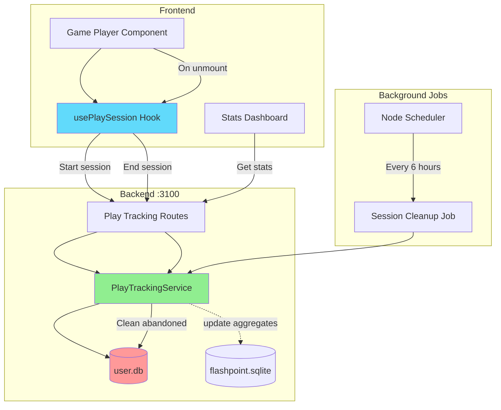
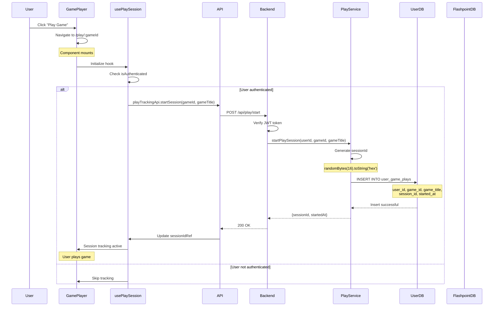
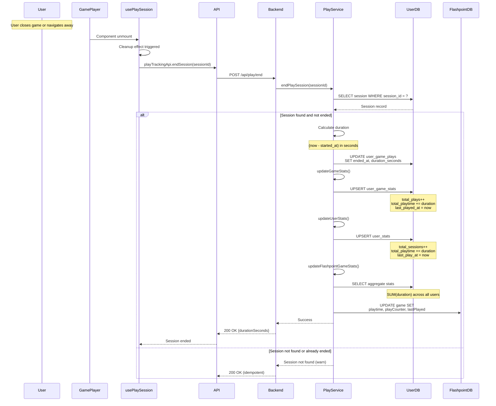
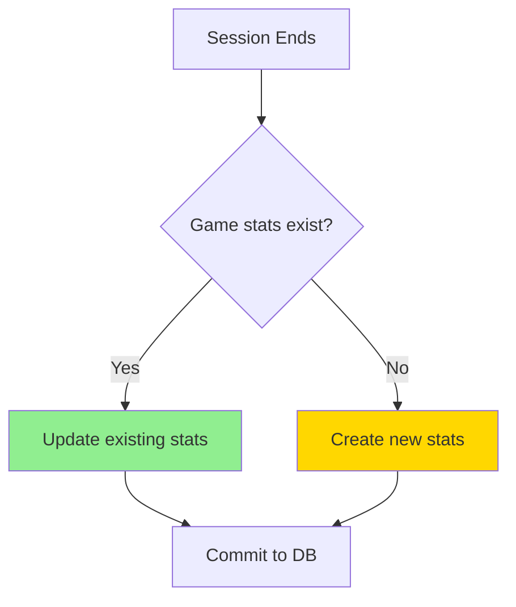
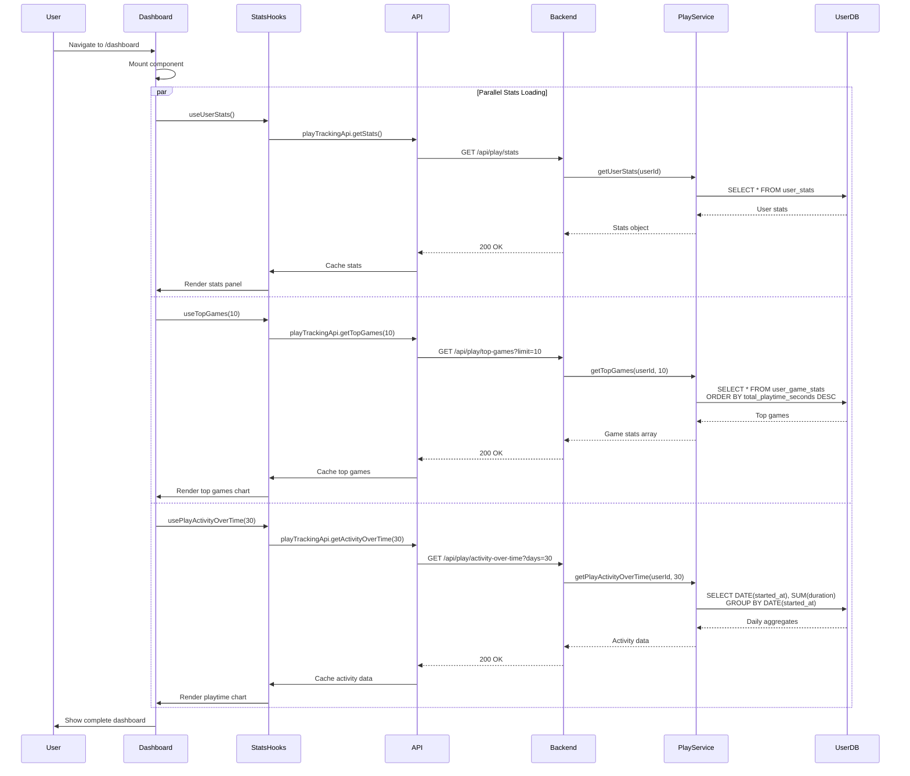
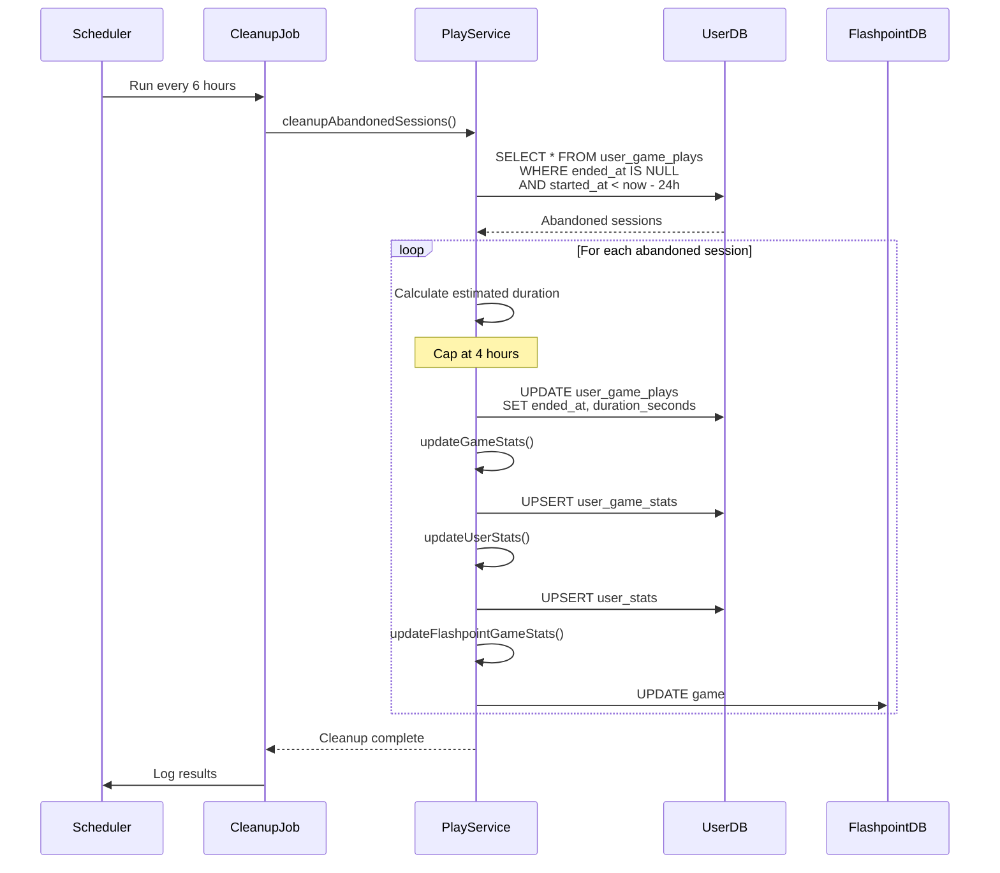

# Play Tracking Flow

## Overview

The play tracking system monitors user gameplay sessions, records statistics, and provides analytics. This document details how play sessions are started, tracked, ended, and how statistics are aggregated for both individual users and the global Flashpoint database.

## Play Tracking Architecture



## 1. Session Start Flow

### Sequence Diagram



### Session Start Implementation

**Frontend Hook**:
```typescript
export function usePlaySession(gameId: string | null, gameTitle: string | null) {
  const sessionIdRef = useRef<string | null>(null);
  const previousGameIdRef = useRef<string | null>(null);
  const hasStartedSessionRef = useRef(false);
  const { isAuthenticated } = useAuthStore();

  const startMutation = useMutation({
    mutationFn: ({ gameId, gameTitle }: { gameId: string; gameTitle: string }) =>
      playTrackingApi.startSession(gameId, gameTitle),
    onSuccess: (data) => {
      sessionIdRef.current = data.sessionId;
      console.log('[PlaySession] Started:', data.sessionId);
    },
    onError: (error) => {
      console.error('[PlaySession] Failed to start:', error);
      hasStartedSessionRef.current = false;
    }
  });

  useEffect(() => {
    if (!isAuthenticated || !gameId || !gameTitle) {
      return;
    }

    if (startMutation.isPending) {
      return; // Prevent duplicate calls in React StrictMode
    }

    if (!hasStartedSessionRef.current || previousGameIdRef.current !== gameId) {
      const previousSessionId = sessionIdRef.current;

      // End previous session if different game
      if (previousSessionId && previousGameIdRef.current !== gameId) {
        playTrackingApi.endSession(previousSessionId).then(() => {
          previousGameIdRef.current = gameId;
          hasStartedSessionRef.current = true;
          startMutation.mutate({ gameId, gameTitle });
        });
      } else {
        previousGameIdRef.current = gameId;
        hasStartedSessionRef.current = true;
        startMutation.mutate({ gameId, gameTitle });
      }
    }
  }, [isAuthenticated, gameId, gameTitle, startMutation.isPending]);

  // End session on unmount
  useEffect(() => {
    return () => {
      if (sessionIdRef.current) {
        playTrackingApi.endSession(sessionIdRef.current);
        hasStartedSessionRef.current = false;
        previousGameIdRef.current = null;
      }
    };
  }, []);

  return {
    sessionId: sessionIdRef.current,
    isTracking: !!sessionIdRef.current
  };
}
```

**Backend Service**:
```typescript
export class PlayTrackingService {
  async startPlaySession(
    userId: number,
    gameId: string,
    gameTitle: string
  ): Promise<string> {
    try {
      // Generate unique session ID
      const sessionId = randomBytes(16).toString('hex');

      // Insert play session
      UserDatabaseService.run(
        `INSERT INTO user_game_plays (user_id, game_id, game_title, session_id, started_at)
         VALUES (?, ?, ?, ?, strftime('%Y-%m-%dT%H:%M:%fZ', 'now'))`,
        [userId, gameId, gameTitle, sessionId]
      );

      logger.info(`Play session started: userId=${userId}, gameId=${gameId}, sessionId=${sessionId}`);
      return sessionId;
    } catch (error) {
      logger.error('Failed to start play session:', error);
      throw error;
    }
  }
}
```

### Database Schema

**user_game_plays Table**:
```sql
CREATE TABLE user_game_plays (
  id INTEGER PRIMARY KEY AUTOINCREMENT,
  user_id INTEGER NOT NULL,
  game_id TEXT NOT NULL,
  game_title TEXT NOT NULL,
  session_id TEXT UNIQUE NOT NULL,
  started_at TEXT NOT NULL,
  ended_at TEXT,
  duration_seconds INTEGER,
  created_at TEXT DEFAULT (datetime('now')),
  FOREIGN KEY (user_id) REFERENCES users(id) ON DELETE CASCADE
);

CREATE INDEX idx_user_game_plays_user_id ON user_game_plays(user_id);
CREATE INDEX idx_user_game_plays_game_id ON user_game_plays(game_id);
CREATE INDEX idx_user_game_plays_session_id ON user_game_plays(session_id);
CREATE INDEX idx_user_game_plays_started_at ON user_game_plays(started_at);
```

## 2. Session End Flow

### Sequence Diagram



### Session End Implementation

**Backend Service**:
```typescript
async endPlaySession(sessionId: string): Promise<void> {
  try {
    // Get the session
    const session = UserDatabaseService.get(
      `SELECT * FROM user_game_plays WHERE session_id = ? AND ended_at IS NULL`,
      [sessionId]
    );

    if (!session) {
      logger.warn(`Play session not found or already ended: ${sessionId}`);
      return;
    }

    // Calculate duration
    const duration = UserDatabaseService.get(
      `SELECT CAST((julianday('now') - julianday(started_at)) * 86400 AS INTEGER) as duration
       FROM user_game_plays WHERE session_id = ?`,
      [sessionId]
    );

    const durationSeconds = duration?.duration || 0;

    // Update session
    UserDatabaseService.run(
      `UPDATE user_game_plays
       SET ended_at = strftime('%Y-%m-%dT%H:%M:%fZ', 'now'),
           duration_seconds = ?
       WHERE session_id = ?`,
      [durationSeconds, sessionId]
    );

    // Update aggregated stats
    await this.updateGameStats(session.user_id, session.game_id, session.game_title, durationSeconds);
    await this.updateUserStats(session.user_id, durationSeconds);
    await this.updateFlashpointGameStats(session.game_id, durationSeconds);

    logger.info(`Play session ended: sessionId=${sessionId}, duration=${durationSeconds}s`);
  } catch (error) {
    logger.error('Failed to end play session:', error);
    throw error;
  }
}
```

## 3. Statistics Aggregation Flow

### Per-Game Statistics



**user_game_stats Table**:
```sql
CREATE TABLE user_game_stats (
  id INTEGER PRIMARY KEY AUTOINCREMENT,
  user_id INTEGER NOT NULL,
  game_id TEXT NOT NULL,
  game_title TEXT NOT NULL,
  total_plays INTEGER DEFAULT 0,
  total_playtime_seconds INTEGER DEFAULT 0,
  first_played_at TEXT NOT NULL,
  last_played_at TEXT NOT NULL,
  created_at TEXT DEFAULT (datetime('now')),
  updated_at TEXT DEFAULT (datetime('now')),
  FOREIGN KEY (user_id) REFERENCES users(id) ON DELETE CASCADE,
  UNIQUE(user_id, game_id)
);

CREATE INDEX idx_user_game_stats_user_id ON user_game_stats(user_id);
CREATE INDEX idx_user_game_stats_game_id ON user_game_stats(game_id);
```

**Update Logic**:
```typescript
private async updateGameStats(
  userId: number,
  gameId: string,
  gameTitle: string,
  durationSeconds: number
): Promise<void> {
  try {
    const existing = UserDatabaseService.get(
      'SELECT * FROM user_game_stats WHERE user_id = ? AND game_id = ?',
      [userId, gameId]
    );

    if (existing) {
      // Update existing stats
      UserDatabaseService.run(
        `UPDATE user_game_stats
         SET total_plays = total_plays + 1,
             total_playtime_seconds = total_playtime_seconds + ?,
             last_played_at = strftime('%Y-%m-%dT%H:%M:%fZ', 'now'),
             updated_at = strftime('%Y-%m-%dT%H:%M:%fZ', 'now')
         WHERE user_id = ? AND game_id = ?`,
        [durationSeconds, userId, gameId]
      );
    } else {
      // Insert new stats
      UserDatabaseService.run(
        `INSERT INTO user_game_stats (
           user_id, game_id, game_title, total_plays,
           total_playtime_seconds, first_played_at, last_played_at
         ) VALUES (?, ?, ?, 1, ?,
           strftime('%Y-%m-%dT%H:%M:%fZ', 'now'),
           strftime('%Y-%m-%dT%H:%M:%fZ', 'now')
         )`,
        [userId, gameId, gameTitle, durationSeconds]
      );
    }
  } catch (error) {
    logger.error('Failed to update game stats:', error);
  }
}
```

### Overall User Statistics

**user_stats Table**:
```sql
CREATE TABLE user_stats (
  id INTEGER PRIMARY KEY AUTOINCREMENT,
  user_id INTEGER UNIQUE NOT NULL,
  total_games_played INTEGER DEFAULT 0,
  total_playtime_seconds INTEGER DEFAULT 0,
  total_sessions INTEGER DEFAULT 0,
  first_play_at TEXT,
  last_play_at TEXT,
  created_at TEXT DEFAULT (datetime('now')),
  updated_at TEXT DEFAULT (datetime('now')),
  FOREIGN KEY (user_id) REFERENCES users(id) ON DELETE CASCADE
);
```

**Update Logic**:
```typescript
private async updateUserStats(userId: number, durationSeconds: number): Promise<void> {
  try {
    const existing = UserDatabaseService.get(
      'SELECT * FROM user_stats WHERE user_id = ?',
      [userId]
    );

    // Count unique games played
    const gamesPlayed = UserDatabaseService.get(
      'SELECT COUNT(DISTINCT game_id) as count FROM user_game_stats WHERE user_id = ?',
      [userId]
    );

    // Count total sessions
    const totalSessions = UserDatabaseService.get(
      'SELECT COUNT(*) as count FROM user_game_plays WHERE user_id = ? AND ended_at IS NOT NULL',
      [userId]
    );

    if (existing) {
      UserDatabaseService.run(
        `UPDATE user_stats
         SET total_games_played = ?,
             total_playtime_seconds = total_playtime_seconds + ?,
             total_sessions = ?,
             last_play_at = strftime('%Y-%m-%dT%H:%M:%fZ', 'now'),
             updated_at = strftime('%Y-%m-%dT%H:%M:%fZ', 'now')
         WHERE user_id = ?`,
        [gamesPlayed?.count || 0, durationSeconds, totalSessions?.count || 0, userId]
      );
    } else {
      UserDatabaseService.run(
        `INSERT INTO user_stats (
           user_id, total_games_played, total_playtime_seconds,
           total_sessions, first_play_at, last_play_at
         ) VALUES (?, ?, ?, ?,
           strftime('%Y-%m-%dT%H:%M:%fZ', 'now'),
           strftime('%Y-%m-%dT%H:%M:%fZ', 'now')
         )`,
        [userId, gamesPlayed?.count || 0, durationSeconds, totalSessions?.count || 0]
      );
    }
  } catch (error) {
    logger.error('Failed to update user stats:', error);
  }
}
```

### Flashpoint Database Integration

The system updates the main Flashpoint database to maintain compatibility with the Flashpoint Launcher:

```typescript
private async updateFlashpointGameStats(
  gameId: string,
  sessionDuration: number
): Promise<void> {
  try {
    // Get aggregate stats across ALL users for this game
    const aggregateStats = UserDatabaseService.get(
      `SELECT
        COUNT(*) as totalPlays,
        SUM(duration_seconds) as totalPlaytime,
        MAX(ended_at) as lastPlayed
      FROM user_game_plays
      WHERE game_id = ? AND ended_at IS NOT NULL`,
      [gameId]
    ) as { totalPlays: number; totalPlaytime: number; lastPlayed: string } | undefined;

    if (!aggregateStats) {
      return;
    }

    // Update the game table in flashpoint.sqlite
    DatabaseService.run(
      `UPDATE game
      SET lastPlayed = ?,
          playtime = ?,
          playCounter = ?
      WHERE id = ?`,
      [
        aggregateStats.lastPlayed,
        aggregateStats.totalPlaytime,
        aggregateStats.totalPlays,
        gameId
      ]
    );

    logger.info(
      `Updated Flashpoint DB stats for game ${gameId}: ${aggregateStats.totalPlays} plays`
    );
  } catch (error) {
    // Log but don't throw - Flashpoint DB might be locked by Launcher
    logger.warn(`Failed to update Flashpoint DB stats for game ${gameId}:`, error);
  }
}
```

## 4. Statistics Retrieval Flow

### User Stats Dashboard



### API Endpoints

**Get User Stats**:
```http
GET /api/play/stats
Authorization: Bearer {token}

Response 200:
{
  "userId": 1,
  "totalGamesPlayed": 50,
  "totalPlaytimeSeconds": 123456,
  "totalSessions": 150,
  "firstPlayAt": "2025-01-01T00:00:00.000Z",
  "lastPlayAt": "2025-01-18T12:00:00.000Z"
}
```

**Get Top Games**:
```http
GET /api/play/top-games?limit=10
Authorization: Bearer {token}

Response 200:
[
  {
    "gameId": "abc-123",
    "gameTitle": "Super Mario Flash",
    "totalPlays": 25,
    "totalPlaytimeSeconds": 15000,
    "firstPlayedAt": "2025-01-05T10:00:00.000Z",
    "lastPlayedAt": "2025-01-18T12:00:00.000Z"
  },
  ...
]
```

**Get Play Activity**:
```http
GET /api/play/activity-over-time?days=30
Authorization: Bearer {token}

Response 200:
[
  {
    "date": "2025-01-18",
    "playtime": 3600,
    "sessions": 5
  },
  {
    "date": "2025-01-17",
    "playtime": 7200,
    "sessions": 8
  },
  ...
]
```

**Get Play History**:
```http
GET /api/play/history?limit=50&offset=0
Authorization: Bearer {token}

Response 200:
{
  "data": [
    {
      "id": 1,
      "userId": 1,
      "gameId": "abc-123",
      "gameTitle": "Super Mario Flash",
      "startedAt": "2025-01-18T10:00:00.000Z",
      "endedAt": "2025-01-18T10:30:00.000Z",
      "durationSeconds": 1800,
      "sessionId": "hex-session-id"
    },
    ...
  ],
  "limit": 50,
  "offset": 0
}
```

## 5. Abandoned Session Cleanup

### Background Job



### Implementation

```typescript
async cleanupAbandonedSessions(): Promise<void> {
  try {
    const abandoned = UserDatabaseService.all(
      `SELECT session_id, user_id, game_id, game_title, started_at
       FROM user_game_plays
       WHERE ended_at IS NULL
       AND datetime(started_at) < datetime('now', '-24 hours')`
    );

    for (const session of abandoned) {
      // Calculate estimated duration (capped at 4 hours)
      const maxDuration = 4 * 60 * 60; // 4 hours in seconds

      // End the session with estimated duration
      UserDatabaseService.run(
        `UPDATE user_game_plays
         SET ended_at = strftime('%Y-%m-%dT%H:%M:%fZ', started_at, '+4 hours'),
             duration_seconds = ?
         WHERE session_id = ?`,
        [maxDuration, session.session_id]
      );

      // Update stats
      await this.updateGameStats(session.user_id, session.game_id, session.game_title, maxDuration);
      await this.updateUserStats(session.user_id, maxDuration);
      await this.updateFlashpointGameStats(session.game_id, maxDuration);
    }

    if (abandoned.length > 0) {
      logger.info(`Cleaned up ${abandoned.length} abandoned play sessions`);
    }
  } catch (error) {
    logger.error('Failed to cleanup abandoned sessions:', error);
  }
}
```

### Scheduler Setup

```typescript
import { schedule } from 'node-cron';

// Run cleanup every 6 hours
schedule('0 */6 * * *', async () => {
  logger.info('Running abandoned session cleanup...');
  const playTrackingService = new PlayTrackingService();
  await playTrackingService.cleanupAbandonedSessions();
});
```

## 6. Statistics Visualization

### Frontend Components

**User Stats Panel**:
```typescript
export const UserStatsPanel = () => {
  const { data: stats, isLoading } = useUserStats();

  if (isLoading) return <Skeleton />;

  return (
    <div className="stats-panel">
      <StatCard
        title="Total Games Played"
        value={stats.totalGamesPlayed}
        icon={<GamepadIcon />}
      />
      <StatCard
        title="Total Playtime"
        value={formatDuration(stats.totalPlaytimeSeconds)}
        icon={<ClockIcon />}
      />
      <StatCard
        title="Total Sessions"
        value={stats.totalSessions}
        icon={<PlayIcon />}
      />
      <StatCard
        title="Average Session"
        value={formatDuration(stats.totalPlaytimeSeconds / stats.totalSessions)}
        icon={<AvgIcon />}
      />
    </div>
  );
};
```

**Top Games Chart**:
```typescript
export const TopGamesChart = () => {
  const { data: topGames } = useTopGames(10);

  const chartData = topGames?.map(game => ({
    name: game.gameTitle,
    playtime: game.totalPlaytimeSeconds / 3600, // Convert to hours
    plays: game.totalPlays
  })) || [];

  return (
    <ResponsiveContainer width="100%" height={300}>
      <BarChart data={chartData}>
        <CartesianGrid strokeDasharray="3 3" />
        <XAxis dataKey="name" />
        <YAxis />
        <Tooltip />
        <Bar dataKey="playtime" fill="#8884d8" name="Hours Played" />
      </BarChart>
    </ResponsiveContainer>
  );
};
```

**Playtime Over Time Chart**:
```typescript
export const PlaytimeChart = () => {
  const { data: activity } = usePlayActivityOverTime(30);

  const chartData = activity?.map(day => ({
    date: new Date(day.date).toLocaleDateString(),
    hours: day.playtime / 3600
  })) || [];

  return (
    <ResponsiveContainer width="100%" height={300}>
      <LineChart data={chartData}>
        <CartesianGrid strokeDasharray="3 3" />
        <XAxis dataKey="date" />
        <YAxis />
        <Tooltip />
        <Line type="monotone" dataKey="hours" stroke="#82ca9d" name="Hours" />
      </LineChart>
    </ResponsiveContainer>
  );
};
```

## 7. Performance Considerations

### Database Indexing

```sql
-- Speed up user queries
CREATE INDEX idx_user_game_plays_user_id ON user_game_plays(user_id);
CREATE INDEX idx_user_game_stats_user_id ON user_game_stats(user_id);

-- Speed up game queries
CREATE INDEX idx_user_game_plays_game_id ON user_game_plays(game_id);
CREATE INDEX idx_user_game_stats_game_id ON user_game_stats(game_id);

-- Speed up date range queries
CREATE INDEX idx_user_game_plays_started_at ON user_game_plays(started_at);

-- Speed up top games queries
CREATE INDEX idx_user_game_stats_playtime ON user_game_stats(user_id, total_playtime_seconds DESC);
```

### Query Optimization

**Avoid N+1 Queries**:
```typescript
// Bad: Multiple queries
for (const session of sessions) {
  const game = await getGameById(session.gameId);
}

// Good: Single query with JOIN
const sessionsWithGames = UserDatabaseService.all(`
  SELECT
    ugp.*,
    g.title, g.logoPath
  FROM user_game_plays ugp
  LEFT JOIN game g ON g.id = ugp.game_id
  WHERE ugp.user_id = ?
  ORDER BY ugp.started_at DESC
`, [userId]);
```

### Caching Strategy

**Frontend**:
```typescript
// Cache stats for 5 minutes
useQuery({
  queryKey: ['playStats'],
  queryFn: () => playTrackingApi.getStats(),
  staleTime: 5 * 60 * 1000,
  cacheTime: 10 * 60 * 1000
});

// Cache top games for 5 minutes
useQuery({
  queryKey: ['topGames', limit],
  queryFn: () => playTrackingApi.getTopGames(limit),
  staleTime: 5 * 60 * 1000
});
```

## 8. Privacy and Data Management

### User Data Deletion

When a user is deleted, cascade delete their play data:

```sql
-- Cascade deletes in schema
FOREIGN KEY (user_id) REFERENCES users(id) ON DELETE CASCADE
```

### Data Export

Allow users to export their play history:

```typescript
export const exportPlayHistory = async (userId: number) => {
  const sessions = UserDatabaseService.all(
    'SELECT * FROM user_game_plays WHERE user_id = ?',
    [userId]
  );

  const csv = convertToCSV(sessions);
  return csv;
};
```

### Aggregation Accuracy

Ensure aggregate stats match raw session data:

```typescript
// Periodic verification job
async verifyStatsAccuracy(userId: number): Promise<void> {
  const calculatedStats = UserDatabaseService.get(`
    SELECT
      COUNT(DISTINCT game_id) as gamesPlayed,
      SUM(duration_seconds) as totalPlaytime,
      COUNT(*) as totalSessions
    FROM user_game_plays
    WHERE user_id = ? AND ended_at IS NOT NULL
  `, [userId]);

  const storedStats = UserDatabaseService.get(
    'SELECT * FROM user_stats WHERE user_id = ?',
    [userId]
  );

  if (calculatedStats.totalPlaytime !== storedStats.total_playtime_seconds) {
    logger.warn(`Stats mismatch for user ${userId}, recalculating...`);
    await this.recalculateUserStats(userId);
  }
}
```

## Conclusion

The play tracking system in Flashpoint Web provides:

- Automatic session tracking tied to component lifecycle
- Comprehensive statistics at user, game, and aggregate levels
- Integration with Flashpoint database for Launcher compatibility
- Background cleanup of abandoned sessions
- Rich analytics and visualizations
- Optimized database queries with proper indexing

This architecture enables detailed gameplay analytics while maintaining data integrity and performance at scale.
