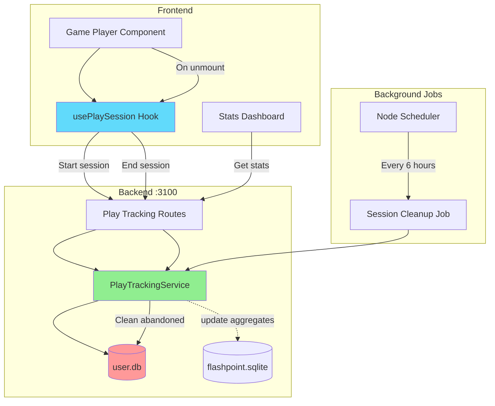
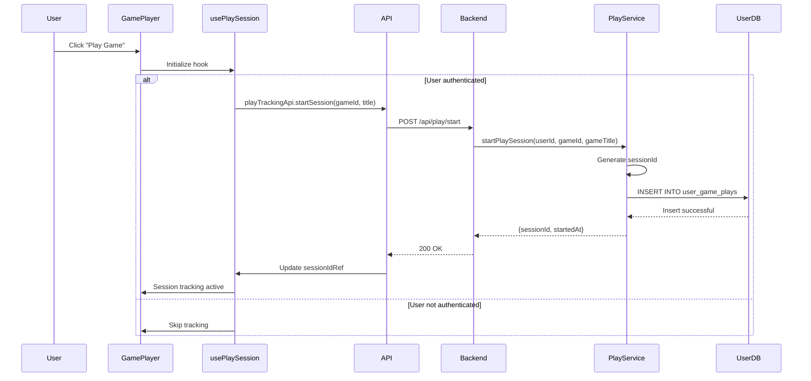
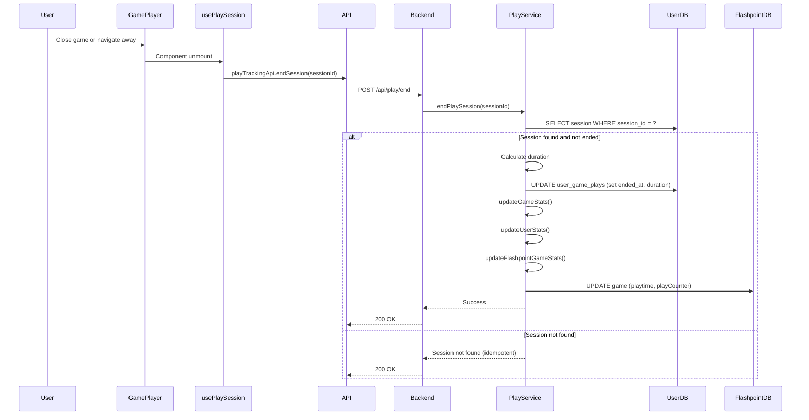
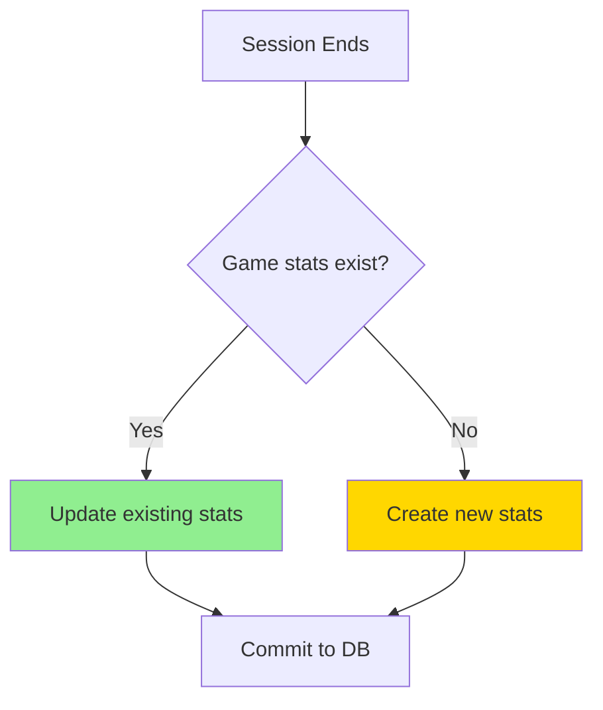
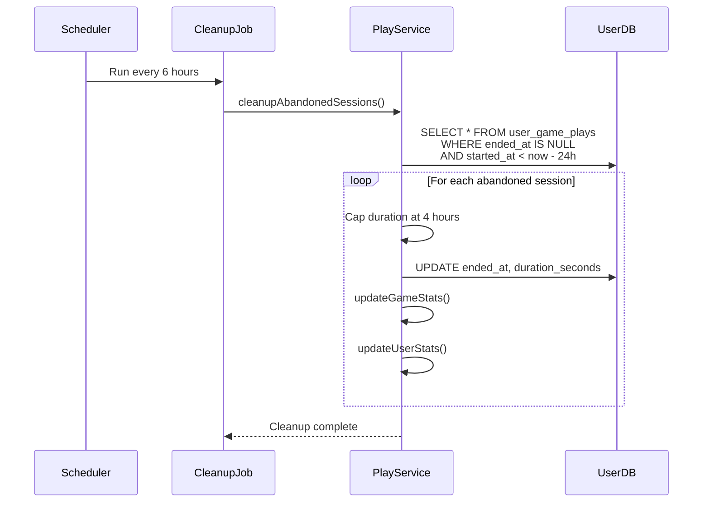

# Play Tracking Flow

## Overview

The play tracking system monitors user gameplay sessions, records statistics,
and provides analytics.

## Architecture



## 1. Session Start Flow



**Database Schema**:

```sql
CREATE TABLE user_game_plays (
  id INTEGER PRIMARY KEY AUTOINCREMENT,
  user_id INTEGER NOT NULL,
  game_id TEXT NOT NULL,
  game_title TEXT NOT NULL,
  session_id TEXT UNIQUE NOT NULL,
  started_at TEXT NOT NULL,
  ended_at TEXT,
  duration_seconds INTEGER,
  created_at TEXT DEFAULT (datetime('now')),
  FOREIGN KEY (user_id) REFERENCES users(id) ON DELETE CASCADE
);

CREATE INDEX idx_user_game_plays_user_id ON user_game_plays(user_id);
CREATE INDEX idx_user_game_plays_game_id ON user_game_plays(game_id);
```

**Frontend Hook**:

```typescript
export function usePlaySession(
  gameId: string | null,
  gameTitle: string | null
) {
  const sessionIdRef = useRef<string | null>(null);
  const previousGameIdRef = useRef<string | null>(null);
  const hasStartedSessionRef = useRef(false);
  const { isAuthenticated } = useAuthStore();

  const startMutation = useMutation({
    mutationFn: ({ gameId, gameTitle }) =>
      playTrackingApi.startSession(gameId, gameTitle),
    onSuccess: (data) => {
      sessionIdRef.current = data.sessionId;
    },
    onError: (error) => {
      hasStartedSessionRef.current = false;
    },
  });

  useEffect(() => {
    if (!isAuthenticated || !gameId || !gameTitle || startMutation.isPending) {
      return;
    }

    if (!hasStartedSessionRef.current || previousGameIdRef.current !== gameId) {
      if (previousGameIdRef.current !== gameId && sessionIdRef.current) {
        playTrackingApi.endSession(sessionIdRef.current).then(() => {
          previousGameIdRef.current = gameId;
          hasStartedSessionRef.current = true;
          startMutation.mutate({ gameId, gameTitle });
        });
      } else {
        previousGameIdRef.current = gameId;
        hasStartedSessionRef.current = true;
        startMutation.mutate({ gameId, gameTitle });
      }
    }
  }, [isAuthenticated, gameId, gameTitle, startMutation.isPending]);

  // End session on unmount
  useEffect(() => {
    return () => {
      if (sessionIdRef.current) {
        playTrackingApi.endSession(sessionIdRef.current);
      }
    };
  }, []);

  return {
    sessionId: sessionIdRef.current,
    isTracking: !!sessionIdRef.current,
  };
}
```

## 2. Session End Flow



**Backend Service**:

```typescript
async endPlaySession(sessionId: string): Promise<void> {
  const session = UserDatabaseService.get(
    `SELECT * FROM user_game_plays WHERE session_id = ? AND ended_at IS NULL`,
    [sessionId]
  );

  if (!session) {
    logger.warn(`Play session not found: ${sessionId}`);
    return;
  }

  const duration = UserDatabaseService.get(
    `SELECT CAST((julianday('now') - julianday(started_at)) * 86400 AS INTEGER) as duration
     FROM user_game_plays WHERE session_id = ?`,
    [sessionId]
  );

  const durationSeconds = duration?.duration || 0;

  UserDatabaseService.run(
    `UPDATE user_game_plays
     SET ended_at = strftime('%Y-%m-%dT%H:%M:%fZ', 'now'),
         duration_seconds = ?
     WHERE session_id = ?`,
    [durationSeconds, sessionId]
  );

  await this.updateGameStats(session.user_id, session.game_id, session.game_title, durationSeconds);
  await this.updateUserStats(session.user_id, durationSeconds);
  await this.updateFlashpointGameStats(session.game_id, durationSeconds);

  logger.info(`Play session ended: sessionId=${sessionId}, duration=${durationSeconds}s`);
}
```

## 3. Statistics Aggregation

### Per-Game Statistics



**Database Schema**:

```sql
CREATE TABLE user_game_stats (
  id INTEGER PRIMARY KEY AUTOINCREMENT,
  user_id INTEGER NOT NULL,
  game_id TEXT NOT NULL,
  game_title TEXT NOT NULL,
  total_plays INTEGER DEFAULT 0,
  total_playtime_seconds INTEGER DEFAULT 0,
  first_played_at TEXT NOT NULL,
  last_played_at TEXT NOT NULL,
  FOREIGN KEY (user_id) REFERENCES users(id) ON DELETE CASCADE,
  UNIQUE(user_id, game_id)
);
```

**Update Logic**:

```typescript
private async updateGameStats(
  userId: number,
  gameId: string,
  gameTitle: string,
  durationSeconds: number
): Promise<void> {
  const existing = UserDatabaseService.get(
    'SELECT * FROM user_game_stats WHERE user_id = ? AND game_id = ?',
    [userId, gameId]
  );

  if (existing) {
    UserDatabaseService.run(
      `UPDATE user_game_stats
       SET total_plays = total_plays + 1,
           total_playtime_seconds = total_playtime_seconds + ?,
           last_played_at = strftime('%Y-%m-%dT%H:%M:%fZ', 'now')
       WHERE user_id = ? AND game_id = ?`,
      [durationSeconds, userId, gameId]
    );
  } else {
    UserDatabaseService.run(
      `INSERT INTO user_game_stats (
         user_id, game_id, game_title, total_plays, total_playtime_seconds,
         first_played_at, last_played_at
       ) VALUES (?, ?, ?, 1, ?,
         strftime('%Y-%m-%dT%H:%M:%fZ', 'now'),
         strftime('%Y-%m-%dT%H:%M:%fZ', 'now')
       )`,
      [userId, gameId, gameTitle, durationSeconds]
    );
  }
}
```

### Overall User Statistics

**Database Schema**:

```sql
CREATE TABLE user_stats (
  id INTEGER PRIMARY KEY AUTOINCREMENT,
  user_id INTEGER UNIQUE NOT NULL,
  total_games_played INTEGER DEFAULT 0,
  total_playtime_seconds INTEGER DEFAULT 0,
  total_sessions INTEGER DEFAULT 0,
  first_play_at TEXT,
  last_play_at TEXT,
  FOREIGN KEY (user_id) REFERENCES users(id) ON DELETE CASCADE
);
```

### Flashpoint Database Integration

Updates the main Flashpoint database for Launcher compatibility:

```typescript
private async updateFlashpointGameStats(
  gameId: string,
  sessionDuration: number
): Promise<void> {
  const aggregateStats = UserDatabaseService.get(
    `SELECT
      COUNT(*) as totalPlays,
      SUM(duration_seconds) as totalPlaytime,
      MAX(ended_at) as lastPlayed
    FROM user_game_plays
    WHERE game_id = ? AND ended_at IS NOT NULL`,
    [gameId]
  );

  if (!aggregateStats) return;

  DatabaseService.run(
    `UPDATE game
    SET lastPlayed = ?,
        playtime = ?,
        playCounter = ?
    WHERE id = ?`,
    [
      aggregateStats.lastPlayed,
      aggregateStats.totalPlaytime,
      aggregateStats.totalPlays,
      gameId
    ]
  );
}
```

## 4. Statistics Retrieval

**API Endpoints**:

```http
GET /api/play/stats
GET /api/play/top-games?limit=10
GET /api/play/activity-over-time?days=30
GET /api/play/history?limit=50&offset=0
```

**Response Examples**:

```json
{
  "userId": 1,
  "totalGamesPlayed": 50,
  "totalPlaytimeSeconds": 123456,
  "totalSessions": 150,
  "firstPlayAt": "2025-01-01T00:00:00.000Z",
  "lastPlayAt": "2025-01-18T12:00:00.000Z"
}
```

## 5. Abandoned Session Cleanup

Runs every 6 hours. Sessions inactive for 24+ hours are marked as ended with
4-hour duration cap.



**Implementation**:

```typescript
async cleanupAbandonedSessions(): Promise<void> {
  const abandoned = UserDatabaseService.all(
    `SELECT session_id, user_id, game_id, game_title, started_at
     FROM user_game_plays
     WHERE ended_at IS NULL
     AND datetime(started_at) < datetime('now', '-24 hours')`
  );

  for (const session of abandoned) {
    const maxDuration = 4 * 60 * 60; // 4 hours

    UserDatabaseService.run(
      `UPDATE user_game_plays
       SET ended_at = strftime('%Y-%m-%dT%H:%M:%fZ', started_at, '+4 hours'),
           duration_seconds = ?
       WHERE session_id = ?`,
      [maxDuration, session.session_id]
    );

    await this.updateGameStats(session.user_id, session.game_id, session.game_title, maxDuration);
    await this.updateUserStats(session.user_id, maxDuration);
  }

  if (abandoned.length > 0) {
    logger.info(`Cleaned up ${abandoned.length} abandoned play sessions`);
  }
}
```

**Scheduler Setup**:

```typescript
import { schedule } from 'node-cron';

schedule('0 */6 * * *', async () => {
  logger.info('Running abandoned session cleanup...');
  const playTrackingService = new PlayTrackingService();
  await playTrackingService.cleanupAbandonedSessions();
});
```

## 6. Frontend Components

**User Stats Panel**:

```typescript
export const UserStatsPanel = () => {
  const { data: stats, isLoading } = useUserStats();

  if (isLoading) return <Skeleton />;

  return (
    <div className="stats-panel">
      <StatCard title="Total Games Played" value={stats.totalGamesPlayed} />
      <StatCard title="Total Playtime" value={formatDuration(stats.totalPlaytimeSeconds)} />
      <StatCard title="Total Sessions" value={stats.totalSessions} />
      <StatCard
        title="Average Session"
        value={formatDuration(stats.totalPlaytimeSeconds / stats.totalSessions)}
      />
    </div>
  );
};
```

## Performance Optimization

**Database Indexing**:

```sql
CREATE INDEX idx_user_game_plays_user_id ON user_game_plays(user_id);
CREATE INDEX idx_user_game_plays_game_id ON user_game_plays(game_id);
CREATE INDEX idx_user_game_plays_started_at ON user_game_plays(started_at);
CREATE INDEX idx_user_game_stats_playtime ON user_game_stats(user_id, total_playtime_seconds DESC);
```

**Query Optimization**: Use JOINs instead of N+1 queries.

**Frontend Caching**:

```typescript
useQuery({
  queryKey: ['playStats'],
  queryFn: () => playTrackingApi.getStats(),
  staleTime: 5 * 60 * 1000, // Cache for 5 minutes
});
```

## Data Management

**User Data Deletion**: Cascade delete their play data via foreign keys.

**Data Export**: Allow users to export play history as CSV.

**Aggregation Verification**: Periodic verification job compares calculated
stats with stored stats and recalculates on mismatch.
