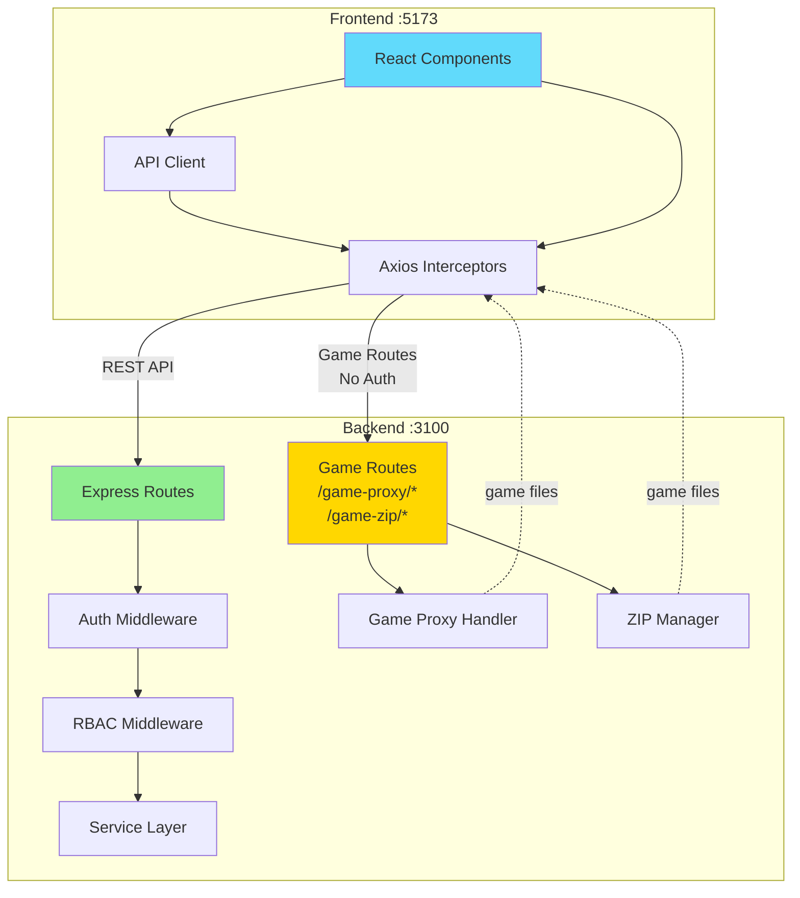
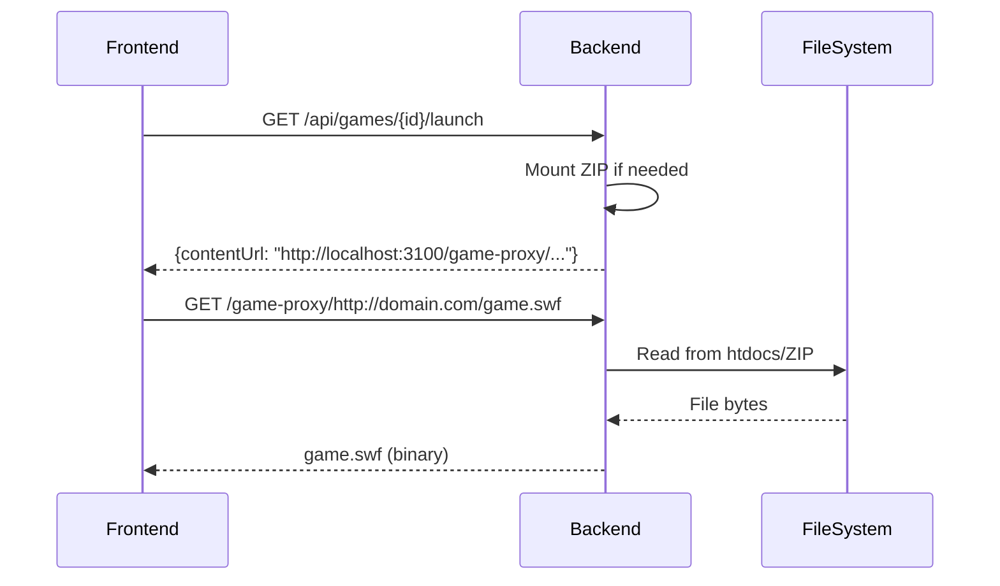

# Service Communication

## Overview

Flashpoint Web uses HTTP-based communication between two services. Frontend
communicates with backend via REST API. The backend handles both business logic
and game file serving through integrated routes.

## Communication Architecture



## Frontend ↔ Backend Communication

**Protocol**: HTTP/1.1 with JSON, JWT Bearer authentication

**API Client Configuration**:

```typescript
const api = axios.create({
  baseURL: '/api',
  headers: { 'Content-Type': 'application/json' },
});

// Request interceptor adds JWT
api.interceptors.request.use((config) => {
  const token = useAuthStore.getState().accessToken;
  if (token) {
    config.headers.Authorization = `Bearer ${token}`;
  }
  return config;
});

// Response interceptor handles 401 with token refresh
api.interceptors.response.use(
  (response) => response,
  async (error) => {
    if (error.response?.status === 401 && !originalRequest._retry) {
      originalRequest._retry = true;
      const tokens = await authApi.refreshToken(refreshToken);
      updateAccessToken(tokens.accessToken);
      return api(originalRequest);
    }
    return Promise.reject(error);
  }
);
```

## API Endpoints

### Games API

```http
GET /api/games?search=mario&platform=Flash&page=1&limit=50
GET /api/games/{gameId}
GET /api/games/{gameId}/launch
```

### Authentication API

```http
POST /api/auth/login {username, password}
POST /api/auth/refresh {refreshToken}
GET /api/auth/me
```

### Play Tracking API

```http
POST /api/play/start {gameId, gameTitle}
POST /api/play/end {sessionId}
GET /api/play/stats
GET /api/play/top-games?limit=10
GET /api/play/activity-over-time?days=30
```

### Users Management API

```http
GET /api/users?page=1&limit=50
POST /api/users {username, email, password, roleId}
PATCH /api/users/me/settings {theme_mode, primary_color}
```

**Error Response Format**:

```json
{
  "error": "Error message description",
  "statusCode": 400,
  "details": { "field": "validation error details" }
}
```

## Backend Game File Serving

Game file serving is integrated into the backend service. When a game launch is
requested:

1. Backend mounts ZIP directly in-process via GameZipManager
2. Returns launch URLs pointing to backend game routes
3. Frontend loads content directly from backend game routes
4. Game routes bypass auth middleware but include permissive CORS headers

**Example: Game Launch**:

```http
GET /api/games/{gameId}/launch
Response: { "contentUrl": "http://localhost:3100/game-proxy/http://example.com/game.swf" }
```

**Backend Game Routes**:

- `GET /game-proxy/{url}` - HTTP proxy with fallback chain (htdocs → game data → ZIPs → CDN)
- `GET /game-zip/{gameId}/{filePath}` - Stream files from mounted ZIPs

## Frontend ↔ Backend Game Routes Communication

Frontend loads game content **directly** from backend game routes:



### Game Proxy Route (`/game-proxy/*`)

**Request**: `GET /game-proxy/http://example.com/path/game.swf`

**Fallback Chain**:

1. Local htdocs: `D:/Flashpoint/Legacy/htdocs/example.com/path/game.swf`
2. Game data directory
3. Mounted ZIPs (via ZIP manager)
4. External CDN: `http://infinity.flashpointarchive.org/...`
5. Cache downloaded content locally

**Response Headers**:

```
Content-Type: application/x-shockwave-flash
Access-Control-Allow-Origin: *
Cache-Control: public, max-age=31536000
```

**Important**: This route is registered **before** auth middleware and has
permissive CORS to allow cross-origin game content loading.

### Game ZIP Route (`/game-zip/*`)

**Request**: `GET /game-zip/{gameId}/path/to/file.swf`

- Streams files directly from ZIP (no extraction)
- Appropriate MIME type header
- CORS headers for cross-origin access
- LRU cache for ZIP mounts (max 100, 30-min TTL)
- Auto-cleanup on eviction
- Registered before auth middleware

## Development Environment: Vite Proxy

In development, Vite proxies requests to avoid CORS:

```typescript
// vite.config.ts
export default defineConfig({
  server: {
    proxy: {
      '/api': {
        target: 'http://localhost:3100',
        changeOrigin: true,
      },
      '/game-proxy': {
        target: 'http://localhost:3100',
        changeOrigin: true,
      },
      '/game-zip': {
        target: 'http://localhost:3100',
        changeOrigin: true,
      },
    },
  },
});
```

## State Synchronization

### TanStack Query Cache Invalidation

```typescript
// After mutations
await queryClient.invalidateQueries({ queryKey: ['playlists'] });
await queryClient.invalidateQueries({ queryKey: ['user', 'settings'] });
await queryClient.invalidateQueries({ queryKey: ['playStats'] });

// Stale time strategy
useQuery({
  queryKey: ['games'],
  queryFn: fetchGames,
  staleTime: 5 * 60 * 1000, // 5 minutes
  cacheTime: 10 * 60 * 1000, // 10 minutes
});
```

### Optimistic Updates

```typescript
const mutation = useMutation({
  mutationFn: (gameId) => playlistsApi.addGames(playlistId, [gameId]),
  onMutate: async (gameId) => {
    await queryClient.cancelQueries(['playlist', playlistId]);
    const previous = queryClient.getQueryData(['playlist', playlistId]);

    queryClient.setQueryData(['playlist', playlistId], (old) => ({
      ...old,
      games: [...old.games, gameId],
    }));

    return { previous };
  },
  onError: (err, gameId, context) => {
    queryClient.setQueryData(['playlist', playlistId], context.previous);
  },
  onSettled: () => {
    queryClient.invalidateQueries(['playlist', playlistId]);
  },
});
```

## Rate Limiting

**Backend**:

```typescript
const limiter = rateLimit({
  windowMs: 15 * 60 * 1000,
  max: 100,
  message: 'Too many requests',
});

const authLimiter = rateLimit({
  windowMs: 15 * 60 * 1000,
  max: 5,
  skipSuccessfulRequests: true,
});

app.use('/api/', limiter);
app.post('/api/auth/login', authLimiter, loginHandler);
```

**Frontend**: TanStack Query deduplication prevents duplicate concurrent
requests.

## Error Handling

**Frontend**:

```typescript
useQuery({
  queryKey: ['games'],
  queryFn: fetchGames,
  retry: 3,
  retryDelay: (attemptIndex) => Math.min(1000 * 2 ** attemptIndex, 30000),
});
```

**Backend**:

```typescript
router.get('/:id', async (req, res, next) => {
  try {
    const game = await gameService.getGameById(req.params.id);
    if (!game) throw new AppError(404, 'Game not found');
    res.json(game);
  } catch (error) {
    next(error);
  }
});

app.use((err, req, res, next) => {
  if (err instanceof AppError) {
    return res.status(err.statusCode).json({ error: err.message });
  }
  logger.error('Unhandled error:', err);
  res.status(500).json({ error: 'Internal server error' });
});
```

## Performance Optimization

**Response Compression**:

```typescript
import compression from 'compression';
app.use(compression());
```

**Connection Pooling**: BetterSqlite3 uses single connection (optimized for
SQLite).

## Security Considerations

**CORS Configuration**:

```typescript
// Backend - Restricted CORS for API routes
app.use(
  cors({
    origin: process.env.DOMAIN || 'http://localhost:5173',
    credentials: true,
    allowedHeaders: ['Content-Type', 'Authorization'],
  })
);

// Backend - Permissive CORS for game routes (registered before general CORS)
app.use('/game-proxy', cors({ origin: '*', methods: ['GET', 'HEAD', 'OPTIONS'] }));
app.use('/game-zip', cors({ origin: '*', methods: ['GET', 'HEAD', 'OPTIONS'] }));
```

**Request Validation**:

```typescript
const searchQuerySchema = z.object({
  search: z.string().optional(),
  page: z.coerce.number().int().min(1).default(1),
  limit: z.coerce.number().int().min(1).max(100).default(50),
});

const query = searchQuerySchema.parse(req.query);
```

**SQL Injection Prevention**: Always use parameterized queries.

```typescript
// Safe
const game = DatabaseService.get('SELECT * FROM game WHERE id = ?', [gameId]);

// NEVER
const game = DatabaseService.get(`SELECT * FROM game WHERE id = '${gameId}'`);
```

## Monitoring

**Request Logging**:

```typescript
import morgan from 'morgan';
app.use(
  morgan('combined', {
    stream: { write: (message) => logger.info(message.trim()) },
  })
);
```

**Activity Tracking**:

```typescript
export const logActivity = (action: string, targetType: string) => {
  return async (req, res, next) => {
    activityLoggerService.log({
      userId: req.user!.id,
      action,
      targetType,
      targetId: req.params.id,
      ipAddress: req.ip,
    });
    next();
  };
};
```
