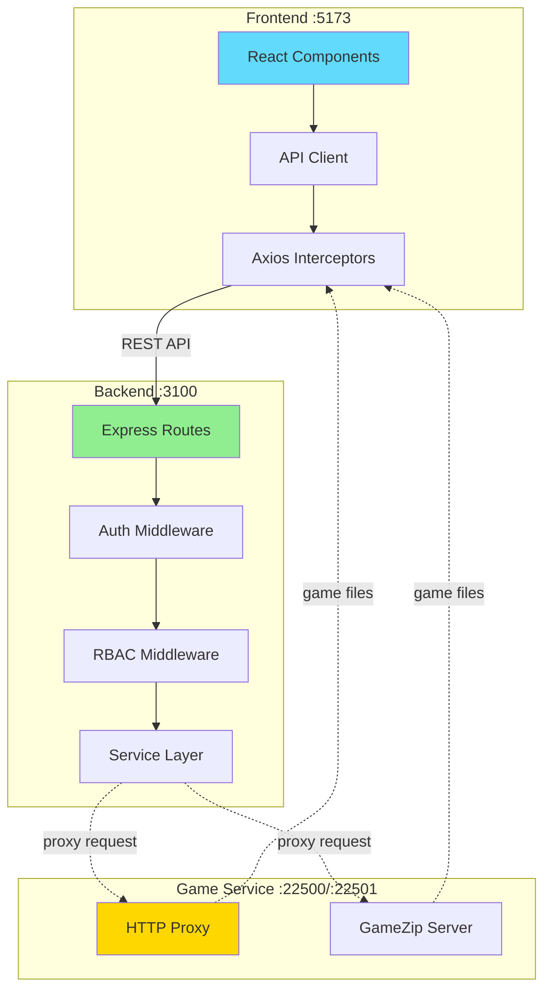
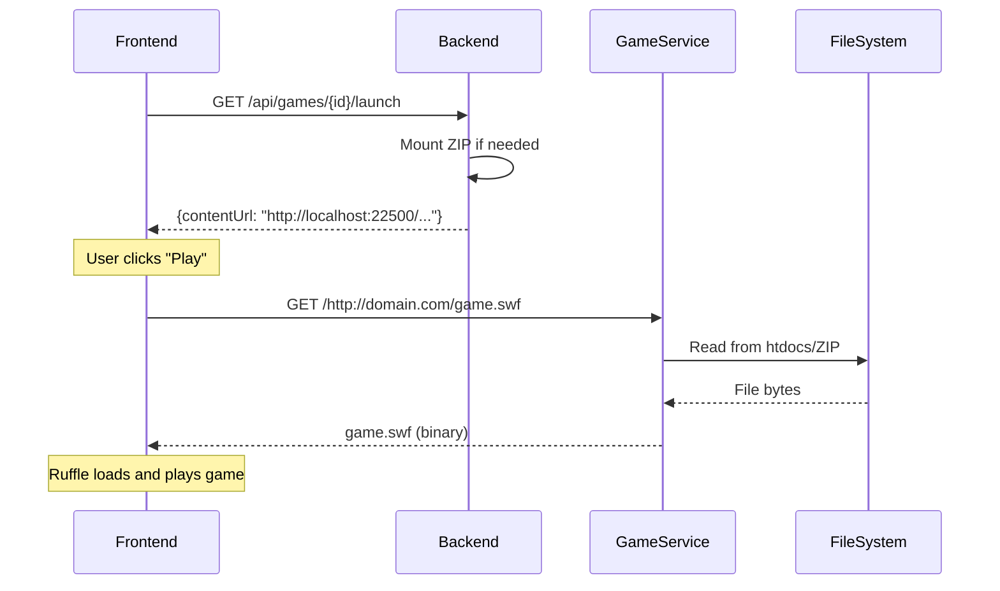

# Service Communication

## Overview

Flashpoint Web uses HTTP-based communication between its three services. The frontend communicates exclusively with the backend, which in turn proxies game file requests to the game service. This document details the communication patterns, protocols, and data flow between services.

## Communication Architecture



## Frontend ↔ Backend Communication

### Protocol

**Transport**: HTTP/1.1 over TCP

**Format**: JSON for request/response bodies

**Authentication**: JWT Bearer tokens in Authorization header

### API Client Architecture

**Base Configuration**:
```typescript
const api = axios.create({
  baseURL: '/api',
  headers: {
    'Content-Type': 'application/json'
  }
});
```

**Request Interceptor** (adds JWT token):
```typescript
api.interceptors.request.use((config) => {
  const token = useAuthStore.getState().accessToken;
  if (token) {
    config.headers.Authorization = `Bearer ${token}`;
  }
  return config;
});
```

**Response Interceptor** (handles token refresh):
```typescript
api.interceptors.response.use(
  (response) => response,
  async (error) => {
    if (error.response?.status === 401 && !originalRequest._retry) {
      originalRequest._retry = true;
      const tokens = await authApi.refreshToken(refreshToken);
      updateAccessToken(tokens.accessToken);
      return api(originalRequest); // Retry with new token
    }
    return Promise.reject(error);
  }
);
```

### API Endpoints by Domain

#### Games API

**Search Games**:
```http
GET /api/games?search=mario&platform=Flash&page=1&limit=50
Authorization: Bearer {token}

Response 200:
{
  "data": [{ game objects }],
  "total": 1234,
  "page": 1,
  "limit": 50,
  "totalPages": 25
}
```

**Get Game Details**:
```http
GET /api/games/{gameId}
Authorization: Bearer {token}

Response 200:
{
  "id": "uuid",
  "title": "Game Title",
  "platform": "Flash",
  "developer": "Developer Name",
  ...
}
```

**Get Launch Data**:
```http
GET /api/games/{gameId}/launch
Authorization: Bearer {token}

Response 200:
{
  "gameId": "uuid",
  "title": "Game Title",
  "platform": "Flash",
  "launchCommand": "http://example.com/game.swf",
  "contentUrl": "http://localhost:22500/http://example.com/game.swf",
  "canPlayInBrowser": true
}
```

#### Authentication API

**Login**:
```http
POST /api/auth/login
Content-Type: application/json

{
  "username": "user@example.com",
  "password": "password123"
}

Response 200:
{
  "user": {
    "id": 1,
    "username": "user",
    "email": "user@example.com",
    "role": "user",
    "permissions": ["games.read", "games.play", ...]
  },
  "accessToken": "eyJhbGc...",
  "refreshToken": "eyJhbGc..."
}
```

**Refresh Token**:
```http
POST /api/auth/refresh
Content-Type: application/json

{
  "refreshToken": "eyJhbGc..."
}

Response 200:
{
  "accessToken": "eyJhbGc...",
  "refreshToken": "eyJhbGc..."
}
```

**Get Current User**:
```http
GET /api/auth/me
Authorization: Bearer {token}

Response 200:
{
  "id": 1,
  "username": "user",
  "email": "user@example.com",
  "role": "user",
  "permissions": ["games.read", "games.play", ...]
}
```

#### Play Tracking API

**Start Session**:
```http
POST /api/play/start
Authorization: Bearer {token}
Content-Type: application/json

{
  "gameId": "uuid",
  "gameTitle": "Game Title"
}

Response 200:
{
  "sessionId": "hex-session-id",
  "startedAt": "2025-01-18T12:00:00.000Z"
}
```

**End Session**:
```http
POST /api/play/end
Authorization: Bearer {token}
Content-Type: application/json

{
  "sessionId": "hex-session-id"
}

Response 200:
{
  "success": true,
  "durationSeconds": 1234
}
```

**Get User Stats**:
```http
GET /api/play/stats
Authorization: Bearer {token}

Response 200:
{
  "userId": 1,
  "totalGamesPlayed": 50,
  "totalPlaytimeSeconds": 123456,
  "totalSessions": 150,
  "firstPlayAt": "2025-01-01T00:00:00.000Z",
  "lastPlayAt": "2025-01-18T12:00:00.000Z"
}
```

#### Users Management API

**List Users** (admin only):
```http
GET /api/users?page=1&limit=50
Authorization: Bearer {admin-token}

Response 200:
{
  "data": [{ user objects }],
  "total": 10,
  "page": 1,
  "limit": 50,
  "totalPages": 1
}
```

**Create User** (admin only):
```http
POST /api/users
Authorization: Bearer {admin-token}
Content-Type: application/json

{
  "username": "newuser",
  "email": "newuser@example.com",
  "password": "password123",
  "roleId": 2
}

Response 201:
{
  "id": 5,
  "username": "newuser",
  "email": "newuser@example.com",
  "roleId": 2,
  "roleName": "user",
  ...
}
```

**Update User Settings**:
```http
PATCH /api/users/me/settings
Authorization: Bearer {token}
Content-Type: application/json

{
  "theme_mode": "dark",
  "primary_color": "blue"
}

Response 200:
{
  "theme_mode": "dark",
  "primary_color": "blue"
}
```

### Error Response Format

All API errors follow a consistent format:

```json
{
  "error": "Error message description",
  "statusCode": 400,
  "details": {
    "field": "validation error details"
  }
}
```

**Common Status Codes**:
- `200 OK`: Successful request
- `201 Created`: Resource created successfully
- `400 Bad Request`: Invalid request data
- `401 Unauthorized`: Missing or invalid authentication
- `403 Forbidden`: Insufficient permissions
- `404 Not Found`: Resource not found
- `409 Conflict`: Resource already exists
- `500 Internal Server Error`: Server error

## Backend ↔ Game Service Communication

### Communication Pattern

The backend **does not** directly proxy game files. Instead, it:
1. Returns launch URLs pointing to game service
2. Frontend loads game content directly from game service
3. Backend mounts ZIPs when needed via internal API calls

### Internal API: ZIP Mounting

**Mount Game ZIP**:
```typescript
// Backend calls game service internally
await gameDataService.mountGameZip(gameId);

// Internal HTTP call to game service
POST http://localhost:22501/mount
Content-Type: application/json

{
  "gameId": "uuid",
  "zipPath": "D:/Flashpoint/Data/Games/A/uuid.zip"
}

Response 200:
{
  "success": true,
  "mountPoint": "/gamedata/uuid",
  "message": "ZIP mounted successfully"
}
```

**Unmount Game ZIP**:
```typescript
POST http://localhost:22501/unmount
Content-Type: application/json

{
  "gameId": "uuid"
}

Response 200:
{
  "success": true,
  "message": "ZIP unmounted successfully"
}
```

### Game Content URLs

Backend generates URLs that point directly to game service:

```typescript
// For Flash/HTML5 games
const contentUrl = `http://localhost:22500/${fullGameUrl}`;

// Example: http://localhost:22500/http://example.com/game.swf
// Game service proxies this to the actual game file
```

**URL Format**:
- Absolute URLs: `http://localhost:22500/http://domain.com/path/file.swf`
- Relative paths: `http://localhost:22500/http://domain.com/path/file.html`

## Frontend ↔ Game Service Communication

### Direct Communication Pattern

The frontend loads game content **directly** from the game service, bypassing the backend entirely for game files.



### HTTP Proxy Server (:22500)

**Request Format**:
```http
GET /http://example.com/path/game.swf HTTP/1.1
Host: localhost:22500
```

**Fallback Chain**:
1. Check local htdocs: `D:/Flashpoint/Legacy/htdocs/example.com/path/game.swf`
2. Check game data directory
3. Query ZIP manager for file in mounted ZIPs
4. Fallback to external CDN: `http://infinity.flashpointarchive.org/...`
5. Cache downloaded content locally

**Response Headers**:
```http
HTTP/1.1 200 OK
Content-Type: application/x-shockwave-flash
Content-Length: 1234567
Access-Control-Allow-Origin: *
Cache-Control: public, max-age=31536000
```

### GameZip Server (:22501)

**Request Format**:
```http
GET /gamedata/{gameId}/path/to/file.swf HTTP/1.1
Host: localhost:22501
```

**Response**:
- Streams file directly from ZIP (no extraction)
- Appropriate MIME type header
- CORS headers for cross-origin access

## Development Environment: Vite Proxy

In development, Vite proxies requests to avoid CORS issues:

```typescript
// vite.config.ts
export default defineConfig({
  server: {
    proxy: {
      '/api': {
        target: 'http://localhost:3100',
        changeOrigin: true
      },
      '/proxy': {
        target: 'http://localhost:22500',
        changeOrigin: true
      }
    }
  }
});
```

**Request Flow**:
```
Frontend :5173 → Vite Proxy → Backend :3100
Frontend :5173 → Vite Proxy → Game Service :22500
```

## State Synchronization

### TanStack Query Cache Invalidation

**After Mutations**:
```typescript
// After creating a playlist
await queryClient.invalidateQueries({ queryKey: ['playlists'] });

// After updating user settings
await queryClient.invalidateQueries({ queryKey: ['user', 'settings'] });

// After ending play session
await queryClient.invalidateQueries({ queryKey: ['playStats'] });
```

**Stale Time Strategy**:
- User data: 5 minutes
- Game metadata: 10 minutes
- Play stats: 5 minutes
- Filter options: Infinity (static data)

### Optimistic Updates

**Example: Add to Playlist**:
```typescript
const mutation = useMutation({
  mutationFn: (gameId) => playlistsApi.addGames(playlistId, [gameId]),
  onMutate: async (gameId) => {
    // Cancel outgoing refetches
    await queryClient.cancelQueries(['playlist', playlistId]);

    // Snapshot previous value
    const previous = queryClient.getQueryData(['playlist', playlistId]);

    // Optimistically update
    queryClient.setQueryData(['playlist', playlistId], (old) => ({
      ...old,
      games: [...old.games, gameId]
    }));

    return { previous };
  },
  onError: (err, gameId, context) => {
    // Rollback on error
    queryClient.setQueryData(['playlist', playlistId], context.previous);
  },
  onSettled: () => {
    // Refetch to ensure sync
    queryClient.invalidateQueries(['playlist', playlistId]);
  }
});
```

## WebSocket Communication (Future)

Currently not implemented, but potential use cases:

**Real-time Features**:
- Live activity feed
- Multiplayer game coordination
- Admin notifications
- Download progress updates

**Proposed Architecture**:
```typescript
// Backend WebSocket server
const wss = new WebSocketServer({ port: 3002 });

wss.on('connection', (ws, req) => {
  const userId = authenticateWebSocket(req);

  ws.on('message', (message) => {
    handleMessage(userId, message);
  });
});

// Frontend WebSocket client
const ws = new WebSocket('ws://localhost:3002');

ws.onmessage = (event) => {
  const data = JSON.parse(event.data);
  updateRealtimeState(data);
};
```

## Rate Limiting

### Backend Rate Limits

**Express Rate Limit Middleware**:
```typescript
import rateLimit from 'express-rate-limit';

const limiter = rateLimit({
  windowMs: 15 * 60 * 1000, // 15 minutes
  max: 100, // Limit each IP to 100 requests per windowMs
  message: 'Too many requests from this IP'
});

app.use('/api/', limiter);
```

**Per-Endpoint Limits**:
```typescript
const authLimiter = rateLimit({
  windowMs: 15 * 60 * 1000,
  max: 5, // 5 login attempts per 15 minutes
  skipSuccessfulRequests: true
});

app.post('/api/auth/login', authLimiter, loginHandler);
```

### Frontend Rate Limiting

**TanStack Query Deduplication**:
```typescript
// Multiple components requesting same data
// Only one request is made
useQuery({ queryKey: ['games', filters], queryFn: fetchGames });
```

**Debounced Search**:
```typescript
const debouncedSearch = useMemo(
  () => debounce((value: string) => {
    setFilters({ ...filters, search: value });
  }, 300),
  [filters]
);
```

## Error Handling and Retry Logic

### Frontend Retry Strategy

**TanStack Query Retry**:
```typescript
useQuery({
  queryKey: ['games'],
  queryFn: fetchGames,
  retry: 3,
  retryDelay: (attemptIndex) => Math.min(1000 * 2 ** attemptIndex, 30000),
  staleTime: 5 * 60 * 1000
});
```

**Axios Retry**:
```typescript
api.interceptors.response.use(null, async (error) => {
  const { config } = error;

  // Retry on network errors
  if (!error.response && config.retryCount < 3) {
    config.retryCount = (config.retryCount || 0) + 1;
    await new Promise(resolve => setTimeout(resolve, 1000 * config.retryCount));
    return api(config);
  }

  return Promise.reject(error);
});
```

### Backend Error Propagation

**Service Layer**:
```typescript
class GameService {
  async getGameById(id: string): Promise<Game | null> {
    try {
      const game = DatabaseService.get(sql, [id]);
      return game;
    } catch (error) {
      logger.error('Error getting game by ID:', error);
      throw error; // Propagate to route handler
    }
  }
}
```

**Route Handler**:
```typescript
router.get('/:id', async (req, res, next) => {
  try {
    const game = await gameService.getGameById(req.params.id);
    if (!game) {
      throw new AppError(404, 'Game not found');
    }
    res.json(game);
  } catch (error) {
    next(error); // Pass to error middleware
  }
});
```

**Global Error Middleware**:
```typescript
app.use((err, req, res, next) => {
  if (err instanceof AppError) {
    return res.status(err.statusCode).json({ error: err.message });
  }

  logger.error('Unhandled error:', err);
  res.status(500).json({ error: 'Internal server error' });
});
```

## Performance Optimization

### Request Batching

**Multiple Game Details**:
```typescript
// Instead of N requests
const games = await Promise.all(
  gameIds.map(id => gamesApi.getById(id))
);

// Better: Single batch request (if implemented)
const games = await gamesApi.getBatch(gameIds);
```

### Response Compression

**Backend**:
```typescript
import compression from 'compression';
app.use(compression());
```

**Game Service**:
```typescript
// Compress large responses
app.use(compression({
  threshold: 1024, // Only compress responses > 1KB
  filter: (req, res) => {
    if (req.headers['x-no-compression']) {
      return false;
    }
    return compression.filter(req, res);
  }
}));
```

### Connection Pooling

**Database Connections**:
```typescript
// BetterSqlite3 uses single connection (fast for SQLite)
// For PostgreSQL (future):
const pool = new Pool({
  max: 20,
  min: 5,
  idleTimeoutMillis: 30000
});
```

## Security Considerations

### CORS Configuration

**Backend**:
```typescript
app.use(cors({
  origin: process.env.DOMAIN || 'http://localhost:5173',
  credentials: true,
  allowedHeaders: ['Content-Type', 'Authorization']
}));
```

**Game Service**:
```typescript
// Wide CORS for game content (cross-domain assets)
app.use(cors({
  origin: '*',
  methods: ['GET', 'HEAD', 'OPTIONS']
}));
```

### Request Validation

**Zod Schemas**:
```typescript
const searchQuerySchema = z.object({
  search: z.string().optional(),
  page: z.coerce.number().int().min(1).default(1),
  limit: z.coerce.number().int().min(1).max(100).default(50)
});

const query = searchQuerySchema.parse(req.query);
```

### SQL Injection Prevention

**Parameterized Queries**:
```typescript
// Safe: Uses parameterized query
const game = DatabaseService.get(
  'SELECT * FROM game WHERE id = ?',
  [gameId]
);

// NEVER DO THIS:
const game = DatabaseService.get(
  `SELECT * FROM game WHERE id = '${gameId}'`
);
```

## Monitoring and Observability

### Request Logging

**Backend**:
```typescript
import morgan from 'morgan';

app.use(morgan('combined', {
  stream: {
    write: (message) => logger.info(message.trim())
  }
}));
```

### Activity Tracking

**Middleware**:
```typescript
export const logActivity = (action: string, targetType: string) => {
  return async (req, res, next) => {
    activityLoggerService.log({
      userId: req.user!.id,
      action,
      targetType,
      targetId: req.params.id,
      ipAddress: req.ip
    });
    next();
  };
};
```

## Conclusion

The service communication architecture is designed for simplicity and performance, with clear boundaries between services. The frontend communicates exclusively with the backend for metadata and business logic, while game files are served directly from the game service to minimize latency and backend load. This separation allows independent scaling and optimization of each service while maintaining a clean, maintainable codebase.
