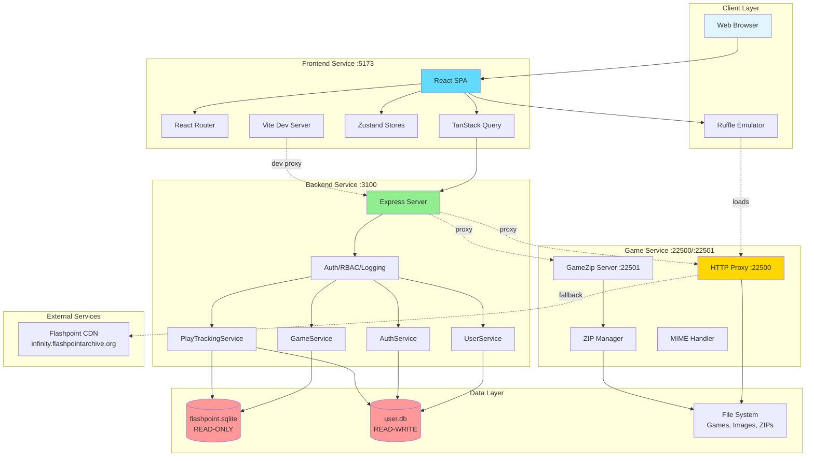
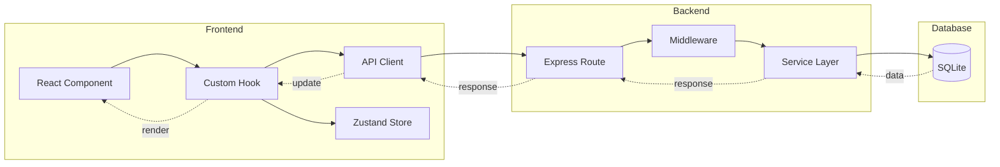
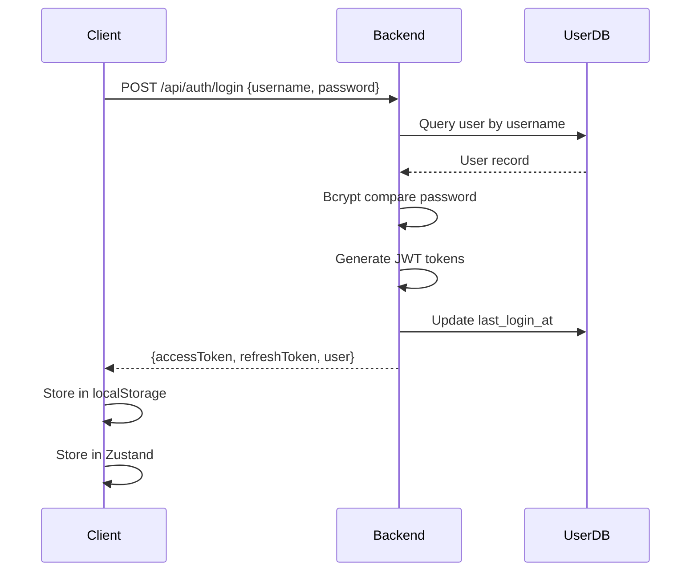

# System Architecture

## Overview

Flashpoint Web is built as a monorepo containing three independent microservices that work together to provide a complete web-based game browsing and playing experience. The architecture follows a clean separation of concerns pattern with distinct services for metadata management, game file serving, and user interface.

## Architecture Diagram



## Service Architecture

### 1. Frontend Service (Port 5173)

**Purpose**: Single-Page Application providing the user interface

**Technology Stack**:
- React 18 with TypeScript
- Vite for build tooling and development server
- React Router for client-side routing
- TanStack Query for server state management
- Zustand for client-side UI state
- Tailwind CSS for styling
- Ruffle WebAssembly for Flash emulation

**Key Responsibilities**:
- User interface rendering and interaction
- Client-side routing and navigation
- Server state caching and synchronization
- Flash game embedding via Ruffle
- Authentication state management
- Theme and UI preferences

**State Management**:
- **Server State** (TanStack Query): Games, playlists, user data, play stats
- **UI State** (Zustand): Sidebar visibility, view modes, auth state
- **URL State** (React Router): Search params, filters, pagination
- **Local Storage**: Auth tokens, theme preferences

### 2. Backend Service (Port 3100)

**Purpose**: REST API server for metadata, authentication, and business logic

**Technology Stack**:
- Express.js with TypeScript
- BetterSqlite3 for database access
- JWT for authentication
- Bcrypt for password hashing
- Zod for request validation

**Key Responsibilities**:
- Game metadata queries from flashpoint.sqlite
- User management and authentication
- Role-based access control (RBAC)
- Play session tracking
- Playlist management
- Activity logging
- Database hot-reloading (watches for Flashpoint Launcher updates)

**Database Access**:
- **flashpoint.sqlite**: Read-only access with file watcher for external changes
- **user.db**: Read-write access with schema migrations

**Service Layer Pattern**:
```
routes/ → middleware/ → services/ → databases/
```

### 3. Game Service (Ports 22500, 22501)

**Purpose**: Game file serving, proxying, and ZIP mounting

**Technology Stack**:
- Express.js with TypeScript
- node-stream-zip for ZIP file handling
- Custom MIME type detection (199+ types)

**Key Responsibilities**:

**HTTP Proxy Server (22500)**:
- Serves legacy web content with fallback chain:
  1. Local htdocs directory
  2. Game data directory
  3. ZIP archives (via zip-manager)
  4. External CDN fallback
  5. Local cache for downloaded content
- CORS headers for cross-domain content
- URL decoding and path normalization

**GameZip Server (22501)**:
- Mounts and serves files from ZIP archives
- Streaming support for large files
- Zero-extraction design (files served directly from ZIP)
- **LRU cache** for ZIP mounts (max 100, 30-min TTL, auto-cleanup on eviction)
- **Request body size limit** (1MB maximum) for DoS protection
- Automatic cleanup of unused mounts

## Data Flow Architecture

### Component Communication



### Request Processing Pipeline

**Frontend → Backend**:
1. User interaction triggers component action
2. Custom hook calls API client function
3. API client adds JWT token via interceptor
4. Axios sends HTTP request to backend
5. Vite dev proxy forwards to Express (in development)

**Backend Processing**:
1. Express route receives request
2. Authentication middleware verifies JWT
3. RBAC middleware checks permissions
4. Activity logger records action
5. Route handler validates request (Zod)
6. Service layer executes business logic
7. Database query returns data
8. Response sent back to client

**Frontend State Update**:
1. TanStack Query receives response
2. Cache updated with new data
3. Dependent components re-render
4. Optimistic updates for better UX

## Database Architecture

### Flashpoint Database (flashpoint.sqlite)

**Ownership**: Flashpoint Launcher (external)

**Access Pattern**: Read-only with hot-reload

**Key Tables**:
- `game`: Game metadata (100,000+ entries)
- `game_data`: Game file paths and launch commands
- `platform`: Gaming platforms (Flash, HTML5, etc.)
- `tag`: Tags and categories
- `game_tags_tag`: Many-to-many game-tag relationships
- `playlist`: Community playlists
- `playlist_game`: Playlist entries

**Hot-Reload Mechanism**:
```typescript
fs.watch(dbPath, (eventType) => {
  if (eventType === 'change') {
    closeConnection();
    openConnection();
    logger.info('Database reloaded');
  }
});
```

### User Database (user.db)

**Ownership**: Flashpoint Web (application-managed)

**Access Pattern**: Read-write with migrations

**Schema Versioning**: Managed via migration files in `backend/src/migrations/`

**Key Tables**:

**Authentication & Authorization**:
- `users`: User accounts with hashed passwords (bcrypt)
- `roles`: RBAC roles (admin, moderator, user, guest)
- `role_permissions`: Permissions assigned to roles
- `user_roles`: User role assignments
- `system_settings`: Global system-wide configuration (auth, app, metadata, features, game, storage, rate limiting)

**User Features**:
- `user_playlists`: User-created playlists
- `user_favorites`: Favorited games per user
- `user_settings`: Key-value settings storage (theme, preferences)

**Play Tracking**:
- `user_game_plays`: Individual play sessions with duration
- `user_game_stats`: Aggregated per-game statistics
- `user_stats`: Overall user statistics

**Activity Logging**:
- `activity_logs`: Audit trail of user actions

## Security Architecture

### Authentication Flow



### Authorization Model

**Role-Based Access Control (RBAC)**:

```
User → assigned to → Role → has → Permissions
```

**Default Roles**:
- `admin`: Full system access
- `moderator`: Content management, user support
- `user`: Standard user features
- `guest`: Read-only access (if enabled)

**Permission Format**: `resource.action`

Examples:
- `games.read`: View games
- `games.play`: Play games
- `playlists.create`: Create playlists
- `users.manage`: Manage users

**Middleware Stack**:
```typescript
router.get('/games',
  authenticate,              // Verify JWT
  requirePermission('games.read'),  // Check permission
  logActivity('games.list'), // Log action
  async (req, res) => { ... }
);
```

### Token Management

**Access Token**:
- Short-lived (15 minutes default)
- Contains user ID, role, permissions
- Signed with JWT_SECRET
- Sent in Authorization header

**Refresh Token**:
- Long-lived (7 days default)
- Stored securely in httpOnly cookie (production)
- Used to obtain new access token
- Invalidated on logout

**Token Refresh Flow**:
```typescript
// Axios interceptor handles 401 automatically
api.interceptors.response.use(null, async (error) => {
  if (error.response?.status === 401 && !originalRequest._retry) {
    const tokens = await authApi.refreshToken(refreshToken);
    updateAccessToken(tokens.accessToken);
    return api(originalRequest); // Retry with new token
  }
});
```

## File System Architecture

### Directory Structure

```
D:/Flashpoint/
├── Data/
│   ├── flashpoint.sqlite         # Game metadata database
│   ├── Images/                   # Game screenshots
│   │   └── {gameId}.png
│   ├── Logos/                    # Game logos
│   │   └── {gameId}.png
│   ├── Games/                    # ZIP archives
│   │   └── {first-letter}/
│   │       └── {gameId}.zip
│   └── Playlists/                # Playlist JSON files
│       └── {playlistId}.json
├── Legacy/
│   └── htdocs/                   # Legacy web content
│       └── {domain}/
│           └── {path}
└── Flashpoint.exe                # Flashpoint Launcher
```

### File Access Patterns

**Images & Logos**:
- Served directly by backend from file system
- Endpoint: `/api/images/{type}/{gameId}`
- Cached by browser with appropriate headers

**Game Content**:
- Never served by backend
- Delegated to game-service proxy
- Backend returns launch URLs pointing to game-service

**ZIP Archives**:
- Mounted by GameZip server on-demand
- Files served without extraction
- Automatic unmounting after inactivity

## Scalability Considerations

### Current Architecture (Single-Server)

All services run on localhost:
- Frontend: :5173
- Backend: :3100
- Game Service: :22500/:22501

### Potential Scaling Strategies

**Horizontal Scaling**:
- Frontend: Static hosting on CDN (Vercel, Netlify)
- Backend: Multiple instances behind load balancer
- Game Service: Region-specific replicas

**Database Scaling**:
- flashpoint.sqlite: Read replicas for queries
- user.db: PostgreSQL/MySQL for better concurrency

**Caching Layer**:
- Redis for session storage
- CDN for static game assets
- HTTP cache for metadata responses

**Performance Optimizations**:
- **Frontend**: Route-based lazy loading (38% bundle size reduction)
- **Frontend**: React.memo with custom comparison (98% fewer re-renders)
- **Game Service**: LRU cache for ZIP mounts (prevents memory leaks)
- **Game Service**: Request body size limits (1MB max, DoS protection)
- **Backend**: Query result caching (statistics, permissions)
- Database connection pooling (future)
- Virtual scrolling for large datasets (future)

## Development vs Production

### Development Mode

**Frontend**:
- Vite dev server with HMR
- Proxy configuration for API and game files
- Source maps enabled
- React Developer Tools

**Backend**:
- tsx with watch mode
- Detailed logging (DEBUG level)
- CORS enabled for localhost:5173
- SQLite in WAL mode

**Game Service**:
- Node with tsx watch
- Verbose logging
- Local file system paths

### Production Mode

**Frontend**:
- Static build in `dist/`
- Minified and tree-shaken
- Served by backend or CDN
- Source maps optional

**Backend**:
- Compiled to `dist/`
- Production logging (INFO level)
- Environment-specific JWT secret
- Rate limiting enabled

**Game Service**:
- Compiled TypeScript
- Structured logging
- Optimized for concurrent requests

## Error Handling Strategy

### Frontend Error Boundaries

```typescript
<ErrorBoundary fallback={<ErrorPage />}>
  <GameList />
</ErrorBoundary>
```

### Backend Error Handler

```typescript
class AppError extends Error {
  constructor(public statusCode: number, message: string) {}
}

// Global error middleware
app.use((err, req, res, next) => {
  if (err instanceof AppError) {
    return res.status(err.statusCode).json({ error: err.message });
  }
  // Log unexpected errors
  logger.error(err);
  res.status(500).json({ error: 'Internal server error' });
});
```

### Graceful Degradation

- Guest mode when auth is disabled
- Fallback to CDN when local files missing
- Offline-friendly with cached data
- Error toasts for user feedback

## Monitoring and Logging

### Activity Logging

All significant user actions are logged:
```typescript
{
  userId: number,
  action: 'games.play' | 'users.create' | ...,
  targetType: 'games' | 'users' | ...,
  targetId: string,
  metadata: { ... },
  ipAddress: string,
  timestamp: ISO8601
}
```

### Performance Metrics

- Play session durations
- API response times
- Database query performance
- Game launch success rate

### Log Levels

- `DEBUG`: Development debugging
- `INFO`: Normal operations
- `WARN`: Recoverable issues (DB locked, file not found)
- `ERROR`: Critical failures

## Technology Choices Rationale

### Why TypeScript?

- Type safety across frontend and backend
- Better IDE support and refactoring
- Shared types between services
- Reduced runtime errors

### Why BetterSqlite3?

- Synchronous API (simpler code)
- Better performance than async wrappers
- Perfect for read-heavy workloads
- WAL mode for concurrent reads

### Why TanStack Query?

- Automatic caching and invalidation
- Background refetching
- Optimistic updates
- Loading and error states

### Why Monorepo?

- Shared TypeScript types
- Coordinated development
- Single deployment
- Consistent tooling

## Future Architecture Considerations

### Potential Enhancements

1. **Microservices Evolution**:
   - Separate playlist service
   - Dedicated stats/analytics service
   - Image processing service

2. **Real-time Features**:
   - WebSocket for live updates
   - Real-time multiplayer coordination
   - Live activity feeds

3. **Advanced Caching**:
   - Redis for session management
   - Service Worker for offline support
   - GraphQL for flexible queries

4. **Enhanced Security**:
   - OAuth2 integration
   - Two-factor authentication
   - API rate limiting per user
   - Content Security Policy

5. **Performance**:
   - Database sharding
   - Read replicas
   - CDN integration
   - Edge computing for game service

## Conclusion

The Flashpoint Web architecture balances simplicity with scalability, maintaining clean separation of concerns while enabling efficient communication between services. The three-service design allows independent scaling and deployment while keeping the codebase maintainable and type-safe.
