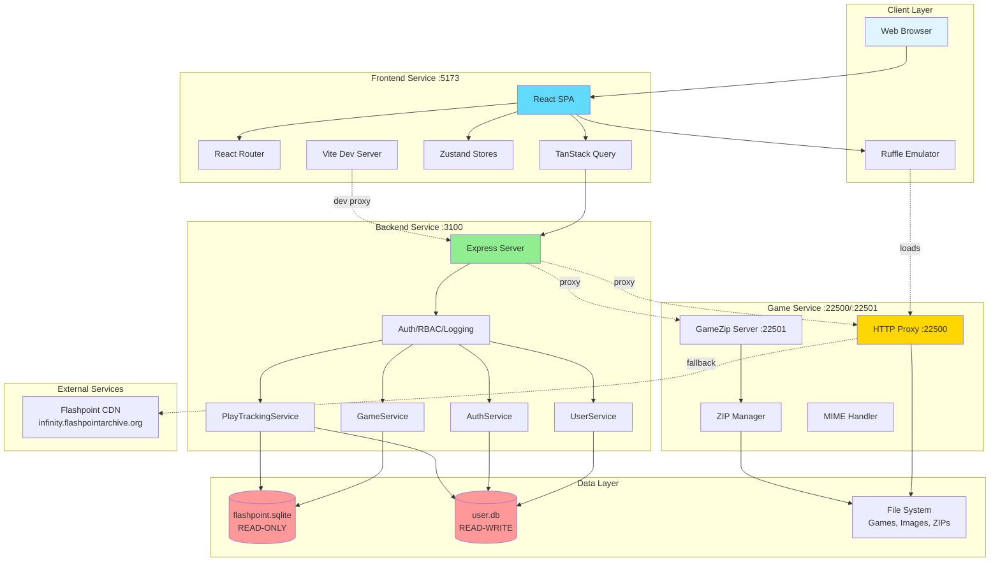
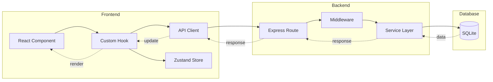
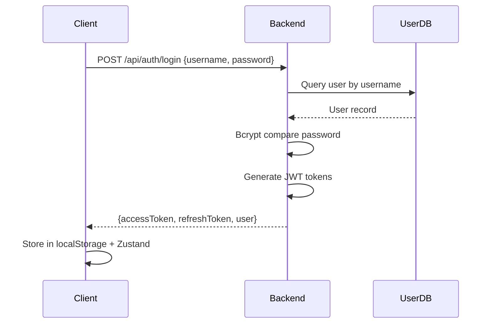

# System Architecture

## Overview

Flashpoint Web is a monorepo containing three independent microservices: frontend (React UI), backend (Express API), and game-service (game file proxy). Services communicate via HTTP with clean separation of concerns.

## Architecture Diagram



## Services Overview

### Frontend Service (Port 5173)

**Purpose**: React single-page application for user interface

**Technology**: React 18, TypeScript, Vite, React Router, TanStack Query, Zustand, Tailwind CSS, Ruffle

**State Management**:
- **Server State** (TanStack Query): Games, playlists, user data
- **UI State** (Zustand): Sidebar, view modes, auth state
- **URL State** (React Router): Search params, filters
- **Local Storage**: Auth tokens, preferences

**Key Features**: Game browsing, search, filtering, play tracking, favorites, playlists

### Backend Service (Port 3100)

**Purpose**: REST API for metadata, authentication, and business logic

**Technology**: Express.js, TypeScript, BetterSqlite3, JWT, Bcrypt, Zod

**Key Responsibilities**:
- Game metadata queries
- User management and authentication
- Role-based access control (RBAC)
- Play session tracking
- Playlist management
- Database hot-reloading for Flashpoint Launcher updates

**Databases**:
- **flashpoint.sqlite**: Read-only with file watcher
- **user.db**: Read-write with schema migrations

**Architecture Pattern**: Routes → Middleware → Services → Databases

### Game Service (Ports 22500, 22501)

**Purpose**: Game file serving and ZIP mounting

**HTTP Proxy Server (22500)**:
- Serves legacy web content with fallback chain:
  1. Local htdocs directory
  2. Game data directory
  3. ZIP archives
  4. External CDN fallback
  5. Local cache

**GameZip Server (22501)**:
- Mounts and streams ZIP archives
- Zero-extraction design
- LRU cache (max 100, 30-min TTL)
- Auto-cleanup on eviction

## Data Flow

### Request Processing Pipeline



**Frontend → Backend**:
1. User interaction triggers component action
2. Custom hook calls API client
3. API client adds JWT token via interceptor
4. Axios sends HTTP request
5. Vite proxy forwards to Express (development)

**Backend Processing**:
1. Express route receives request
2. Authentication middleware verifies JWT
3. RBAC middleware checks permissions
4. Activity logger records action
5. Route handler validates request (Zod)
6. Service layer executes business logic
7. Database query returns data
8. Response sent back to client

**Frontend State Update**:
1. TanStack Query receives response
2. Cache updated with new data
3. Components re-render
4. Optimistic updates for UX

## Database Architecture

### Flashpoint Database (flashpoint.sqlite)

**Ownership**: Flashpoint Launcher (external, read-only)

**Hot-Reload**: FileSystem watcher detects changes and reloads connection

**Key Tables**:
- `game`: Game metadata (100,000+ entries)
- `game_data`: Game file paths and launch commands
- `platform`: Gaming platforms (Flash, HTML5, etc.)
- `tag`, `game_tags_tag`: Tags and relationships
- `playlist`, `playlist_game`: Community playlists

### User Database (user.db)

**Ownership**: Application-managed with migrations

**Authentication & Authorization**:
- `users`: User accounts with hashed passwords (bcrypt)
- `roles`: RBAC roles (admin, moderator, user, guest)
- `role_permissions`: Role-permission mappings
- `system_settings`: Global configuration

**User Features**:
- `user_playlists`: User-created playlists
- `user_favorites`: Favorited games
- `user_settings`: User preferences

**Play Tracking**:
- `user_game_plays`: Individual sessions
- `user_game_stats`: Per-game aggregates
- `user_stats`: Overall user stats

**Activity Logging**:
- `activity_logs`: Audit trail

## Security Architecture

### Authentication



**Access Token**: Short-lived (15 minutes), contains user ID, role, permissions

**Refresh Token**: Long-lived (7 days), used to obtain new access token

**Token Refresh**: Axios interceptor handles 401 automatically

### Authorization

**Role-Based Access Control**:
```
User → Role → Permissions → Resources
```

**Default Roles**:
- `admin`: Full system access
- `moderator`: Content management
- `user`: Standard features
- `guest`: Read-only (if enabled)

**Permission Format**: `resource.action` (e.g., `games.play`, `users.manage`)

## File System Architecture

```
D:/Flashpoint/
├── Data/
│   ├── flashpoint.sqlite         # Game metadata
│   ├── Images/                   # Screenshots
│   ├── Logos/                    # Game logos
│   ├── Games/                    # ZIP archives
│   │   └── {first-letter}/{gameId}.zip
│   └── Playlists/                # Playlist files
├── Legacy/
│   └── htdocs/                   # Legacy web content
│       └── {domain}/{path}
└── Flashpoint.exe
```

**Access Patterns**:
- **Images/Logos**: Served by backend from file system
- **Game Content**: Delegated to game-service proxy
- **ZIPs**: Mounted by GameZip server on-demand

## Scalability Considerations

### Current: Single-Server Architecture

All services run on localhost with SQLite databases.

### Performance Optimizations

- Frontend route-based lazy loading (38% bundle reduction)
- React.memo for component optimization (98% fewer re-renders)
- Game Service LRU cache for ZIP mounts (prevents memory leaks)
- Game Service request size limits (1MB max, DoS protection)
- Backend query result caching

### Scaling Strategies (Future)

**Horizontal**:
- Frontend: Static hosting on CDN (Vercel, Netlify)
- Backend: Multiple instances behind load balancer
- Game Service: Region-specific replicas

**Vertical**:
- flashpoint.sqlite read replicas
- user.db: PostgreSQL/MySQL for better concurrency
- Redis for session storage and caching
- CDN for static game assets

## Development vs Production

### Development

**Frontend**: Vite dev server with HMR, proxy configuration, source maps

**Backend**: tsx watch mode, DEBUG logging, CORS enabled, SQLite WAL mode

**Game Service**: Node with tsx watch, verbose logging

### Production

**Frontend**: Static build in `dist/`, minified, tree-shaken

**Backend**: Compiled TypeScript, INFO logging, rate limiting, environment-specific JWT secret

**Game Service**: Compiled TypeScript, structured logging, optimized concurrency

## Error Handling

**Frontend Error Boundaries**:
```typescript
<ErrorBoundary fallback={<ErrorPage />}>
  <GameList />
</ErrorBoundary>
```

**Backend**:
```typescript
class AppError extends Error {
  constructor(public statusCode: number, message: string) {}
}

app.use((err, req, res, next) => {
  if (err instanceof AppError) {
    return res.status(err.statusCode).json({ error: err.message });
  }
  logger.error(err);
  res.status(500).json({ error: 'Internal server error' });
});
```

**Graceful Degradation**: Guest mode, CDN fallback, cached data, error toasts

## Monitoring & Logging

**Activity Logging**: All significant user actions logged with userId, action, targetType, targetId, timestamp

**Performance Metrics**: Play session durations, API response times, database query performance

**Log Levels**:
- `DEBUG`: Development
- `INFO`: Normal operations
- `WARN`: Recoverable issues
- `ERROR`: Critical failures

## Technology Rationale

**TypeScript**: Type safety, IDE support, refactoring, shared types, reduced runtime errors

**BetterSqlite3**: Synchronous API, performance, perfect for read-heavy workloads, WAL mode

**TanStack Query**: Automatic caching, invalidation, background refetching, optimistic updates

**Monorepo**: Shared types, coordinated development, single deployment, consistent tooling

## Conclusion

Flashpoint Web balances simplicity with scalability, maintaining clean service separation while enabling efficient inter-service communication. The three-service design allows independent scaling and deployment while keeping the codebase maintainable and type-safe.
