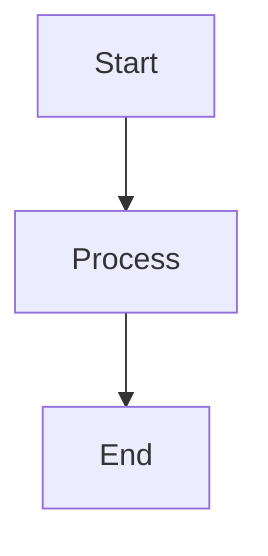
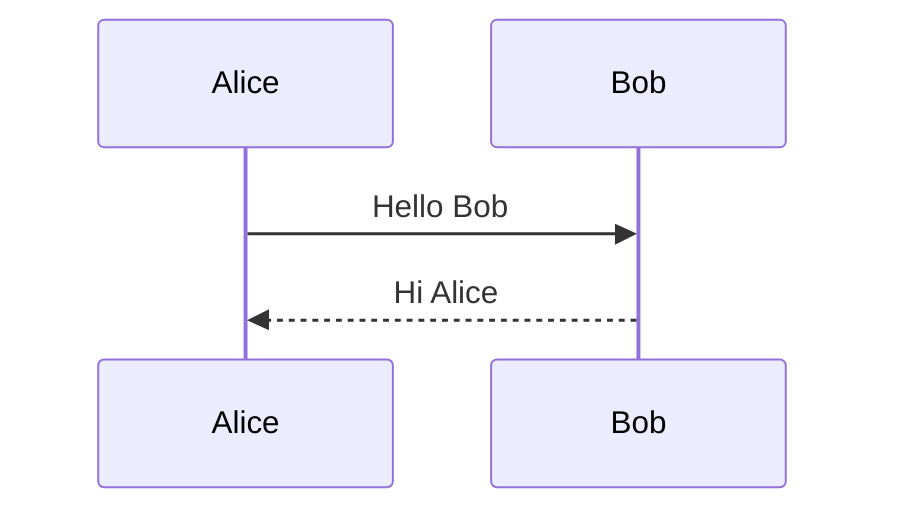
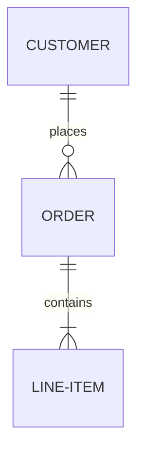

# Mermaid Diagrams

This directory contains Mermaid diagram source files for the Flashpoint Web
documentation. These diagrams can be rendered in any Markdown viewer that
supports Mermaid syntax (GitHub, GitLab, VS Code with Mermaid extension, etc.).

## Diagram Files

### 1. System Architecture (`system-architecture.mmd`)

Complete system architecture showing all three services, databases, and data
flow patterns.

**Contents:**

- Overall system architecture with all components
- Frontend service architecture (React, Vite, TanStack Query, Zustand)
- Backend service architecture (Express, middleware, services)
- Game service architecture (HTTP Proxy, GameZip Server)
- Data layer (databases and file system)
- External services (CDN)

**Use cases:**

- Understanding the overall system design
- Onboarding new developers
- Architecture decision documentation
- System design discussions

---

### 2. Authentication Flow (`authentication-flow.mmd`)

Complete authentication lifecycle including login, token refresh, and logout.

**Contents:**

- User login sequence
- Token refresh flow
- Protected request with RBAC
- User logout sequence
- Guest mode flow

**Use cases:**

- Understanding authentication implementation
- Debugging auth issues
- Security audits
- Implementing similar auth patterns

---

### 3. Game Launch Flow (`game-launch-flow.mmd`)

Complete game launch sequence from user click to game playing.

**Contents:**

- Complete game launch sequence
- ZIP mounting process
- HTTP proxy request resolution
- Ruffle player initialization
- Asset loading workflow

**Use cases:**

- Understanding game launch mechanics
- Debugging game loading issues
- Optimizing game load times
- Implementing new game platforms

---

### 4. Play Tracking Flow (`play-tracking-flow.mmd`)

Session tracking lifecycle from start to cleanup.

**Contents:**

- Play session lifecycle (start/end)
- Statistics aggregation
- Cleanup job for abandoned sessions
- Real-time statistics queries

**Use cases:**

- Understanding play tracking implementation
- Debugging session tracking issues
- Analytics implementation
- Database optimization

---

### 5. Service Communication (`service-communication.mmd`)

Inter-service communication patterns between frontend, backend, and game
service.

**Contents:**

- Service communication overview
- Frontend to backend communication
- Backend to game service communication
- Frontend direct communication with game service
- Error handling and retry logic
- State synchronization patterns

**Use cases:**

- Understanding service interactions
- Debugging communication issues
- API design decisions
- Performance optimization

---

### 6. Database Schema (`database-schema.mmd`)

Entity relationship diagrams for both databases.

**Contents:**

- Flashpoint database schema (flashpoint.sqlite)
- User database authentication & authorization tables
- User database play tracking & statistics tables
- User database settings & preferences tables
- Cross-database relationships
- Database access patterns

**Use cases:**

- Understanding data models
- Database migrations
- Query optimization
- Data integrity verification

---

### 7. Component Hierarchy (`component-hierarchy.mmd`)

Frontend component organization and data flow.

**Contents:**

- Frontend component hierarchy
- Component data flow
- State management architecture
- Component lifecycle examples
- Protected route pattern

**Use cases:**

- Understanding frontend architecture
- Component refactoring
- State management decisions
- Performance optimization

---

## How to View Diagrams

### In GitHub/GitLab

Mermaid diagrams render automatically in Markdown files on GitHub and GitLab.
Simply view any `.md` file containing Mermaid code blocks.

### In VS Code

1. Install the "Markdown Preview Mermaid Support" extension
2. Open any `.mmd` or `.md` file
3. Press `Ctrl+Shift+V` (Windows/Linux) or `Cmd+Shift+V` (Mac) to preview

### Online Editors

- [Mermaid Live Editor](https://mermaid.live/) - Official online editor
- Copy the contents of any `.mmd` file and paste into the editor

### In Documentation Sites

These diagrams are embedded in the main documentation files in the `docs/`
directory:

- `system-architecture.mmd` → Used in
  `docs/02-architecture/system-architecture.md`
- `authentication-flow.mmd` → Used in
  `docs/02-architecture/authentication-flow.md`
- `game-launch-flow.mmd` → Used in `docs/02-architecture/game-launch-flow.md`
- `play-tracking-flow.mmd` → Used in
  `docs/02-architecture/play-tracking-flow.md`
- `service-communication.mmd` → Used in
  `docs/02-architecture/service-communication.md`
- `database-schema.mmd` → Used in `docs/03-backend/database/schema.md`
- `component-hierarchy.mmd` → Used in `docs/04-frontend/architecture.md`

---

## Diagram Syntax

All diagrams use [Mermaid](https://mermaid.js.org/) syntax. Common diagram types
used:

### Flowchart (graph)

### Sequence Diagram

### Entity Relationship Diagram

---

## Updating Diagrams

When updating diagrams:

1. Edit the `.mmd` source file in this directory
2. Update corresponding documentation files if needed
3. Test rendering in multiple viewers (GitHub, VS Code, Mermaid Live)
4. Ensure styling and colors are consistent across diagrams
5. Update this README if adding new diagrams

---

## Style Guide

### Colors

Consistent color scheme across all diagrams:

- **Frontend components**: `#61dafb` (light blue)
- **Backend components**: `#90ee90` (light green)
- **Game service components**: `#ffd700` (gold)
- **Database components**: `#ff9999` (light red)
- **File system components**: `#ffcc99` (light orange)
- **External services**: `#e1e1e1` (light gray)

### Naming Conventions

- Use clear, descriptive names for all nodes
- Follow existing naming patterns from codebase
- Include port numbers for services (`:3100`, `:5173`, etc.)
- Use consistent abbreviations (API, DB, HTTP, etc.)

### Diagram Organization

- Group related components in subgraphs
- Use clear, hierarchical structure
- Add notes for complex logic
- Include key data structures where relevant

---

## Related Documentation

- [System Architecture](../02-architecture/system-architecture.md)
- [Authentication Flow](../02-architecture/authentication-flow.md)
- [Game Launch Flow](../02-architecture/game-launch-flow.md)
- [Database Schema](../03-backend/database/schema.md)
- [Frontend Architecture](../04-frontend/architecture.md)

---

## Resources

- [Mermaid Documentation](https://mermaid.js.org/)
- [Mermaid Live Editor](https://mermaid.live/)
- [Mermaid Cheat Sheet](https://jojozhuang.github.io/tutorial/mermaid-cheat-sheet/)
